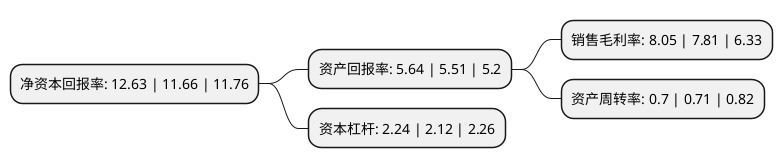

> 本页面由自动化程序生成于 2022年5月20日 01:11
> 内容可能存在错误，如有bug请提交issue至：https://github.com/Eroleice/doc-pi/issues
{.is-warning}

# 上市公司基本情况

## 基本资料

广东宏大控股集团股份有限公司（以下简称“广东宏大”）成立于1988年05月14日，广州市。于2012年06月12日在深交所中小板上市。

广东宏大注册资本74,876.042万元，宏大爆破以大中型露天矿山为主要业务领域，为客户提供民爆器材产品(含现场混装)，矿山基建剥离，整体爆破方案设计，爆破开采，矿物分装与运输等垂直化系列服务，成功打造了“整体化，精准化，个性化，安全化”，以爆破技术为核心的“矿山民爆一体化”服务模式。以下是详细信息：

- 公司名称: 广东宏大控股集团股份有限公司
- 股票代码: 002683.SZ
- 所在地: 广东 - 广州市
- 成立日期: 1988年05月14日
- 注册资本: 74,876.042万元
- 法定代表人: 郑炳旭
- 主营业务: 宏大爆破以大中型露天矿山为主要业务领域，为客户提供民爆器材产品(含现场混装)，矿山基建剥离，整体爆破方案设计，爆破开采，矿物分装与运输等垂直化系列服务，成功打造了“整体化，精准化，个性化，安全化”，以爆破技术为核心的“矿山民爆一体化”服务模式
- 公司官网: www.hdbp.com
- 公司介绍: 公司是国内整体爆破方案设计能力最强、爆破技术最先进、服务内容最齐全的矿山民爆一体化服务商之一。公司以大中型露天矿山为主要业务领域，为客户提供民爆器材产品、矿山基建剥离、整体爆破方案设计、爆破开采、矿物分装与运输等垂直化系列服务。公司独立开发出大变形位移转感应器、建筑物爆破拆除综合科研观测技术、全孔不耦合崩塌爆破技术、亚平面条形药包技术、环保清洁爆破拆除技术等多项国内外领先的科研成果，获得国家科技进步二等奖1项，省部级科技进步奖多项。公司拥有矿山工程施工总承包一级、爆破与拆除工程专业承包一级、土石方工程专业承包一级资质证书等，并先后成功完成了被誉为“中国煤矿第一爆”、“世界环保第一爆”、“中国第一爆”等多项技术难度极高，业内影响极大的项目。

## 股东及高管情况

上市公司第一大股东为广东省环保集团有限公司，持股181,613,500股，占比24.26%，**疑似为**上市公司实际控制人。

截至2022年03月31日，上市公司的前十大股东中，共有4名自然人股东，5名机构股东，1个海外主体，其中5%以上大股东共有2名。上市公司前十大股东明细如下：

> 未能通过持股比例判定出上市公司实际控制人（持股30%以上）
> 可能存在通过间接持股、联合持股、协议控制等方式拥有实际控制权的主体，具体请参考上市公司定期公告！
{.is-warning}

> 截至2022年03月31日，上市公司前十大股东信息如下：

| 股东名称 | 持股数量（股） | 持股比例 |
| --- | --- | --- |
| 广东省环保集团有限公司 | 181,613,500 | 24.26% |
| 郑炳旭 | 44,758,400 | 5.98% |
| 郑明钗 | 36,725,118 | 4.9% |
| 王永庆 | 34,978,400 | 4.67% |
| 广东省伊佩克环保产业有限公司 | 18,205,673 | 2.43% |
| 香港中央结算有限公司(陆股通) | 7,345,089 | 0.98% |
| 华融瑞通股权投资管理有限公司 | 7,206,963 | 0.96% |
| 厦门鑫祥景贸易发展有限公司 | 6,465,419 | 0.86% |
| 广州开发区控股集团有限公司 | 4,869,734 | 0.65% |
| 曹立新 | 4,425,023 | 0.59% |

## 利润表分析

上市公司2021年总收入为85.26亿元，净利润为6.86亿元，实现盈利。

## 杜邦分析

> 数据列示周期：2021年 | 2020年 | 2019年
{.is-info}

上市公司的净资产收益率在近一年有所上升，上升幅度为8.32%，其变化情况分解如下：
- 上市公司的销售毛利率在近一年上升了3.07%，可能是生产效率的提升、商品原材料价格下跌或商品价格的上涨所致。
- 上市公司的资产周转率在近一年下降了-1.41%，可能是源自于更慢的销售回款或库存管理效果下降。
- 上市公司的财务杠杆比率在近一年上升了5.66%，可能是增加负债扩大生产规模。

