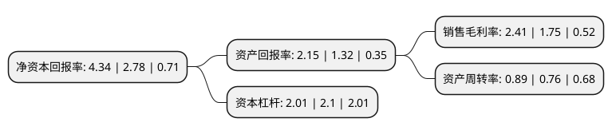

> 本页面由自动化程序生成于 2022年5月20日 01:11
> 内容可能存在错误，如有bug请提交issue至：https://github.com/Eroleice/doc-pi/issues
{.is-warning}

# 上市公司基本情况

## 基本资料

广东光华科技股份有限公司（以下简称“光华科技”）成立于1980年08月30日，汕头市。于2015年02月16日在深交所中小板上市。

光华科技注册资本39,336.074万元，主营业务:公司主要从事PCB化学品，化学试剂等专用化学品的研发，生产，销售和服务。主要产品:产品主要分为PCB化学品和化学试剂两大类。以下是详细信息：

- 公司名称: 广东光华科技股份有限公司
- 股票代码: 002741.SZ
- 所在地: 广东 - 汕头市
- 成立日期: 1980年08月30日
- 注册资本: 39,336.074万元
- 法定代表人: 郑靭
- 主营业务: 主营业务:公司主要从事PCB化学品，化学试剂等专用化学品的研发，生产，销售和服务主要产品:产品主要分为PCB化学品和化学试剂两大类
- 公司官网: www.ghtech.com
- 公司介绍: 公司始创于1980年，现已形成以“高性能电子化学品”、“高品质化学试剂”和“新能源材料”为主导的，集研发、生产、销售和服务为一体的专用化学品产业体系。自成立以来，光华科技坚持自主品牌运营，为广大客户提供高品质的产品与服务，提供全面系统的技术解决方案，是电子、表面处理、日化、生物医药、陶瓷、环保能源等领域标杆企业的整体服务方案提供商。公司实力雄厚，先后获得“国家高新技术企业”、“国家创新型企业”、“国家重点新产品”、“国家知识产权优势企业”和“广东省优秀民营科技企业”等一系列荣誉和称号。拥有一支以教授、博士和硕士为骨干的研发团队，并以此为依托，组建了“院士工作站”、“博士后科研工作站”、“广东省省级企业技术中心”和“广东省化学试剂工程技术研究开发中心”等创新平台，形成了完善的研发体系。

## 股东及高管情况

上市公司第一大股东为郑创发，持股110,471,700股，占比28.08%，**疑似为**上市公司实际控制人。

截至2022年03月31日，上市公司的前十大股东中，共有6名自然人股东，1名机构股东，3个产品账户，其中5%以上大股东共有4名。上市公司前十大股东明细如下：

> 未能通过持股比例判定出上市公司实际控制人（持股30%以上）
> 可能存在通过间接持股、联合持股、协议控制等方式拥有实际控制权的主体，具体请参考上市公司定期公告！
{.is-warning}

> 截至2022年03月31日，上市公司前十大股东信息如下：

| 股东名称 | 持股数量（股） | 持股比例 |
| --- | --- | --- |
| 郑创发 | 110,471,700 | 28.08% |
| 郑靭 | 24,912,880 | 6.33% |
| 陈汉昭 | 24,912,880 | 6.33% |
| 郑侠 | 23,490,000 | 5.97% |
| 汕头市锦煌投资有限公司 | 17,280,000 | 4.39% |
| 方嘉琪 | 10,235,000 | 2.6% |
| 中国建设银行股份有限公司-信达澳银新能源产业股票型证券投资基金 | 7,162,791 | 1.82% |
| 新余善思投资管理中心(有限合伙)-善思慧成捌号私募证券投资基金 | 6,603,556 | 1.68% |
| 谢壮良 | 3,379,310 | 0.86% |
| 上海浦东发展银行股份有限公司-信达澳银领先智选混合型证券投资基金 | 1,980,540 | 0.5% |

## 利润表分析

上市公司2021年总收入为25.8亿元，净利润为0.62亿元，实现盈利。

## 杜邦分析

> 数据列示周期：2021年 | 2020年 | 2019年
{.is-info}

上市公司的净资产收益率在近一年有所上升，上升幅度为56.12%，其变化情况分解如下：
- 上市公司的销售毛利率在近一年上升了37.71%，可能是生产效率的提升、商品原材料价格下跌或商品价格的上涨所致。
- 上市公司的资产周转率在近一年上升了17.11%，可能是源自于更快的销售回款或库存管理效果提升。
- 上市公司的财务杠杆比率在近一年下降了-4.29%，可能是减少负债降低财务费用。

