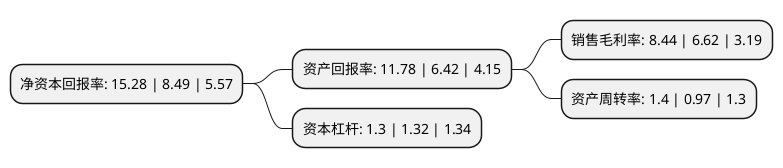

> 本页面由自动化程序生成于 2022年5月20日 01:11
> 内容可能存在错误，如有bug请提交issue至：https://github.com/Eroleice/doc-pi/issues
{.is-warning}

# 上市公司基本情况

## 基本资料

山西永东化工股份有限公司（以下简称“永东股份”）成立于2000年05月20日，运城市。于2015年05月19日在深交所中小板上市。

永东股份注册资本37,544.067万元，主要产品:炭黑及工业萘，轻油，洗油等煤焦油加工产品，主要应用于橡胶制品，电缆屏蔽材料，建筑材料等多个领域。主营业务:煤焦油资源深入研发及应用的高新技术企业，致力于高品质炭黑产品，煤焦油精细加工产品的研发和生产，通过煤焦油加工-炭黑生产-尾气发电的有机结合形成可持续循环的产业模式。以下是详细信息：

- 公司名称: 山西永东化工股份有限公司
- 股票代码: 002753.SZ
- 所在地: 山西 - 运城市
- 成立日期: 2000年05月20日
- 注册资本: 37,544.067万元
- 法定代表人: 刘东杰
- 主营业务: 主要产品:炭黑及工业萘，轻油，洗油等煤焦油加工产品，主要应用于橡胶制品，电缆屏蔽材料，建筑材料等多个领域主营业务:煤焦油资源深入研发及应用的高新技术企业，致力于高品质炭黑产品，煤焦油精细加工产品的研发和生产，通过煤焦油加工-炭黑生产-尾气发电的有机结合形成可持续循环的产业模式
- 公司官网: www.sxydhg.com
- 公司介绍: 公司是一家对煤焦油资源深入研发及应用的高新技术企业，致力于煤焦油精细加工、高品质炭黑产品的研发和生产，以特有的产业链条结构实现资源的综合利用，并通过炭黑尾气发电、循环水利用系统的有机结合形成可持续循环的产业模式，是利用循环经济方式制造、销售炭黑和煤化工产品的中大型化工环保民营企业。公司被炭黑分会、全国橡胶工业信息中心炭黑分中心认定为“科技创新先进企业”。公司获得了中国橡胶工业协会颁发的“质量守信企业”和“推荐品牌”荣誉，通过了ISO9001质量管理体系认证。公司的技术中心被认定为“省级企业技术中心”，“山西省创新型试点企业”，“山西省国家级循环经济标准化试点重点责任单位”、“山西省重点节能减排和资源综合利用的循环经济环保型示范企业”。

## 股东及高管情况

上市公司第一大股东为刘东良，持股97,031,250股，占比25.84%，**疑似为**上市公司实际控制人。

截至2022年03月31日，上市公司的前十大股东中，共有9名自然人股东，1名机构股东，其中5%以上大股东共有3名。上市公司前十大股东明细如下：

> 未能通过持股比例判定出上市公司实际控制人（持股30%以上）
> 可能存在通过间接持股、联合持股、协议控制等方式拥有实际控制权的主体，具体请参考上市公司定期公告！
{.is-warning}

> 截至2022年03月31日，上市公司前十大股东信息如下：

| 股东名称 | 持股数量（股） | 持股比例 |
| --- | --- | --- |
| 刘东良 | 97,031,250 | 25.84% |
| 刘东杰 | 63,281,250 | 16.86% |
| 深圳市东方富海投资管理股份有限公司 | 26,881,350 | 7.16% |
| 靳彩红 | 16,875,000 | 4.49% |
| 刘山云 | 8,719,721 | 2.32% |
| 刘东秀 | 6,750,000 | 1.8% |
| 刘东梅 | 5,062,500 | 1.35% |
| 刘东玉 | 5,062,500 | 1.35% |
| 刘东果 | 5,062,500 | 1.35% |
| 高永福 | 4,117,168 | 1.1% |

## 利润表分析

上市公司2021年总收入为37.59亿元，净利润为3.17亿元，实现盈利。

## 杜邦分析

> 数据列示周期：2021年 | 2020年 | 2019年
{.is-info}

上市公司的净资产收益率在近一年有所上升，上升幅度为79.98%，其变化情况分解如下：
- 上市公司的销售毛利率在近一年上升了27.49%，可能是生产效率的提升、商品原材料价格下跌或商品价格的上涨所致。
- 上市公司的资产周转率在近一年上升了44.33%，可能是源自于更快的销售回款或库存管理效果提升。
- 上市公司的财务杠杆比率在近一年下降了-1.52%，可能是减少负债降低财务费用。

