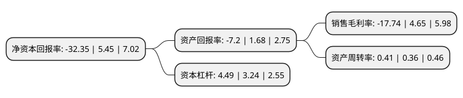

> 本页面由自动化程序生成于 2022年5月20日 01:12
> 内容可能存在错误，如有bug请提交issue至：https://github.com/Eroleice/doc-pi/issues
{.is-warning}

# 上市公司基本情况

## 基本资料

湖北凯龙化工集团股份有限公司（以下简称“凯龙股份”）成立于1994年06月30日，荆门市。于2015年12月09日在深交所中小板上市。

凯龙股份注册资本38,173.033万元，主要产品:改性铵油炸药，膨化硝铵炸药，乳化炸药，震源药柱和硝酸铵;主营业务:工业炸药及相关产品的生产，销售，民爆产品的生产与销售，工程爆破服务，硝酸铵及其制品的生产与销售。以下是详细信息：

- 公司名称: 湖北凯龙化工集团股份有限公司
- 股票代码: 002783.SZ
- 所在地: 湖北 - 荆门市
- 成立日期: 1994年06月30日
- 注册资本: 38,173.033万元
- 法定代表人: 邵兴祥
- 主营业务: 主要产品:改性铵油炸药，膨化硝铵炸药，乳化炸药，震源药柱和硝酸铵;主营业务:工业炸药及相关产品的生产，销售，民爆产品的生产与销售，工程爆破服务，硝酸铵及其制品的生产与销售
- 公司官网: www.hbklgroup.cn
- 公司介绍: 公司从单一的地方军工企业壮大为多元构架的企业集团，成为全国民爆行业的重点骨干企业，是湖北省最大的民爆器材生产销售企业。公司现在主要生产工业炸药、硝酸铵及复合肥系列产品、合成氨、纳米碳酸钙及建筑用石料系列产品、纸塑包装产品,同时开展工程爆破服务和矿石开采业务。公司健全了质量管理体系，通过了ISO9001：2008质量体系认证。公司生产的“凯龙”牌炸药获“湖北省名牌产品”和“新中国60年湖北高科技产品优质奖”荣誉称号，“凯龙”商标获“湖北著名商标”和“中国驰名商标”称号，“凯龙”牌震源药柱获“全国用户满意产品”称号。公司连续多年被湖北省政府授予湖北省安全生产红旗单位，荣获湖北省首届“十佳安全生产示范企业”等荣誉称号，被国家安监总局确认为全国安全文化建设示范企业。

## 股东及高管情况

上市公司第一大股东为中荆投资控股集团有限公司，持股59,792,682股，占比15.66%，**疑似为**上市公司实际控制人。

截至2022年03月31日，上市公司的前十大股东中，共有9名自然人股东，1名机构股东，其中5%以上大股东共有2名。上市公司前十大股东明细如下：

> 未能通过持股比例判定出上市公司实际控制人（持股30%以上）
> 可能存在通过间接持股、联合持股、协议控制等方式拥有实际控制权的主体，具体请参考上市公司定期公告！
{.is-warning}

> 截至2022年03月31日，上市公司前十大股东信息如下：

| 股东名称 | 持股数量（股） | 持股比例 |
| --- | --- | --- |
| 中荆投资控股集团有限公司 | 59,792,682 | 15.66% |
| 邵兴祥 | 53,465,200 | 14.01% |
| 罗春莲 | 6,415,959 | 1.68% |
| 王维森 | 4,224,427 | 1.11% |
| 陈慧 | 3,258,800 | 0.85% |
| 邱莉莎 | 3,214,918 | 0.84% |
| 刘卫 | 2,386,088 | 0.63% |
| 秦卫国 | 2,231,600 | 0.58% |
| 陈献贤 | 2,161,471 | 0.57% |
| 张俊 | 1,957,100 | 0.51% |

## 利润表分析

上市公司2021年总收入为27.41亿元，净利润为-4.87亿元，**未实现盈利**。

## 杜邦分析

> 数据列示周期：2021年 | 2020年 | 2019年
{.is-info}

上市公司的净资产收益率在近一年有所下降，下降幅度为-693.58%，其变化情况分解如下：
- 上市公司的销售毛利率在近一年下降了-481.51%，可能是生产效率的下降、商品原材料价格上涨或商品价格的下跌所致。
- 上市公司的资产周转率在近一年上升了13.89%，可能是源自于更快的销售回款或库存管理效果提升。
- 上市公司的财务杠杆比率在近一年上升了38.58%，可能是增加负债扩大生产规模。

