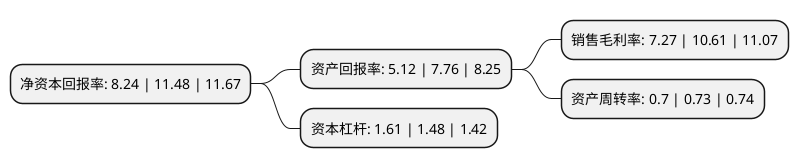

> 本页面由自动化程序生成于 2022年5月20日 01:12
> 内容可能存在错误，如有bug请提交issue至：https://github.com/Eroleice/doc-pi/issues
{.is-warning}

# 上市公司基本情况

## 基本资料

广东红墙新材料股份有限公司（以下简称“红墙股份”）成立于2005年03月31日，惠州市。于2016年08月23日在深交所中小板上市。

红墙股份注册资本20,688.987万元，主要从事各种混凝土外加剂的研发，生产，销售和技术服务。主要产品以萘系减水剂，聚羧酸系减水剂为主导，根据客户实际需要提供定制化混凝土外加剂产品。以下是详细信息：

- 公司名称: 广东红墙新材料股份有限公司
- 股票代码: 002809.SZ
- 所在地: 广东 - 惠州市
- 成立日期: 2005年03月31日
- 注册资本: 20,688.987万元
- 法定代表人: 刘连军
- 主营业务: 主要从事各种混凝土外加剂的研发，生产，销售和技术服务主要产品以萘系减水剂，聚羧酸系减水剂为主导，根据客户实际需要提供定制化混凝土外加剂产品
- 公司官网: www.redwall.com.cn
- 公司介绍: 公司是一家专业从事研发、生产、销售混凝土外加剂的上市公司。公司持有广东省著名商标“红墙”商标，被评为“广东省名牌产品”，公司还获评“广东省自主创新标杆企业”、“广东省雇主责任示范企业”等荣誉称号，“恒利”被评为中国驰名商标。公司为广东省优秀企业，同时还是广东省建筑材料行业协会副会长单位中唯一的一家混凝土外加剂企业，是《聚羧酸系高性能减水剂》、《混凝土外加剂安全生产要求》等多个标准的起草与参编单位。

## 股东及高管情况

上市公司第一大股东为刘连军，持股95,473,275股，占比45.78%，为上市公司实际控制人。

截至2022年03月31日，上市公司的前十大股东中，共有8名自然人股东，1名机构股东，1个产品账户，其中5%以上大股东共有2名。上市公司前十大股东明细如下：

> 截至2022年03月31日，上市公司前十大股东信息如下：

| 股东名称 | 持股数量（股） | 持股比例 |
| --- | --- | --- |
| 刘连军 | 95,473,275 | 45.78% |
| 广东省科技创业投资有限公司 | 18,189,488 | 8.72% |
| 何文钜 | 2,200,005 | 1.05% |
| 梁盛谊 | 1,831,201 | 0.88% |
| 何元杰 | 1,111,090 | 0.53% |
| 冯境铭 | 1,108,675 | 0.53% |
| 张玉成 | 793,085 | 0.38% |
| 徐克怀 | 663,400 | 0.32% |
| 中国民生银行股份有限公司-金元顺安元启灵活配置混合型证券投资基金 | 636,000 | 0.3% |
| 施能狮 | 512,240 | 0.25% |

## 利润表分析

上市公司2021年总收入为15.51亿元，净利润为1.12亿元，实现盈利。

## 杜邦分析

> 数据列示周期：2021年 | 2020年 | 2019年
{.is-info}

上市公司的净资产收益率在近一年有所下降，下降幅度为-28.22%，其变化情况分解如下：
- 上市公司的销售毛利率在近一年下降了-31.48%，可能是生产效率的下降、商品原材料价格上涨或商品价格的下跌所致。
- 上市公司的资产周转率在近一年下降了-4.11%，可能是源自于更慢的销售回款或库存管理效果下降。
- 上市公司的财务杠杆比率在近一年上升了8.78%，可能是增加负债扩大生产规模。

