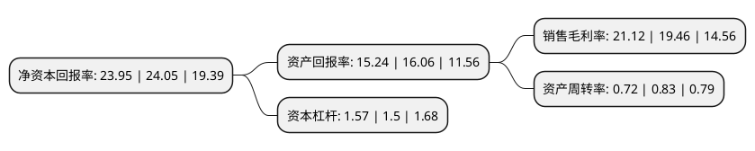

> 本页面由自动化程序生成于 2022年5月20日 01:12
> 内容可能存在错误，如有bug请提交issue至：https://github.com/Eroleice/doc-pi/issues
{.is-warning}

# 上市公司基本情况

## 基本资料

山东赫达集团股份有限公司（以下简称“山东赫达”）成立于1992年12月07日，淄博市。于2016年08月26日在深交所中小板上市。

山东赫达注册资本34,257.604万元，主营业务:从事水溶性高分子化合物产品的研发，生产和销售;主要产品是非离子型纤维素醚。以下是详细信息：

- 公司名称: 山东赫达集团股份有限公司
- 股票代码: 002810.SZ
- 所在地: 山东 - 淄博市
- 成立日期: 1992年12月07日
- 注册资本: 34,257.604万元
- 法定代表人: 毕于东
- 主营业务: 主营业务:从事水溶性高分子化合物产品的研发，生产和销售;主要产品是非离子型纤维素醚
- 公司官网: www.sdhead.com
- 公司介绍: 公司致力于水溶性高分子化合物的研发、生产和销售，主要产品是非离子型纤维素醚，是国内同行业中少数具备自主研发并同时大规模生产中高端型号建材级、医药级和食品级非离子型纤维素醚的企业之一。经过多年的研发和技术积累，公司掌握了具有自主知识产权的规模化生产纤维素醚的核心技术，从小型装置成长为大规模装置连续生产，在纤维素醚的产销规模、生产技术、产品种类、产品质量稳定性和生产环保措施等方面的综合实力，在国内同行业企业中名列前茅。

## 股东及高管情况

上市公司第一大股东为毕心德，持股91,670,305股，占比26.76%，**疑似为**上市公司实际控制人。

截至2022年03月31日，上市公司的前十大股东中，共有4名自然人股东，5个产品账户，1个海外主体，其中5%以上大股东共有3名。上市公司前十大股东明细如下：

> 未能通过持股比例判定出上市公司实际控制人（持股30%以上）
> 可能存在通过间接持股、联合持股、协议控制等方式拥有实际控制权的主体，具体请参考上市公司定期公告！
{.is-warning}

> 截至2022年03月31日，上市公司前十大股东信息如下：

| 股东名称 | 持股数量（股） | 持股比例 |
| --- | --- | --- |
| 毕心德 | 91,670,305 | 26.76% |
| 毕于东 | 26,613,060 | 7.77% |
| 毕文娟 | 20,538,632 | 6% |
| 香港中央结算有限公司(陆股通) | 8,750,596 | 2.55% |
| 杨力 | 8,406,106 | 2.45% |
| 中国农业银行股份有限公司-大成新锐产业混合型证券投资基金 | 7,656,935 | 2.24% |
| 建信基金-建设银行-中国人寿-中国人寿委托建信基金股票型组合 | 5,180,449 | 1.51% |
| 全国社保基金四一四组合 | 5,164,255 | 1.51% |
| 交通银行股份有限公司-富国天益价值混合型证券投资基金 | 5,003,731 | 1.46% |
| 广发证券股份有限公司-大成睿景灵活配置混合型证券投资基金 | 4,844,400 | 1.41% |

## 杜邦分析

> 数据列示周期：2021年 | 2020年 | 2019年
{.is-info}

上市公司的净资产收益率在近一年有所下降，下降幅度为-0.42%，其变化情况分解如下：
- 上市公司的销售毛利率在近一年上升了8.53%，可能是生产效率的提升、商品原材料价格下跌或商品价格的上涨所致。
- 上市公司的资产周转率在近一年下降了-13.25%，可能是源自于更慢的销售回款或库存管理效果下降。
- 上市公司的财务杠杆比率在近一年上升了4.67%，可能是增加负债扩大生产规模。

