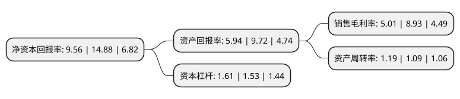

> 本页面由自动化程序生成于 2022年5月20日 01:12
> 内容可能存在错误，如有bug请提交issue至：https://github.com/Eroleice/doc-pi/issues
{.is-warning}

# 上市公司基本情况

## 基本资料

上海纳尔实业股份有限公司（以下简称“纳尔股份”）成立于2005年11月09日，上海市。于2016年11月29日在深交所中小板上市。

纳尔股份注册资本17,139.838万元，主营业务:主要从事数码喷印材料的研发，生产和销售。主要产品:包括车身贴，单透膜，涂层喷印材料和贴合喷印材料等承印材料，其中，车身贴，单透膜和涂层喷印材料以自产为主，贴合喷印材料采用外购的模式。以下是详细信息：

- 公司名称: 上海纳尔实业股份有限公司
- 股票代码: 002825.SZ
- 所在地: 上海 - 上海市
- 成立日期: 2005年11月09日
- 注册资本: 17,139.838万元
- 法定代表人: 游爱国
- 主营业务: 主营业务:主要从事数码喷印材料的研发，生产和销售主要产品:包括车身贴，单透膜，涂层喷印材料和贴合喷印材料等承印材料，其中，车身贴，单透膜和涂层喷印材料以自产为主，贴合喷印材料采用外购的模式
- 公司官网: www.nar.com.cn
- 公司介绍: 公司成长为研发、生产、销售为一体的数码喷印材料行业龙头企业。公司主要从事数码喷印材料的研发、生产和销售。数码喷印材料是数码喷墨印刷中的承印材料，属于印刷及设备器材制造业的细分子行业，也属于复合材料的细分行业。公司产品主要包括车身贴、单透膜、涂层喷印材料和贴合喷印材料等承印材料，其中，车身贴、单透膜和涂层喷印材料以自产为主，贴合喷印材料采用外购的模式。公司作为上海市级企业技术中心，纳尔拥有一支专业结构合理、行业经验丰富的研发团队，结合行业新技术、新应用，开发符合市场需求的新产品。纳尔还与华东理工大学等211高校开展产学研合作。纳尔作为第一起草单位制定“车身喷绘贴膜”等2项行业标准，先后荣获国家火炬计划重点高新技术企业、上海市科技小巨人、上海专利试点单位、上海标准化良好行为企业、上海科技进步奖等荣誉，公司产品获得“国家火炬计划”、“国家重点新产品”称号，“纳尔”品牌也连续被评为“上海名牌”、“上海市著名商标”。

## 股东及高管情况

上市公司第一大股东为游爱国，持股49,398,408股，占比28.82%，**疑似为**上市公司实际控制人。

截至2022年03月31日，上市公司的前十大股东中，共有8名自然人股东，2名机构股东，其中5%以上大股东共有3名。上市公司前十大股东明细如下：

> 未能通过持股比例判定出上市公司实际控制人（持股30%以上）
> 可能存在通过间接持股、联合持股、协议控制等方式拥有实际控制权的主体，具体请参考上市公司定期公告！
{.is-warning}

> 截至2022年03月31日，上市公司前十大股东信息如下：

| 股东名称 | 持股数量（股） | 持股比例 |
| --- | --- | --- |
| 游爱国 | 49,398,408 | 28.82% |
| 王树明 | 23,220,687 | 13.55% |
| 杨建堂 | 16,319,311 | 9.52% |
| 陶福生 | 4,698,599 | 2.74% |
| 上海纳印商务咨询管理有限公司 | 2,799,802 | 1.63% |
| 王首斌 | 1,621,717 | 0.95% |
| 沈映斌 | 920,400 | 0.54% |
| 张雨洁 | 728,570 | 0.43% |
| 深圳匠台技术合伙企业(有限合伙) | 639,518 | 0.37% |
| 唐义旺 | 565,000 | 0.33% |

## 利润表分析

上市公司2021年总收入为17.58亿元，净利润为0.88亿元，实现盈利。

## 杜邦分析

> 数据列示周期：2021年 | 2020年 | 2019年
{.is-info}

上市公司的净资产收益率在近一年有所下降，下降幅度为-35.75%，其变化情况分解如下：
- 上市公司的销售毛利率在近一年下降了-43.9%，可能是生产效率的下降、商品原材料价格上涨或商品价格的下跌所致。
- 上市公司的资产周转率在近一年上升了9.17%，可能是源自于更快的销售回款或库存管理效果提升。
- 上市公司的财务杠杆比率在近一年上升了5.23%，可能是增加负债扩大生产规模。

