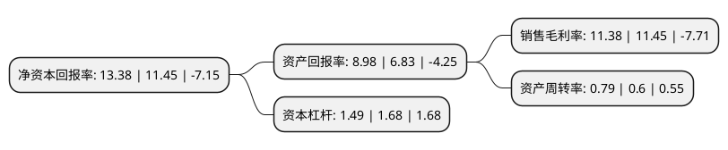

> 本页面由自动化程序生成于 2022年5月20日 01:13
> 内容可能存在错误，如有bug请提交issue至：https://github.com/Eroleice/doc-pi/issues
{.is-warning}

# 上市公司基本情况

## 基本资料

浙江中欣氟材股份有限公司（以下简称“中欣氟材”）成立于2000年08月29日，绍兴市。于2017年12月05日在深交所中小板上市。

中欣氟材注册资本23,425.541万元，主营业务:主要从事氟精细化学品研发，生产，销售。现阶段公司产品主要涉及含氟医药中间体，农药中间体，新材料与电子化学品等氟精细化学品。主要产品:2，3，4，5-四氟苯系列，氟氯苯乙酮系列，哌嗪系列及2，3，5，6-四氟苯。以下是详细信息：

- 公司名称: 浙江中欣氟材股份有限公司
- 股票代码: 002915.SZ
- 所在地: 浙江 - 绍兴市
- 成立日期: 2000年08月29日
- 注册资本: 23,425.541万元
- 法定代表人: 陈寅镐
- 主营业务: 主营业务:主要从事氟精细化学品研发，生产，销售现阶段公司产品主要涉及含氟医药中间体，农药中间体，新材料与电子化学品等氟精细化学品主要产品:2，3，4，5-四氟苯系列，氟氯苯乙酮系列，哌嗪系列及2，3，5，6-四氟苯
- 公司官网: www.zxchemgroup.com
- 公司介绍: 公司是一家主要从事氟精细化学品研发、生产、销售的高新技术企业。公司是国家火炬计划高新技术企业，已先后通过ISO-9001质量管理体系认证、ISO-14001环境管理体系认证、OHSAS18001职业健康安全管理体系认证及清洁生产审核认证。公司拥有省级高新技术企业研究开发中心、省级中小企业技术中心、省级企业研究院—浙江中欣含氟化学品与新材料研究院。

## 股东及高管情况

上市公司第一大股东为浙江白云伟业控股集团有限公司，持股46,423,852股，占比19.82%，**疑似为**上市公司实际控制人。

截至2022年03月31日，上市公司的前十大股东中，共有6名自然人股东，4名机构股东，其中5%以上大股东共有4名。上市公司前十大股东明细如下：

> 未能通过持股比例判定出上市公司实际控制人（持股30%以上）
> 可能存在通过间接持股、联合持股、协议控制等方式拥有实际控制权的主体，具体请参考上市公司定期公告！
{.is-warning}

> 截至2022年03月31日，上市公司前十大股东信息如下：

| 股东名称 | 持股数量（股） | 持股比例 |
| --- | --- | --- |
| 浙江白云伟业控股集团有限公司 | 46,423,852 | 19.82% |
| 绍兴中玮投资合伙企业(有限合伙) | 23,310,000 | 9.95% |
| 陈寅镐 | 13,981,500 | 5.97% |
| 高宝矿业有限公司 | 13,170,993 | 5.62% |
| 曹国路 | 10,075,000 | 4.3% |
| 王超 | 9,262,500 | 3.95% |
| 徐建国 | 7,176,000 | 3.06% |
| 福建雅鑫电子材料有限公司 | 5,644,710 | 2.41% |
| 吴刚 | 2,774,000 | 1.18% |
| 王大为 | 2,439,000 | 1.04% |

## 利润表分析

上市公司2021年总收入为15.26亿元，净利润为1.73亿元，实现盈利。

## 杜邦分析

> 数据列示周期：2021年 | 2020年 | 2019年
{.is-info}

上市公司的净资产收益率在近一年有所上升，上升幅度为16.86%，其变化情况分解如下：
- 上市公司的销售毛利率在近一年下降了-0.61%，可能是生产效率的下降、商品原材料价格上涨或商品价格的下跌所致。
- 上市公司的资产周转率在近一年上升了31.67%，可能是源自于更快的销售回款或库存管理效果提升。
- 上市公司的财务杠杆比率在近一年下降了-11.31%，可能是减少负债降低财务费用。

