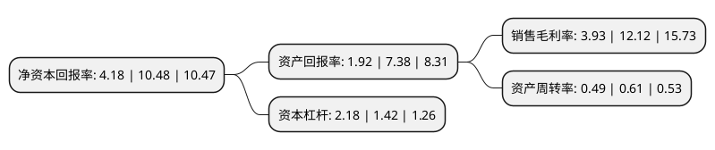

> 本页面由自动化程序生成于 2022年5月20日 01:13
> 内容可能存在错误，如有bug请提交issue至：https://github.com/Eroleice/doc-pi/issues
{.is-warning}

# 上市公司基本情况

## 基本资料

深圳市金奥博科技股份有限公司（以下简称“金奥博”）成立于1994年01月19日，深圳市。于2017年12月08日在深交所中小板上市。

金奥博注册资本34,761.42万元，主营业务是为客户提供生产民爆器材的成套工艺技术，装备，软件系统及工业炸药关键原辅材料的一站式综合服务。主要产品包括:工业炸药生产工艺技术，软件及设备系统，工业炸药关键原辅材料和工业雷管生产线。以下是详细信息：

- 公司名称: 深圳市金奥博科技股份有限公司
- 股票代码: 002917.SZ
- 所在地: 广东 - 深圳市
- 成立日期: 1994年01月19日
- 注册资本: 34,761.42万元
- 法定代表人: 明景谷
- 主营业务: 主营业务是为客户提供生产民爆器材的成套工艺技术，装备，软件系统及工业炸药关键原辅材料的一站式综合服务主要产品包括:工业炸药生产工艺技术，软件及设备系统，工业炸药关键原辅材料和工业雷管生产线
- 公司官网: www.kingexplorer.com
- 公司介绍: 公司为国内首批“国家级高新技术企业”，总部位于国家级高新区--深圳市高新技术产业园。公司主营业务是为客户提供生产民爆器材的成套工艺技术、装备、软件系统及工业炸药关键原辅材料的一站式综合服务，主要产品包括包装型工业炸药制药装药系统、包装型工业炸药包装系统、散装型工业炸药生产系统及现场混装车、智慧民爆信息服务系统、一体化复合油相和乳化剂、工业雷管生产线等。公司技术力量雄厚，拥有由国务院安委会专家、国家级突出贡献专家、国家民爆行业咨询委标技委委员、省安全生产专家库专家和各类专业人才组成的核心团队。近年来，公司研究开发的成套生产线装备、工业机器人智能包装线，地面和井下现场混装系统等项目均通过了工信部安全生产司和科技司组织的科技成果鉴定和生产验收，在行业内实现了多项重大技术突破，填补了多项国内民爆行业技术领域的空白。

## 股东及高管情况

上市公司第一大股东为明刚，持股84,678,273股，占比24.36%，**疑似为**上市公司实际控制人。

截至2022年05月06日，上市公司的前十大股东中，共有2名自然人股东，4名机构股东，4个产品账户，其中5%以上大股东共有3名。上市公司前十大股东明细如下：

> 未能通过持股比例判定出上市公司实际控制人（持股30%以上）
> 可能存在通过间接持股、联合持股、协议控制等方式拥有实际控制权的主体，具体请参考上市公司定期公告！
{.is-warning}

> 截至2022年05月06日，上市公司前十大股东信息如下：

| 股东名称 | 持股数量（股） | 持股比例 |
| --- | --- | --- |
| 明刚 | 84,678,273 | 24.36% |
| 四川雅化实业集团股份有限公司 | 41,000,000 | 11.79% |
| 明景谷 | 34,852,182 | 10.03% |
| 深圳市奥博合利投资合伙企业(有限合伙) | 12,960,000 | 3.73% |
| 上海宽投资产管理有限公司-宽投幸运星9号私募证券投资基金 | 10,840,000 | 3.12% |
| 深圳君宜私募证券基金管理有限公司-君宜祈初私募证券投资基金 | 7,149,122 | 2.06% |
| 深圳市奥博合鑫投资合伙企业(有限合伙) | 6,912,000 | 1.99% |
| 工银安盛人寿保险有限公司-短期分红 | 6,856,002 | 1.97% |
| 深圳君宜私募证券基金管理有限公司-君宜祈良私募证券投资基金 | 6,019,736 | 1.73% |
| 深圳君宜私募证券基金管理有限公司-君宜祈灵私募证券投资基金 | 5,372,807 | 1.55% |

## 利润表分析

上市公司2021年总收入为8.15亿元，净利润为0.32亿元，实现盈利。

## 杜邦分析

> 数据列示周期：2021年 | 2020年 | 2019年
{.is-info}

上市公司的净资产收益率在近一年有所下降，下降幅度为-60.11%，其变化情况分解如下：
- 上市公司的销售毛利率在近一年下降了-67.57%，可能是生产效率的下降、商品原材料价格上涨或商品价格的下跌所致。
- 上市公司的资产周转率在近一年下降了-19.67%，可能是源自于更慢的销售回款或库存管理效果下降。
- 上市公司的财务杠杆比率在近一年上升了53.52%，可能是增加负债扩大生产规模。

