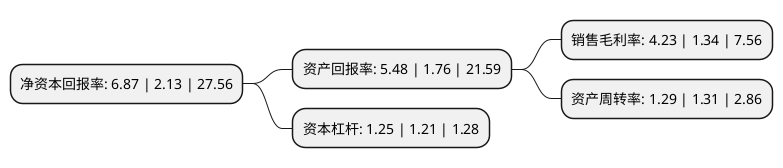

> 本页面由自动化程序生成于 2022年5月20日 01:13
> 内容可能存在错误，如有bug请提交issue至：https://github.com/Eroleice/doc-pi/issues
{.is-warning}

# 上市公司基本情况

## 基本资料

湖南宇新能源科技股份有限公司（以下简称“宇新股份”）成立于2009年10月12日，长沙市。于2020年06月02日在深交所中小板上市。

宇新股份注册资本15,867.6万元，主营业务:以LPG为原料的有机化工产品的工艺研发，生产和销售。主要产品是以LPG中的碳四(C4)组分为原料生产的异辛烷，MTBE和SBAC。以下是详细信息：

- 公司名称: 湖南宇新能源科技股份有限公司
- 股票代码: 002986.SZ
- 所在地: 湖南 - 长沙市
- 成立日期: 2009年10月12日
- 注册资本: 15,867.6万元
- 法定代表人: 胡先念
- 主营业务: 主营业务:以LPG为原料的有机化工产品的工艺研发，生产和销售主要产品是以LPG中的碳四(C4)组分为原料生产的异辛烷，MTBE和SBAC
- 公司官网: www.yussen.com.cn
- 公司介绍: 公司与中山大学惠州研究院建立了“绿色溶剂工程技术中心”，并设立了广东省科学技术厅认证的“碳四烃类高效转化及应用工程技术研究中心”。公司已累计取得专利18项，其中发明专利10项，实用新型专利8项。此外，公司的异辛烷、MTBE、SBAC等主要产品，均被广东省高新技术企业协会认定为广东省高新技术产品；宇新化工10万吨/年SBAC工业化生产技术获得了广东省人民政府授予的广东省科学技术二等奖和惠州市人民政府授予的惠州市科学技术一等奖，并在第十届国际发明展览会上荣获“发明创业奖-项目奖”金奖；宇新化工被广东省高新技术企业协会认定为广东省创新型企业。此外，宇新化工是广东省地方标准《精制乙酸仲丁酯》和《工业用异辛烷》的主要起草单位，也是中国材料与试验团体标准委员会(CSTM)批准立项的《烷基化异辛烷》团体标准的主要参与单位。

## 股东及高管情况

上市公司第一大股东为胡先念，持股47,600,000股，占比30%，**疑似为**上市公司实际控制人。

截至2022年03月31日，上市公司的前十大股东中，共有8名自然人股东，1名机构股东，1个产品账户，其中5%以上大股东共有2名。上市公司前十大股东明细如下：

> 截至2022年03月31日，上市公司前十大股东信息如下：

| 股东名称 | 持股数量（股） | 持股比例 |
| --- | --- | --- |
| 胡先念 | 47,600,000 | 30% |
| 曾政寰 | 12,872,150 | 8.11% |
| 倪毓蓓 | 6,956,250 | 4.38% |
| 陈海波 | 5,250,000 | 3.31% |
| 张林峰 | 3,319,000 | 2.09% |
| 郑文卿 | 3,123,500 | 1.97% |
| 王欢欢 | 3,115,000 | 1.96% |
| 珠海阿巴马资产管理有限公司-阿巴马悦享红利58号私募证券投资基金 | 2,981,000 | 1.88% |
| 深圳穗甬汇智投资管理有限公司-珠海穗甬汇富股权投资合伙企业(有限合伙) | 2,518,360 | 1.59% |
| 胡凤华 | 1,800,020 | 1.13% |

## 利润表分析

上市公司2021年总收入为32.01亿元，净利润为1.35亿元，实现盈利。

## 杜邦分析

> 数据列示周期：2021年 | 2020年 | 2019年
{.is-info}

上市公司的净资产收益率在近一年有所上升，上升幅度为222.54%，其变化情况分解如下：
- 上市公司的销售毛利率在近一年上升了215.67%，可能是生产效率的提升、商品原材料价格下跌或商品价格的上涨所致。
- 上市公司的资产周转率在近一年下降了-1.53%，可能是源自于更慢的销售回款或库存管理效果下降。
- 上市公司的财务杠杆比率在近一年上升了3.31%，可能是增加负债扩大生产规模。

