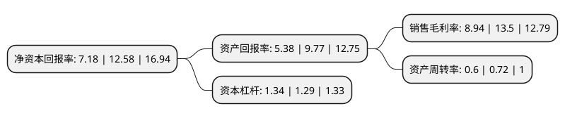

> 本页面由自动化程序生成于 2022年5月20日 01:13
> 内容可能存在错误，如有bug请提交issue至：https://github.com/Eroleice/doc-pi/issues
{.is-warning}

# 上市公司基本情况

## 基本资料

浙江大洋生物科技集团股份有限公司（以下简称“大洋生物”）成立于1976年01月01日，杭州市。于2020年10月26日在深交所中小板上市。

大洋生物注册资本6,000万元，碳酸钾，碳酸氢钾，盐酸氨丙啉，氟化产品及其关联产品以下是详细信息：

- 公司名称: 浙江大洋生物科技集团股份有限公司
- 股票代码: 003017.SZ
- 所在地: 浙江 - 杭州市
- 成立日期: 1976年01月01日
- 注册资本: 6,000万元
- 法定代表人: 陈阳贵
- 主营业务: 碳酸钾，碳酸氢钾，盐酸氨丙啉，氟化产品及其关联产品
- 公司官网: www.dyhg.com
- 公司介绍: 公司作为专业的化学原料制造企业，主要从事无机盐、兽用原料药等化学原料产品的生产和销售。公司坚持“绿色发展、品质第一、契约精神、共创共赢”的经营理念，以市场需求为导向、安全环保为基石、技术创新为动力，立足现有优势产品，加强新产品开发，形成钾盐为主、兽药及氟化工共同发展的产业格局。目前公司主要产品包括碳酸钾、碳酸氢钾、盐酸氨丙啉、2-氯-6-氟苯甲醛等。公司为国家级高新技术企业、浙江省专利示范企业，建有浙江省博士后工作站、大洋纳米材料省级高新技术研究开发中心、省级企业技术中心和浙江省大洋科技钾盐研究院，具有较强的技术研发实力。公司先后承担并完成了包括国家重大新药创制项目、863计划和国家火炬计划等科技攻关项目在内的十余项国家、省部级科技项目，研发的新产品、新技术获得多项省、市级科技奖。截至本招股说明书签署日，公司拥有发明专利31项，实用新型专利5项，在国内外核心学术期刊发表论文30余篇。公司先后主持起草国家/行业标准5项，参与起草国家/行业标准1项，具备较为突出的行业地位和研究开发、技术创新能力，引领碳酸钾、碳酸氢钾行业的发展方向。

## 股东及高管情况

上市公司第一大股东为陈阳贵，持股5,317,261股，占比8.86%，**疑似为**上市公司实际控制人。

截至2022年03月31日，上市公司的前十大股东中，共有8名自然人股东，2个产品账户，其中5%以上大股东共有1名。上市公司前十大股东明细如下：

> 未能通过持股比例判定出上市公司实际控制人（持股30%以上）
> 可能存在通过间接持股、联合持股、协议控制等方式拥有实际控制权的主体，具体请参考上市公司定期公告！
{.is-warning}

> 上市公司第一大股东持股不超过10%，请检查是否存在公司控制权风险！
{.is-danger}

> 截至2022年03月31日，上市公司前十大股东信息如下：

| 股东名称 | 持股数量（股） | 持股比例 |
| --- | --- | --- |
| 陈阳贵 | 5,317,261 | 8.86% |
| 汪贤玉 | 2,879,000 | 4.8% |
| 仇永生 | 2,258,000 | 3.76% |
| 涂永福 | 1,760,577 | 2.93% |
| 陈荣芳 | 1,580,000 | 2.63% |
| 中国建设银行股份有限公司-广发科技创新混合型证券投资基金 | 1,456,500 | 2.43% |
| 袁美琴 | 1,132,000 | 1.89% |
| 兴业银行股份有限公司-广发稳鑫保本混合型证券投资基金 | 1,007,400 | 1.68% |
| 关卫军 | 1,000,000 | 1.67% |
| 郝炳炎 | 802,568 | 1.34% |

## 利润表分析

上市公司2021年总收入为7.83亿元，净利润为0.7亿元，实现盈利。

## 杜邦分析

> 数据列示周期：2021年 | 2020年 | 2019年
{.is-info}

上市公司的净资产收益率在近一年有所下降，下降幅度为-42.93%，其变化情况分解如下：
- 上市公司的销售毛利率在近一年下降了-33.78%，可能是生产效率的下降、商品原材料价格上涨或商品价格的下跌所致。
- 上市公司的资产周转率在近一年下降了-16.67%，可能是源自于更慢的销售回款或库存管理效果下降。
- 上市公司的财务杠杆比率在近一年上升了3.88%，可能是增加负债扩大生产规模。

