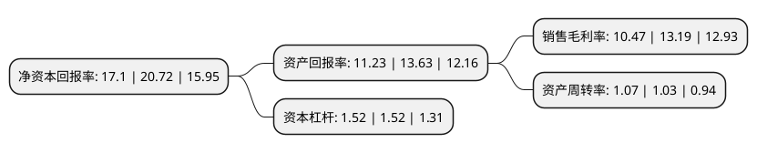

> 本页面由自动化程序生成于 2022年5月20日 01:14
> 内容可能存在错误，如有bug请提交issue至：https://github.com/Eroleice/doc-pi/issues
{.is-warning}

# 上市公司基本情况

## 基本资料

成都硅宝科技股份有限公司（以下简称“硅宝科技”）成立于1998年10月19日，成都市。于2009年10月30日在深交所创业板上市。

硅宝科技注册资本39,113.02万元，主营业务为:室温硅橡胶，制胶专用设备，硅烷偶联剂三大业务，其中室温硅橡胶细分为建筑类用胶和工业类用胶两大类别。以下是详细信息：

- 公司名称: 成都硅宝科技股份有限公司
- 股票代码: 300019.SZ
- 所在地: 四川 - 成都市
- 成立日期: 1998年10月19日
- 注册资本: 39,113.02万元
- 法定代表人: 王有治
- 主营业务: 主营业务为:室温硅橡胶，制胶专用设备，硅烷偶联剂三大业务，其中室温硅橡胶细分为建筑类用胶和工业类用胶两大类别
- 公司官网: www.guibao.cn
- 公司介绍: 公司是中国新材料行业创业板上市公司；是有机硅室温胶行业获得国家工商总局认定的“中国驰名商标”企业。公司是集有机硅室温胶和制胶专用设备研发、生产和销售于一体的企业，聚集了一大批行业权威技术专家、知名顾问团队，组建了以博士、硕士为主的中青年研发团队，具有强大的产品研发、技术创新和技术服务能力。硅宝科技所处的有机硅新材料行业属于国家“十三五”规划重点发展的新材料行业之一，有机硅因无毒、无害、环境友好、耐高低温、生物相溶性等优异功能，被广泛应用于生活的方方面面，并且有望实现对其他材料的替代。硅宝产品广泛应用于建筑幕墙、中空玻璃、节能门窗、电力环保、电子电器、汽车制造、机场道桥、轨道交通、新能源、设备制造及工程服务等众多领域，不仅在国内赢得了良好口碑，而且远销欧美，在国际市场上享有较高的知名度和美誉度。

## 股东及高管情况

上市公司第一大股东为四川发展引领资本管理有限公司，持股55,963,316股，占比14.31%，**疑似为**上市公司实际控制人。

截至2022年03月31日，上市公司的前十大股东中，共有7名自然人股东，3名机构股东，其中5%以上大股东共有4名。上市公司前十大股东明细如下：

> 未能通过持股比例判定出上市公司实际控制人（持股30%以上）
> 可能存在通过间接持股、联合持股、协议控制等方式拥有实际控制权的主体，具体请参考上市公司定期公告！
{.is-warning}

> 截至2022年03月31日，上市公司前十大股东信息如下：

| 股东名称 | 持股数量（股） | 持股比例 |
| --- | --- | --- |
| 四川发展引领资本管理有限公司 | 55,963,316 | 14.31% |
| 郭弟民 | 41,505,472 | 10.61% |
| 王有治 | 31,835,825 | 8.14% |
| 杨丽玫 | 30,771,360 | 7.87% |
| 王有华 | 11,535,100 | 2.95% |
| 李步春 | 11,100,000 | 2.84% |
| 蔡显中 | 10,970,003 | 2.8% |
| 赵能平 | 4,304,160 | 1.1% |
| 共青城胜帮投资管理有限公司-共青城胜帮凯米投资合伙企业(有限合伙) | 3,586,800 | 0.92% |
| 上汽颀臻(上海)资产管理有限公司-上汽投资-颀瑞1号 | 2,168,520 | 0.55% |

## 利润表分析

上市公司2021年总收入为25.55亿元，净利润为2.67亿元，实现盈利。

## 杜邦分析

> 数据列示周期：2021年 | 2020年 | 2019年
{.is-info}

上市公司的净资产收益率在近一年有所下降，下降幅度为-17.47%，其变化情况分解如下：
- 上市公司的销售毛利率在近一年下降了-20.62%，可能是生产效率的下降、商品原材料价格上涨或商品价格的下跌所致。
- 上市公司的资产周转率在近一年上升了3.88%，可能是源自于更快的销售回款或库存管理效果提升。
- 上市公司的财务杠杆比率在近一年下降了0%，可能是减少负债降低财务费用。

