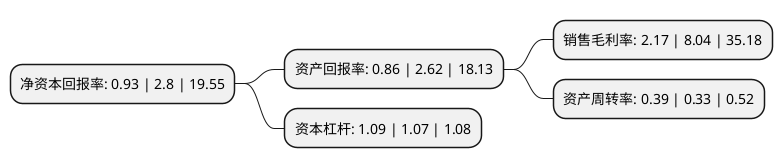

> 本页面由自动化程序生成于 2022年5月20日 01:15
> 内容可能存在错误，如有bug请提交issue至：https://github.com/Eroleice/doc-pi/issues
{.is-warning}

# 上市公司基本情况

## 基本资料

河北建新化工股份有限公司（以下简称“建新股份”）成立于2003年06月27日，沧州市。于2010年08月20日在深交所创业板上市。

建新股份注册资本55,173.107万元，主营业务为苯系中间体产品的生产与销售，产品包括染料中间体，纤维中间体和医药中间体三个系列。主要产品包括“间氨基”，“2，5酸”，“间羟基”和“间氨基苯酚”等。以下是详细信息：

- 公司名称: 河北建新化工股份有限公司
- 股票代码: 300107.SZ
- 所在地: 河北 - 沧州市
- 成立日期: 2003年06月27日
- 注册资本: 55,173.107万元
- 法定代表人: 朱守琛
- 主营业务: 主营业务为苯系中间体产品的生产与销售，产品包括染料中间体，纤维中间体和医药中间体三个系列主要产品包括“间氨基”，“2，5酸”，“间羟基”和“间氨基苯酚”等
- 公司官网: www.jianxinchemical.com
- 公司介绍: 公司是高科技精细化工企业。公司集研发、生产、销售于一体，具有强大的科技创新实力和规模化生产水平。公司研发能力强、主打产品多、市场前景好，拥有自主知识产权的核心技术体系，被评为“河北省企业技术中心”；主营苯系中间体产品的生产，以“间氨基”产品为母核，向下延伸产品链，巩固染料中间体，发展纤维中间体和医药中间体产品，形成了“一链三体”的格局；新型功能性染料在原有ODB2的生产基础上，研发配套产品新型成色剂、显色剂、敏化剂产品，热敏产品具备较强的市场竞争力。公司多次获得“中国化工500强企业”、“中国化工企业综合经济效益500强”、“中国化工化学原料制造业100强”、“2012全国石油和化学工业先进集体”、“2013中国化工百强上市公司”等荣誉称号。

## 股东及高管情况

上市公司第一大股东为朱守琛，持股215,768,643股，占比39.11%，为上市公司实际控制人。

截至2022年03月31日，上市公司的前十大股东中，共有6名自然人股东，4个产品账户，其中5%以上大股东共有2名。上市公司前十大股东明细如下：

> 截至2022年03月31日，上市公司前十大股东信息如下：

| 股东名称 | 持股数量（股） | 持股比例 |
| --- | --- | --- |
| 朱守琛 | 215,768,643 | 39.11% |
| 朱泽瑞 | 35,961,440 | 6.52% |
| 黄吉芬 | 19,978,577 | 3.62% |
| 中国工商银行股份有限公司-富国中证红利指数增强型证券投资基金 | 9,143,700 | 1.66% |
| 陈学为 | 6,573,469 | 1.19% |
| 朱秀全 | 6,453,224 | 1.17% |
| 陈武峰 | 5,957,100 | 1.08% |
| 中国建设银行股份有限公司-大成中证红利指数证券投资基金 | 5,298,492 | 0.96% |
| 基本养老保险基金一零零六组合 | 2,843,906 | 0.52% |
| 中国银行股份有限公司-易方达中证红利交易型开放式指数证券投资基金 | 2,700,600 | 0.49% |

## 杜邦分析

> 数据列示周期：2021年 | 2020年 | 2019年
{.is-info}

上市公司的净资产收益率在近一年有所下降，下降幅度为-66.79%，其变化情况分解如下：
- 上市公司的销售毛利率在近一年下降了-73.01%，可能是生产效率的下降、商品原材料价格上涨或商品价格的下跌所致。
- 上市公司的资产周转率在近一年上升了18.18%，可能是源自于更快的销售回款或库存管理效果提升。
- 上市公司的财务杠杆比率在近一年上升了1.87%，可能是增加负债扩大生产规模。

