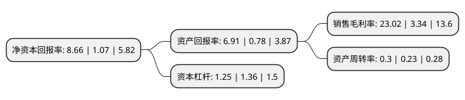

> 本页面由自动化程序生成于 2022年5月20日 01:15
> 内容可能存在错误，如有bug请提交issue至：https://github.com/Eroleice/doc-pi/issues
{.is-warning}

# 上市公司基本情况

## 基本资料

博爱新开源医疗科技集团股份有限公司（以下简称“新开源”）成立于2003年03月13日，焦作市。于2010年08月25日在深交所创业板上市。

新开源注册资本34,361.898万元，主营业务经营药用辅料，聚乙烯吡咯烷酮系列产品及乙烯基甲醚/马来酸酐聚合物产品。公司PVP产品包括PVP K系列，PVP-I，PVPP和PVP/VA共聚物四大系列，四十多个品种，涵盖工业级，化妆品级，食品级和医药级四种规格。从事PVP系列产品的研发，生产和销售。以下是详细信息：

- 公司名称: 博爱新开源医疗科技集团股份有限公司
- 股票代码: 300109.SZ
- 所在地: 河南 - 焦作市
- 成立日期: 2003年03月13日
- 注册资本: 34,361.898万元
- 法定代表人: 张军政
- 主营业务: 主营业务经营药用辅料，聚乙烯吡咯烷酮系列产品及乙烯基甲醚/马来酸酐聚合物产品公司PVP产品包括PVP K系列，PVP-I，PVPP和PVP/VA共聚物四大系列，四十多个品种，涵盖工业级，化妆品级，食品级和医药级四种规格从事PVP系列产品的研发，生产和销售
- 公司官网: www.nkygroup.cn/boai-nky.com
- 公司介绍: 公司是中国最大的PVP制造商，公司主要业务包括精准医疗和精细化工。精准医疗业务的主要产品/服务有：以基因测序为主要技术平台的肿瘤早期筛查、妇女疾病的分子诊断、个体化医疗服务等。精细化工业务的主要生产产品有：聚乙烯吡咯烷酮(PVP)系列以及相关中间体、乙烯基甲醚/马来酸酐共聚物(PVM/MA，欧瑞姿)以及相关中间体、口腔护理相关系列等。公司多项工艺技术改造填补了国内空白，处于国内领先水平。先后取得了ISO9001:2000认证、HACCP认证和Kosher认证，完成了美国FDA食品设施注册和欧洲化学品REACH预注册等市场准入。公司已取得多项实用新型专利，另有多项发明专利申请和实用新型专利申请已为国家知识产权局受理，公司还拥有分步结晶法提纯NVP技术等多项专有技术。

## 股东及高管情况

上市公司第一大股东为王东虎，持股30,663,481股，占比8.92%，**疑似为**上市公司实际控制人。

截至2022年04月14日，上市公司的前十大股东中，共有5名自然人股东，4名机构股东，1个产品账户，其中5%以上大股东共有6名。上市公司前十大股东明细如下：

> 未能通过持股比例判定出上市公司实际控制人（持股30%以上）
> 可能存在通过间接持股、联合持股、协议控制等方式拥有实际控制权的主体，具体请参考上市公司定期公告！
{.is-warning}

> 上市公司第一大股东持股不超过10%，请检查是否存在公司控制权风险！
{.is-danger}

> 截至2022年04月14日，上市公司前十大股东信息如下：

| 股东名称 | 持股数量（股） | 持股比例 |
| --- | --- | --- |
| 王东虎 | 30,663,481 | 8.92% |
| 王东虎 | 30,663,481 | 8.92% |
| 华融天泽投资有限公司 | 21,301,067 | 6.2% |
| 华融天泽投资有限公司 | 21,301,067 | 6.2% |
| 王坚强 | 20,950,177 | 6.1% |
| 芜湖长谦投资中心(有限合伙) | 17,328,591 | 5.043% |
| 赵天 | 9,939,427 | 2.89% |
| 上海周济同历私募基金管理有限公司-天津同历并赢二号企业管理咨询中心(有限合伙) | 3,813,096 | 1.11% |
| 潘庆玲 | 2,990,221 | 0.87% |
| 西藏金和信商贸有限公司 | 2,909,879 | 0.85% |

## 利润表分析

上市公司2021年总收入为12.2亿元，净利润为2.8亿元，实现盈利。

## 杜邦分析

> 数据列示周期：2021年 | 2020年 | 2019年
{.is-info}

上市公司的净资产收益率在近一年有所上升，上升幅度为709.35%，其变化情况分解如下：
- 上市公司的销售毛利率在近一年上升了589.22%，可能是生产效率的提升、商品原材料价格下跌或商品价格的上涨所致。
- 上市公司的资产周转率在近一年上升了30.43%，可能是源自于更快的销售回款或库存管理效果提升。
- 上市公司的财务杠杆比率在近一年下降了-8.09%，可能是减少负债降低财务费用。

