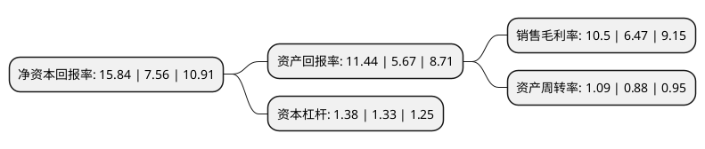

> 本页面由自动化程序生成于 2022年5月20日 01:15
> 内容可能存在错误，如有bug请提交issue至：https://github.com/Eroleice/doc-pi/issues
{.is-warning}

# 上市公司基本情况

## 基本资料

山东阳谷华泰化工股份有限公司（以下简称“阳谷华泰”）成立于2000年03月23日，聊城市。于2010年09月17日在深交所创业板上市。

阳谷华泰注册资本37,513.171万元，主营业务是橡胶助剂的研发，生产，销售。主要产品是橡胶防焦剂CTP，促进剂NS和增塑剂A等橡胶助剂。以下是详细信息：

- 公司名称: 山东阳谷华泰化工股份有限公司
- 股票代码: 300121.SZ
- 所在地: 山东 - 聊城市
- 成立日期: 2000年03月23日
- 注册资本: 37,513.171万元
- 法定代表人: 王文博
- 主营业务: 主营业务是橡胶助剂的研发，生产，销售主要产品是橡胶防焦剂CTP，促进剂NS和增塑剂A等橡胶助剂
- 公司官网: www.yghuatai.com
- 公司介绍: 公司是中国橡胶助剂行业骨干企业、中国橡胶工业协会橡胶助剂专业委员会副理事长单位、国家橡胶助剂工程技术研究中心依托单位、国家高新技术企业。公司主要产品为广泛应用于橡胶、轮胎、胶管、胶带等行业的防焦剂、促进剂、加工助剂、预分散体化学品等种类齐全的橡胶助剂产品。公司曾获“全国民营化工优秀企业”、“省级星火示范企业”等荣誉称号。

## 股东及高管情况

上市公司第一大股东为王传华，持股101,557,010股，占比27.07%，**疑似为**上市公司实际控制人。

截至2022年03月31日，上市公司的前十大股东中，共有3名自然人股东，1名机构股东，6个产品账户，其中5%以上大股东共有2名。上市公司前十大股东明细如下：

> 未能通过持股比例判定出上市公司实际控制人（持股30%以上）
> 可能存在通过间接持股、联合持股、协议控制等方式拥有实际控制权的主体，具体请参考上市公司定期公告！
{.is-warning}

> 截至2022年03月31日，上市公司前十大股东信息如下：

| 股东名称 | 持股数量（股） | 持股比例 |
| --- | --- | --- |
| 王传华 | 101,557,010 | 27.07% |
| 尹月荣 | 34,222,500 | 9.12% |
| 王文博 | 17,716,660 | 4.72% |
| 广发银行股份有限公司-国泰聚信价值优势灵活配置混合型证券投资基金 | 10,300,000 | 2.75% |
| 德邦基金-益安地风2号私募证券投资基金-德邦基金北京益安一号单一资产管理计划 | 6,748,141 | 1.8% |
| 山东阳谷华泰化工股份有限公司-第一期员工持股计划 | 6,116,602 | 1.63% |
| 中国建设银行股份有限公司-国泰大制造两年持有期混合型证券投资基金 | 5,597,100 | 1.49% |
| 泰康人寿保险有限责任公司-投连-优选成长 | 5,170,060 | 1.38% |
| 泰康人寿保险有限责任公司-传统-普通保险产品-019L-CT001深 | 4,820,798 | 1.29% |
| 中国工商银行股份有限公司-诺安先锋混合型证券投资基金 | 4,688,545 | 1.25% |

## 利润表分析

上市公司2021年总收入为27.05亿元，净利润为2.83亿元，实现盈利。

## 杜邦分析

> 数据列示周期：2021年 | 2020年 | 2019年
{.is-info}

上市公司的净资产收益率在近一年有所上升，上升幅度为109.52%，其变化情况分解如下：
- 上市公司的销售毛利率在近一年上升了62.29%，可能是生产效率的提升、商品原材料价格下跌或商品价格的上涨所致。
- 上市公司的资产周转率在近一年上升了23.86%，可能是源自于更快的销售回款或库存管理效果提升。
- 上市公司的财务杠杆比率在近一年上升了3.76%，可能是增加负债扩大生产规模。

