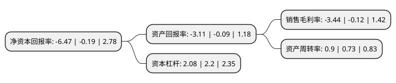

> 本页面由自动化程序生成于 2022年5月20日 01:15
> 内容可能存在错误，如有bug请提交issue至：https://github.com/Eroleice/doc-pi/issues
{.is-warning}

# 上市公司基本情况

## 基本资料

江苏宝利国际投资股份有限公司（以下简称“宝利国际”）成立于2002年11月07日，无锡市。于2010年10月26日在深交所创业板上市。

宝利国际注册资本92,160万元，主营业务为高等级公路新材料的研发，生产和销售，主营产品为通用型改性沥青，高强度结构沥青料，高铁专用乳化沥青，废橡塑改性沥青等专业沥青。以下是详细信息：

- 公司名称: 江苏宝利国际投资股份有限公司
- 股票代码: 300135.SZ
- 所在地: 江苏 - 无锡市
- 成立日期: 2002年11月07日
- 注册资本: 92,160万元
- 法定代表人: 周文彬
- 主营业务: 主营业务为高等级公路新材料的研发，生产和销售，主营产品为通用型改性沥青，高强度结构沥青料，高铁专用乳化沥青，废橡塑改性沥青等专业沥青
- 公司官网: www.baolijt.cn
- 公司介绍: 公司是一家专业生产各类道路复合改性沥青系列产品的高新技术上市公司。公司主打沥青产品广泛应用于高速公路、高铁公路、机场跑道、国道、省道、市政各级公路。且主营范围除了沥青以外，正式涉足航空装备领域、油品贸易领域、海外沥青业务领域、融资租赁业务领域等。沥青主业方面，公司拥有先进的实验、检测设备和仪器，确保产品出厂质量符合相关技术要求。作为高新技术企业，公司一直以科技创新为目标，坚持走产学研合作模式，致力于道路新材料的研发，拥有自主品牌、自主技术、自主知识产权，并取得了欧盟(CE)认证。

## 股东及高管情况

上市公司第一大股东为周德洪，持股282,440,928股，占比30.65%，为上市公司实际控制人。

截至2022年03月31日，上市公司的前十大股东中，共有7名自然人股东，2名机构股东，1个海外主体，其中5%以上大股东共有1名。上市公司前十大股东明细如下：

> 截至2022年03月31日，上市公司前十大股东信息如下：

| 股东名称 | 持股数量（股） | 持股比例 |
| --- | --- | --- |
| 周德洪 | 282,440,928 | 30.65% |
| 周秀凤 | 43,567,200 | 4.73% |
| 欧阳建文 | 8,291,980 | 0.9% |
| 彭凯 | 8,029,900 | 0.87% |
| 中国国际金融香港资产管理有限公司-客户资金2 | 5,073,900 | 0.55% |
| 赵芳华 | 4,194,400 | 0.46% |
| 华泰证券股份有限公司 | 3,998,087 | 0.43% |
| 旷立群 | 3,710,000 | 0.4% |
| 王潮彬 | 3,000,200 | 0.33% |
| JPMORGAN CHASE BANK,NATIONAL ASSOCIATION | 2,823,921 | 0.31% |

## 利润表分析

上市公司2021年总收入为22.82亿元，净利润为-0.79亿元，**未实现盈利**。

## 杜邦分析

> 数据列示周期：2021年 | 2020年 | 2019年
{.is-info}

上市公司的净资产收益率在近一年有所上升，上升幅度为3305.26%，其变化情况分解如下：
- 上市公司的销售毛利率在近一年上升了2766.67%，可能是生产效率的提升、商品原材料价格下跌或商品价格的上涨所致。
- 上市公司的资产周转率在近一年上升了23.29%，可能是源自于更快的销售回款或库存管理效果提升。
- 上市公司的财务杠杆比率在近一年下降了-5.45%，可能是减少负债降低财务费用。

