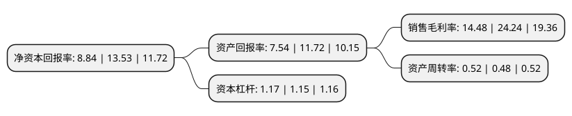

> 本页面由自动化程序生成于 2022年5月20日 01:15
> 内容可能存在错误，如有bug请提交issue至：https://github.com/Eroleice/doc-pi/issues
{.is-warning}

# 上市公司基本情况

## 基本资料

北京高盟新材料股份有限公司（以下简称“高盟新材”）成立于1999年07月22日，北京市。于2011年04月07日在深交所创业板上市。

高盟新材注册资本42,552.443万元，专注于高性能复合聚氨酯胶粘剂，主要从事反应型复合聚氨酯胶粘剂的研发，生产和销售。公司产品种类包括塑料软包装用复合聚氨酯胶粘剂，油墨粘结料，高铁用聚氨酯胶粘剂，反光材料复合用胶粘剂，复膜铁专用胶等几大类一百多种产品。以下是详细信息：

- 公司名称: 北京高盟新材料股份有限公司
- 股票代码: 300200.SZ
- 所在地: 北京 - 北京市
- 成立日期: 1999年07月22日
- 注册资本: 42,552.443万元
- 法定代表人: 陈登雨
- 主营业务: 专注于高性能复合聚氨酯胶粘剂，主要从事反应型复合聚氨酯胶粘剂的研发，生产和销售公司产品种类包括塑料软包装用复合聚氨酯胶粘剂，油墨粘结料，高铁用聚氨酯胶粘剂，反光材料复合用胶粘剂，复膜铁专用胶等几大类一百多种产品
- 公司官网: www.co-mens.com
- 公司介绍: 公司是国内高性能复合聚氨酯胶粘剂行业龙头企业，是软包装复合聚氨酯胶粘剂领域品种最多、规模最大的专业厂家。公司主要从事反应型复合聚氨酯胶粘剂的研发、生产和销售；主要产品包括应用于食品、医药、日化、电子、轻纺等包装领域的耐高温蒸煮系列、抗介质系列、铝箔和镀铝复合系列、各种水煮和耐巴氏杀菌复合系列复合聚氨脂胶粘剂。公司拥有国内领先的复合聚氨酯胶粘剂技术创新开发基地，有一支由行业内一流的技术专家组成的核心研发团队。公司获得过“国家高新技术企业”、“国家火炬计划重点高新技术企业”、“中国包装优秀企业”等荣誉称号；公司产品和品牌被评为“中国包装名牌产品”、“北京市著名商标”。

## 股东及高管情况

上市公司第一大股东为高金技术产业集团有限公司，持股99,423,360股，占比23.36%，**疑似为**上市公司实际控制人。

截至2022年03月31日，上市公司的前十大股东中，共有5名自然人股东，4名机构股东，1个产品账户，其中5%以上大股东共有3名。上市公司前十大股东明细如下：

> 未能通过持股比例判定出上市公司实际控制人（持股30%以上）
> 可能存在通过间接持股、联合持股、协议控制等方式拥有实际控制权的主体，具体请参考上市公司定期公告！
{.is-warning}

> 截至2022年03月31日，上市公司前十大股东信息如下：

| 股东名称 | 持股数量（股） | 持股比例 |
| --- | --- | --- |
| 高金技术产业集团有限公司 | 99,423,360 | 23.36% |
| 广州诚信投资控股有限公司 | 23,045,267 | 5.42% |
| 青岛高盟投资有限公司 | 22,546,982 | 5.3% |
| 武汉汇森投资有限公司 | 16,163,918 | 3.8% |
| 唐小林 | 11,243,522 | 2.64% |
| 胡余友 | 8,275,728 | 1.94% |
| 北京高盟新材料股份有限公司-第一期员工持股计划 | 8,031,638 | 1.89% |
| 王子平 | 8,010,581 | 1.88% |
| 何宇飞 | 1,855,680 | 0.44% |
| 鱼杰 | 1,844,460 | 0.43% |

## 利润表分析

上市公司2021年总收入为10.99亿元，净利润为1.59亿元，实现盈利。

## 杜邦分析

> 数据列示周期：2021年 | 2020年 | 2019年
{.is-info}

上市公司的净资产收益率在近一年有所下降，下降幅度为-34.66%，其变化情况分解如下：
- 上市公司的销售毛利率在近一年下降了-40.26%，可能是生产效率的下降、商品原材料价格上涨或商品价格的下跌所致。
- 上市公司的资产周转率在近一年上升了8.33%，可能是源自于更快的销售回款或库存管理效果提升。
- 上市公司的财务杠杆比率在近一年上升了1.74%，可能是增加负债扩大生产规模。

