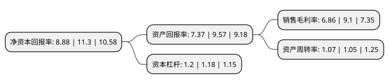

> 本页面由自动化程序生成于 2022年5月20日 01:15
> 内容可能存在错误，如有bug请提交issue至：https://github.com/Eroleice/doc-pi/issues
{.is-warning}

# 上市公司基本情况

## 基本资料

山东日科化学股份有限公司（以下简称“日科化学”）成立于2003年12月26日，潍坊市。于2011年05月11日在深交所创业板上市。

日科化学注册资本47,081.261万元，主营业务为PVC塑料改性剂产品的研发，生产和销售。主要产品是ACR抗冲加工改性剂，AMB抗冲改性剂和ACM低温增韧剂。以下是详细信息：

- 公司名称: 山东日科化学股份有限公司
- 股票代码: 300214.SZ
- 所在地: 山东 - 潍坊市
- 成立日期: 2003年12月26日
- 注册资本: 47,081.261万元
- 法定代表人: 刘大伟
- 主营业务: 主营业务为PVC塑料改性剂产品的研发，生产和销售主要产品是ACR抗冲加工改性剂，AMB抗冲改性剂和ACM低温增韧剂
- 公司官网: www.rikechem.com
- 公司介绍: 公司是国内塑料助剂行业上市企业。公司是集科研、生产、销售和技术服务于一体的高新技术企业，总部位于省级开发区——山东省昌乐经济开发区内，南接胶济铁路，北临济青高速。公司建有山东省塑料改性工程技术研究中心、山东省和潍坊市企业技术中心、博士后工作站，先后承担国家、省、市科技计划多项，获得国家发明专利数项，获得美国发明专利数项。先后荣获山东省专利奖二等奖，山东省技术发明三等奖，行业技术发明奖1项，是“泰山学者”设岗单位。公司现已通过ISO9001、ISO14001和OHSAS18001管理体系认证。

## 股东及高管情况

上市公司第一大股东为赵东日，持股81,785,037股，占比17.37%，**疑似为**上市公司实际控制人。

截至2022年03月31日，上市公司的前十大股东中，共有6名自然人股东，3名机构股东，1个产品账户，其中5%以上大股东共有3名。上市公司前十大股东明细如下：

> 未能通过持股比例判定出上市公司实际控制人（持股30%以上）
> 可能存在通过间接持股、联合持股、协议控制等方式拥有实际控制权的主体，具体请参考上市公司定期公告！
{.is-warning}

> 截至2022年03月31日，上市公司前十大股东信息如下：

| 股东名称 | 持股数量（股） | 持股比例 |
| --- | --- | --- |
| 赵东日 | 81,785,037 | 17.37% |
| 济南鲁民投金湖投资合伙企业(有限合伙) | 62,067,859 | 13.18% |
| 鲁民投基金管理有限公司-鲁民投点金一号私募证券投资基金 | 40,534,951 | 8.61% |
| 山东新科产业投资合伙企业(有限合伙) | 12,539,184 | 2.66% |
| 赵东升 | 7,523,332 | 1.6% |
| 青岛信立百年管理咨询服务有限公司 | 6,269,592 | 1.33% |
| 韩鑫 | 4,861,321 | 1.03% |
| 刘明磊 | 4,358,967 | 0.93% |
| 修海军 | 3,664,500 | 0.78% |
| 杨秀风 | 3,239,688 | 0.69% |

## 利润表分析

上市公司2021年总收入为27.72亿元，净利润为1.9亿元，实现盈利。

## 杜邦分析

> 数据列示周期：2021年 | 2020年 | 2019年
{.is-info}

上市公司的净资产收益率在近一年有所下降，下降幅度为-21.42%，其变化情况分解如下：
- 上市公司的销售毛利率在近一年下降了-24.62%，可能是生产效率的下降、商品原材料价格上涨或商品价格的下跌所致。
- 上市公司的资产周转率在近一年上升了1.9%，可能是源自于更快的销售回款或库存管理效果提升。
- 上市公司的财务杠杆比率在近一年上升了1.69%，可能是增加负债扩大生产规模。

