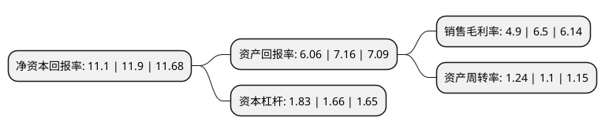

> 本页面由自动化程序生成于 2022年5月20日 01:16
> 内容可能存在错误，如有bug请提交issue至：https://github.com/Eroleice/doc-pi/issues
{.is-warning}

# 上市公司基本情况

## 基本资料

山东瑞丰高分子材料股份有限公司（以下简称“瑞丰高材”）成立于2001年10月26日，淄博市。于2011年07月12日在深交所创业板上市。

瑞丰高材注册资本23,232.285万元，主要从事高性能PVC助剂的研发，生产和销售，产品主要分为PVC加工助剂及抗冲改性剂两大类，包括加工ACR，抗冲ACR及抗冲MBS。以下是详细信息：

- 公司名称: 山东瑞丰高分子材料股份有限公司
- 股票代码: 300243.SZ
- 所在地: 山东 - 淄博市
- 成立日期: 2001年10月26日
- 注册资本: 23,232.285万元
- 法定代表人: 周仕斌
- 主营业务: 主要从事高性能PVC助剂的研发，生产和销售，产品主要分为PVC加工助剂及抗冲改性剂两大类，包括加工ACR，抗冲ACR及抗冲MBS
- 公司官网: www.ruifengchemical.com
- 公司介绍: 公司属国家级高新技术企业。公司主要从事PVC助剂的研发、制造和销售，主导产品为：丙烯酸酯类抗冲改性剂、丙烯酸酯类加工助剂、抗冲改性剂MBS树脂和超高分子量PVC发泡调节剂、抗冲改性剂CPE，PVC润滑剂。产品广泛应用于聚氯乙烯(PVC)门窗、管道、管件、装饰板、发泡板、片材等硬制品。公司通过了ISO9001:2000质量管理体系的认证。

## 股东及高管情况

上市公司第一大股东为周仕斌，持股51,752,197股，占比22.28%，**疑似为**上市公司实际控制人。

截至2022年03月31日，上市公司的前十大股东中，共有9名自然人股东，1个产品账户，其中5%以上大股东共有2名。上市公司前十大股东明细如下：

> 未能通过持股比例判定出上市公司实际控制人（持股30%以上）
> 可能存在通过间接持股、联合持股、协议控制等方式拥有实际控制权的主体，具体请参考上市公司定期公告！
{.is-warning}

> 截至2022年03月31日，上市公司前十大股东信息如下：

| 股东名称 | 持股数量（股） | 持股比例 |
| --- | --- | --- |
| 周仕斌 | 51,752,197 | 22.28% |
| 桑培洲 | 13,011,240 | 5.6% |
| 王功军 | 4,291,913 | 1.85% |
| 蔡成玉 | 3,910,000 | 1.68% |
| 卿明丽 | 2,901,800 | 1.25% |
| 刘春信 | 2,851,640 | 1.23% |
| 蔡志兴 | 2,739,830 | 1.18% |
| 张荣兴 | 2,018,765 | 0.87% |
| 宋志刚 | 1,478,088 | 0.64% |
| 中国工商银行股份有限公司-融通健康产业灵活配置混合型证券投资基金 | 1,438,200 | 0.62% |

## 利润表分析

上市公司2021年总收入为18.58亿元，净利润为0.91亿元，实现盈利。

## 杜邦分析

> 数据列示周期：2021年 | 2020年 | 2019年
{.is-info}

上市公司的净资产收益率在近一年有所下降，下降幅度为-6.72%，其变化情况分解如下：
- 上市公司的销售毛利率在近一年下降了-24.62%，可能是生产效率的下降、商品原材料价格上涨或商品价格的下跌所致。
- 上市公司的资产周转率在近一年上升了12.73%，可能是源自于更快的销售回款或库存管理效果提升。
- 上市公司的财务杠杆比率在近一年上升了10.24%，可能是增加负债扩大生产规模。

