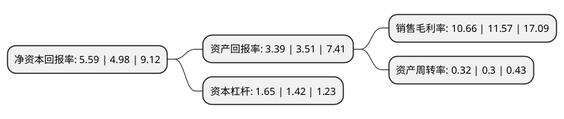

> 本页面由自动化程序生成于 2022年5月20日 01:17
> 内容可能存在错误，如有bug请提交issue至：https://github.com/Eroleice/doc-pi/issues
{.is-warning}

# 上市公司基本情况

## 基本资料

常州强力电子新材料股份有限公司（以下简称“强力新材”）成立于1997年11月22日，常州市。于2015年03月24日在深交所创业板上市。

强力新材注册资本51,526.074万元，主营业务是光刻胶专用化学品的研发，生产和销售及相关贸易业务。主要产品为光刻胶专用化学品，分为光刻胶用光引发剂(包括光增感剂，光致产酸剂等)和光刻胶树脂两大系列。以下是详细信息：

- 公司名称: 常州强力电子新材料股份有限公司
- 股票代码: 300429.SZ
- 所在地: 江苏 - 常州市
- 成立日期: 1997年11月22日
- 注册资本: 51,526.074万元
- 法定代表人: 钱晓春
- 主营业务: 主营业务是光刻胶专用化学品的研发，生产和销售及相关贸易业务主要产品为光刻胶专用化学品，分为光刻胶用光引发剂(包括光增感剂，光致产酸剂等)和光刻胶树脂两大系列
- 公司官网: www.tronly.com
- 公司介绍: 公司是一家以应用研究为导向，立足于产品自主研发创新的高新技术企业，专业从事电子材料领域各类光刻胶专用电子化学品的研发、生产和销售及相关贸易业务。公司主要产品为光刻胶专用化学品，分为光刻胶用光引发剂(包括光增感剂、光致产酸剂等)和光刻胶树脂。公司的产品按照应用领域分类，主要有印制电路板(PCB)光刻胶专用化学品(光引发剂和树脂)、液晶显示器(LCD)光刻胶光引发剂、半导体光刻胶光引发剂及其他用途光引发剂。公司已荣获国家火炬计划重点高新技术企业、江苏省守合同重信用企业等多项荣誉以及高新技术成果转化项目等多个奖项。获得了ISO9001:2008质量管理认证、ISO14001:2004环境管理认证、OHSAS18001:2007职业健康安全管理认证等多项管理认证。

## 股东及高管情况

上市公司第一大股东为钱晓春，持股105,001,175股，占比20.38%，**疑似为**上市公司实际控制人。

截至2022年03月31日，上市公司的前十大股东中，共有8名自然人股东，1名机构股东，1个海外主体，其中5%以上大股东共有2名。上市公司前十大股东明细如下：

> 未能通过持股比例判定出上市公司实际控制人（持股30%以上）
> 可能存在通过间接持股、联合持股、协议控制等方式拥有实际控制权的主体，具体请参考上市公司定期公告！
{.is-warning}

> 截至2022年03月31日，上市公司前十大股东信息如下：

| 股东名称 | 持股数量（股） | 持股比例 |
| --- | --- | --- |
| 钱晓春 | 105,001,175 | 20.38% |
| 管军 | 56,572,388 | 10.98% |
| 钱彬 | 15,386,650 | 2.99% |
| 中信建投证券股份有限公司 | 10,305,000 | 2% |
| 谢斌 | 4,191,273 | 0.81% |
| 陶志仁 | 4,125,316 | 0.8% |
| 管国勤 | 2,605,135 | 0.51% |
| 李军 | 2,412,777 | 0.47% |
| 香港中央结算有限公司(陆股通) | 2,044,566 | 0.4% |
| 钱瑛 | 1,867,509 | 0.36% |

## 利润表分析

上市公司2021年总收入为10.38亿元，净利润为1.1亿元，实现盈利。

## 杜邦分析

> 数据列示周期：2021年 | 2020年 | 2019年
{.is-info}

上市公司的净资产收益率在近一年有所上升，上升幅度为12.25%，其变化情况分解如下：
- 上市公司的销售毛利率在近一年下降了-7.87%，可能是生产效率的下降、商品原材料价格上涨或商品价格的下跌所致。
- 上市公司的资产周转率在近一年上升了6.67%，可能是源自于更快的销售回款或库存管理效果提升。
- 上市公司的财务杠杆比率在近一年上升了16.2%，可能是增加负债扩大生产规模。

