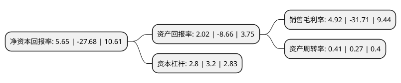

> 本页面由自动化程序生成于 2022年5月20日 01:17
> 内容可能存在错误，如有bug请提交issue至：https://github.com/Eroleice/doc-pi/issues
{.is-warning}

# 上市公司基本情况

## 基本资料

河南清水源科技股份有限公司（以下简称“清水源”）成立于1995年06月08日，济源市。于2015年04月23日在深交所创业板上市。

清水源注册资本25,906.31万元，主营业务为水处理剂的研发，生产与销售。公司是国内规模较大的水处理剂专业生产，研发，服务的厂家之一，主要产品涵盖阻垢剂，分散剂，阻垢缓蚀剂，杀菌防腐剂，金属离子螯合剂，日化助剂，纺织印染助剂，造纸助剂等八大系列六十多种产品，广泛应用于化工，钢铁，电力，污水处理，自来水，纺织，印染，石油，造纸等行业。以下是详细信息：

- 公司名称: 河南清水源科技股份有限公司
- 股票代码: 300437.SZ
- 所在地: 河南 - 济源市
- 成立日期: 1995年06月08日
- 注册资本: 25,906.31万元
- 法定代表人: 王志清
- 主营业务: 主营业务为水处理剂的研发，生产与销售公司是国内规模较大的水处理剂专业生产，研发，服务的厂家之一，主要产品涵盖阻垢剂，分散剂，阻垢缓蚀剂，杀菌防腐剂，金属离子螯合剂，日化助剂，纺织印染助剂，造纸助剂等八大系列六十多种产品，广泛应用于化工，钢铁，电力，污水处理，自来水，纺织，印染，石油，造纸等行业
- 公司官网: www.qywt.com.cn
- 公司介绍: 公司是国内最大的水处理剂专业生产、研发、服务的厂家之一，主要产品涵盖阻垢剂、分散剂、阻垢缓蚀剂、杀菌防腐剂、金属离子螯合剂、日化助剂、纺织印染助剂、造纸助剂等，广泛应用于化工、钢铁、电力、污水处理、自来水、纺织、印染、石油、造纸等行业。公司是国家火炬计划重点高新技术企业、国家级高新技术企业、河南省高成长型企业、省重点服务企业，设有河南省水处理剂工程技术研究中心。公司是中国环境保护产业协会会员、中国化工学会工业水处理专业委员会副主任委员单位、全国化学标准化技术委员会水处理剂分会委员单位、ISO9001、ISO14001、GB/T28001三体系认证企业，拥有四项发明专利和十五项实用新型专利，产品出口到日本、美国、英国、德国、法国、俄罗斯等三十多个国家和地区。

## 股东及高管情况

上市公司第一大股东为王志清，持股95,270,000股，占比36.77%，为上市公司实际控制人。

截至2022年03月31日，上市公司的前十大股东中，共有7名自然人股东，2名机构股东，1个产品账户，其中5%以上大股东共有1名。上市公司前十大股东明细如下：

> 截至2022年03月31日，上市公司前十大股东信息如下：

| 股东名称 | 持股数量（股） | 持股比例 |
| --- | --- | --- |
| 王志清 | 95,270,000 | 36.77% |
| 宋颖标 | 7,000,000 | 2.7% |
| 河南清水源科技股份有限公司-2021年员工持股计划 | 5,002,067 | 1.93% |
| 钟盛 | 4,860,000 | 1.88% |
| 段雪琴 | 4,200,000 | 1.62% |
| 宋勇 | 1,592,600 | 0.61% |
| 河南经纬投资咨询有限公司 | 1,500,000 | 0.58% |
| 杨海星 | 925,000 | 0.36% |
| 李海燕 | 695,275 | 0.27% |
| 华泰金融控股(香港)有限公司-自有资金 | 474,593 | 0.18% |

## 利润表分析

上市公司2021年总收入为16.37亿元，净利润为0.8亿元，实现盈利。

## 杜邦分析

> 数据列示周期：2021年 | 2020年 | 2019年
{.is-info}

上市公司的净资产收益率在近一年有所下降，下降幅度为-120.41%，其变化情况分解如下：
- 上市公司的销售毛利率在近一年下降了-115.52%，可能是生产效率的下降、商品原材料价格上涨或商品价格的下跌所致。
- 上市公司的资产周转率在近一年上升了51.85%，可能是源自于更快的销售回款或库存管理效果提升。
- 上市公司的财务杠杆比率在近一年下降了-12.5%，可能是减少负债降低财务费用。

