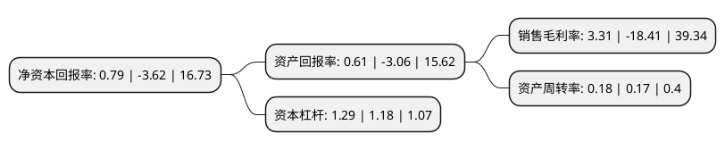

> 本页面由自动化程序生成于 2022年5月20日 01:17
> 内容可能存在错误，如有bug请提交issue至：https://github.com/Eroleice/doc-pi/issues
{.is-warning}

# 上市公司基本情况

## 基本资料

保定乐凯新材料股份有限公司（以下简称“*ST乐材”）成立于2005年02月03日，保定市。于2015年04月23日在深交所创业板上市。

*ST乐材注册资本20,262万元，主营业务为热敏磁票，磁条及磁卡的研发，生产和销售。以下是详细信息：

- 公司名称: 保定乐凯新材料股份有限公司
- 股票代码: 300446.SZ
- 所在地: 河北 - 保定市
- 成立日期: 2005年02月03日
- 注册资本: 20,262万元
- 法定代表人: 张云飞
- 主营业务: 主营业务为热敏磁票，磁条及磁卡的研发，生产和销售
- 公司官网: maginfo.luckyfilm.com.cn
- 公司介绍: 公司是国内信息记录材料行业中同时从事磁记录和热敏记录材料领域的龙头企业。主要产品包括热敏磁票、磁条、磁卡，其中，热敏磁票获得“国家重点新产品证书”、“河北省科技进步二等奖”等多项荣誉；磁条及PET磁卡产品获得河北省科技厅颁发的“高新技术产品证书”。公司为国家认定的高新技术企业，拥有河北省企业技术中心，已掌握先进的磁记录技术、热敏技术、涂布工艺技术，先后承担过多项国家级、省市级重点科研项目，是中国磁记录行业协会秘书处、全国磁记录材料标准化技术委员会秘书处的承担单位。公司在发展过程中不断提升质量管理水平，先后通过了GB/T19001-2008/ISO9001：2008质量管理体系认证和GJB9001B-2009军工产品质量管理体系认证。

## 股东及高管情况

上市公司第一大股东为中国乐凯集团有限公司，持股62,023,754股，占比30.61%，为上市公司实际控制人。

截至2022年03月31日，上市公司的前十大股东中，共有9名自然人股东，1名机构股东，其中5%以上大股东共有1名。上市公司前十大股东明细如下：

> 截至2022年03月31日，上市公司前十大股东信息如下：

| 股东名称 | 持股数量（股） | 持股比例 |
| --- | --- | --- |
| 中国乐凯集团有限公司 | 62,023,754 | 30.61% |
| 刘彦峰 | 3,743,010 | 1.85% |
| 瞿果君 | 2,966,682 | 1.46% |
| 魏巍 | 2,326,565 | 1.15% |
| 李东璘 | 2,035,885 | 1% |
| 毛幼聪 | 1,828,190 | 0.9% |
| 陈武峰 | 1,809,915 | 0.89% |
| 谢胜利 | 1,479,400 | 0.73% |
| 魏娟意 | 1,380,765 | 0.68% |
| 孟晓军 | 1,270,000 | 0.63% |

## 利润表分析

上市公司2021年总收入为1.53亿元，净利润为0.05亿元，实现盈利。

## 杜邦分析

> 数据列示周期：2021年 | 2020年 | 2019年
{.is-info}

上市公司的净资产收益率在近一年有所下降，下降幅度为-121.82%，其变化情况分解如下：
- 上市公司的销售毛利率在近一年下降了-117.98%，可能是生产效率的下降、商品原材料价格上涨或商品价格的下跌所致。
- 上市公司的资产周转率在近一年上升了5.88%，可能是源自于更快的销售回款或库存管理效果提升。
- 上市公司的财务杠杆比率在近一年上升了9.32%，可能是增加负债扩大生产规模。

