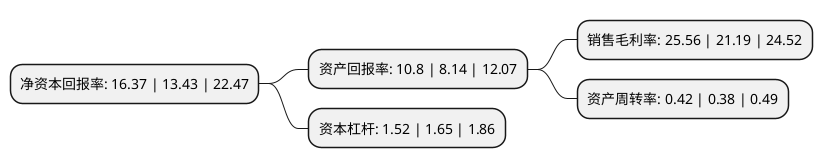

> 本页面由自动化程序生成于 2022年5月20日 01:18
> 内容可能存在错误，如有bug请提交issue至：https://github.com/Eroleice/doc-pi/issues
{.is-warning}

# 上市公司基本情况

## 基本资料

西安蓝晓科技新材料股份有限公司（以下简称“蓝晓科技”）成立于2001年04月05日，西安市。于2015年07月02日在深交所创业板上市。

蓝晓科技注册资本21,967.444万元，主营业务是研发，生产和销售吸附分离树脂并提供应用解决方案。主要产品分为吸附分离树脂和应用装置两大类以下是详细信息：

- 公司名称: 西安蓝晓科技新材料股份有限公司
- 股票代码: 300487.SZ
- 所在地: 陕西 - 西安市
- 成立日期: 2001年04月05日
- 注册资本: 21,967.444万元
- 法定代表人: 高月静
- 主营业务: 主营业务是研发，生产和销售吸附分离树脂并提供应用解决方案主要产品分为吸附分离树脂和应用装置两大类
- 公司官网: www.sunresin.com
- 公司介绍: 公司的主营业务是研发、生产和销售吸附分离树脂并提供应用解决方案。公司提供的吸附分离树脂在下游用户的工艺流程中发挥独特的选择性吸附、分离和纯化等功能，广泛应用于湿法冶金、制药、食品加工、环保、化工和工业水处理等领域。依托强大的技术创新能力，公司以产业化应用为核心，深入细致地研究下游应用领域的技术、工艺发展状况，结合重点应用领域用户的需求，研发和提供吸附分离树脂、工艺和应用技术。公司提供的吸附分离树脂产品和应用解决方案在多个重点应用领域实现了对国外进口材料的替代及原创技术的产业化，推动了相关产业的技术升级。公司产品和服务对于提升下游用户的产品品质、促进工艺革新、降低生产成本起到至关重要的作用，提升了下游用户的核心竞争力，为用户创造了核心价值。

## 股东及高管情况

上市公司第一大股东为寇晓康，持股54,997,105股，占比25.04%，**疑似为**上市公司实际控制人。

截至2022年03月31日，上市公司的前十大股东中，共有6名自然人股东，3个产品账户，1个海外主体，其中5%以上大股东共有3名。上市公司前十大股东明细如下：

> 未能通过持股比例判定出上市公司实际控制人（持股30%以上）
> 可能存在通过间接持股、联合持股、协议控制等方式拥有实际控制权的主体，具体请参考上市公司定期公告！
{.is-warning}

> 截至2022年03月31日，上市公司前十大股东信息如下：

| 股东名称 | 持股数量（股） | 持股比例 |
| --- | --- | --- |
| 寇晓康 | 54,997,105 | 25.04% |
| 田晓军 | 34,200,000 | 15.57% |
| 高月静 | 29,097,305 | 13.25% |
| 香港中央结算有限公司(陆股通) | 3,723,595 | 1.7% |
| 苏碧梧 | 3,241,700 | 1.48% |
| 关利敏 | 2,194,700 | 1% |
| 全国社保基金一一四组合 | 1,800,000 | 0.82% |
| 上海盘京投资管理中心(有限合伙)-盛信2期私募证券投资基金 | 1,663,099 | 0.76% |
| 雷立明 | 1,421,719 | 0.65% |
| 大成价值增长证券投资基金 | 1,261,541 | 0.57% |

## 利润表分析

上市公司2021年总收入为11.94亿元，净利润为3.05亿元，实现盈利。

## 杜邦分析

> 数据列示周期：2021年 | 2020年 | 2019年
{.is-info}

上市公司的净资产收益率在近一年有所上升，上升幅度为21.89%，其变化情况分解如下：
- 上市公司的销售毛利率在近一年上升了20.62%，可能是生产效率的提升、商品原材料价格下跌或商品价格的上涨所致。
- 上市公司的资产周转率在近一年上升了10.53%，可能是源自于更快的销售回款或库存管理效果提升。
- 上市公司的财务杠杆比率在近一年下降了-7.88%，可能是减少负债降低财务费用。

