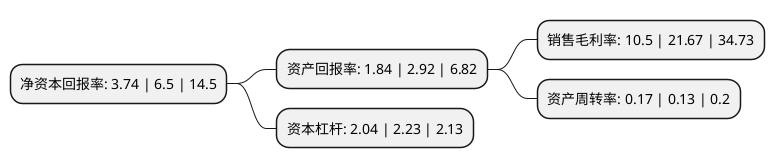

> 本页面由自动化程序生成于 2022年5月20日 01:18
> 内容可能存在错误，如有bug请提交issue至：https://github.com/Eroleice/doc-pi/issues
{.is-warning}

# 上市公司基本情况

## 基本资料

深圳市星源材质科技股份有限公司（以下简称“星源材质”）成立于2003年09月17日，深圳市。于2016年12月01日在深交所创业板上市。

星源材质注册资本76,840.85万元，主营业务:专业从事锂离子电池隔膜研发，生产及销售的新能源，新材料和新能源汽车领域的国家级高新技术企业。公司锂离子电池隔膜包括单层隔膜，双层隔膜和多层隔膜等规格较为齐全的产品系列。以下是详细信息：

- 公司名称: 深圳市星源材质科技股份有限公司
- 股票代码: 300568.SZ
- 所在地: 广东 - 深圳市
- 成立日期: 2003年09月17日
- 注册资本: 76,840.85万元
- 法定代表人: 陈秀峰
- 主营业务: 主营业务:专业从事锂离子电池隔膜研发，生产及销售的新能源，新材料和新能源汽车领域的国家级高新技术企业公司锂离子电池隔膜包括单层隔膜，双层隔膜和多层隔膜等规格较为齐全的产品系列
- 公司官网: www.senior798.com
- 公司介绍: 公司是中国战略新兴产业新能源材料领域的国家级高新技术企业，是全球第一家提出“动力锂电池隔膜”概念的国家火炬计划重点高新技术企业，是中国第一家打破国外垄断的锂电池隔膜干法单拉技术的企业，是中国第一家产品批量出口海外市场的锂电池隔膜制造企业，是中国第一家同时拥有锂电池隔膜干法、湿法和涂覆制备技术的企业，是中国拥有隔膜制备专利技术最多的锂电池隔膜企业，是中国第一家以隔膜为主营业务登陆资本市场的企业。公司专业从事锂离子电池隔膜研发,生产及销售的新能源,新材料和新能源汽车领域的国家级高新技术企业.公司锂离子电池隔膜包括单层隔膜,双层隔膜和多层隔膜等规格较为齐全的产品系列。公司先后完成了ISO9001质量管理体系认证、ISO14001环境管理体系认证、汽车行业ISO/TS16949质量标准体系认证，并正在建立德国汽车工业协会VDA6.3的过程审核标准以及日本索尼有害物质管理体系(GP),持续打造国际一流品质。

## 股东及高管情况

上市公司第一大股东为陈秀峰，持股112,454,213股，占比14.64%，**疑似为**上市公司实际控制人。

截至2022年03月31日，上市公司的前十大股东中，共有2名自然人股东，2名机构股东，5个产品账户，1个海外主体，其中5%以上大股东共有2名。上市公司前十大股东明细如下：

> 未能通过持股比例判定出上市公司实际控制人（持股30%以上）
> 可能存在通过间接持股、联合持股、协议控制等方式拥有实际控制权的主体，具体请参考上市公司定期公告！
{.is-warning}

> 截至2022年03月31日，上市公司前十大股东信息如下：

| 股东名称 | 持股数量（股） | 持股比例 |
| --- | --- | --- |
| 陈秀峰 | 112,454,213 | 14.64% |
| 香港中央结算有限公司(陆股通) | 38,907,921 | 5.06% |
| 中国工商银行股份有限公司-前海开源新经济灵活配置混合型证券投资基金 | 19,120,362 | 2.49% |
| 中国建设银行股份有限公司-前海开源公用事业行业股票型证券投资基金 | 17,257,241 | 2.25% |
| 陈良 | 16,200,972 | 2.11% |
| 深圳市速源控股集团有限公司 | 16,030,063 | 2.09% |
| 深圳市速源投资企业(有限合伙) | 12,878,383 | 1.68% |
| 中国邮政储蓄银行股份有限公司-东方新能源汽车主题混合型证券投资基金 | 9,533,117 | 1.24% |
| 深圳市远致富海投资管理有限公司-深圳远致富海并购股权投资基金合伙企业(有限合伙) | 7,683,641 | 1% |
| 上海浦东发展银行股份有限公司-景顺长城新能源产业股票型证券投资基金 | 7,588,792 | 0.99% |

## 利润表分析

上市公司2021年总收入为18.6亿元，净利润为2.85亿元，实现盈利。

## 杜邦分析

> 数据列示周期：2020年 | 2019年 | 2018年
{.is-info}

上市公司的净资产收益率在近一年有所下降，下降幅度为-42.46%，其变化情况分解如下：
- 上市公司的销售毛利率在近一年下降了-51.55%，可能是生产效率的下降、商品原材料价格上涨或商品价格的下跌所致。
- 上市公司的资产周转率在近一年上升了30.77%，可能是源自于更快的销售回款或库存管理效果提升。
- 上市公司的财务杠杆比率在近一年下降了-8.52%，可能是减少负债降低财务费用。

