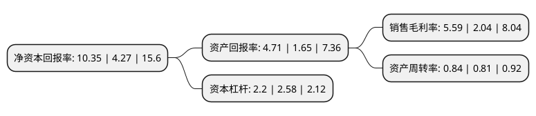

> 本页面由自动化程序生成于 2022年5月20日 01:18
> 内容可能存在错误，如有bug请提交issue至：https://github.com/Eroleice/doc-pi/issues
{.is-warning}

# 上市公司基本情况

## 基本资料

广东美联新材料股份有限公司（以下简称“美联新材”）成立于2000年06月20日，汕头市。于2017年01月04日在深交所创业板上市。

美联新材注册资本52,448.179万元，公司主要从事高分子复合着色材料的研发，生产，销售和技术服务，为客户提供塑料着色一体化解决方案。公司主要产品为色母粒，复配色粉和色胶粒，其中色母粒是公司的核心产品，主要包括白色母粒，黑色母粒，彩色母粒。以下是详细信息：

- 公司名称: 广东美联新材料股份有限公司
- 股票代码: 300586.SZ
- 所在地: 广东 - 汕头市
- 成立日期: 2000年06月20日
- 注册资本: 52,448.179万元
- 法定代表人: 黄伟汕
- 主营业务: 公司主要从事高分子复合着色材料的研发，生产，销售和技术服务，为客户提供塑料着色一体化解决方案公司主要产品为色母粒，复配色粉和色胶粒，其中色母粒是公司的核心产品，主要包括白色母粒，黑色母粒，彩色母粒
- 公司官网: www.malion.cn
- 公司介绍: 公司是一家集研发、制造、销售、服务于一体的国家高新技术企业，座落于美丽的海滨城市——汕头。公司主营白色母粒、黑色母粒、彩色母粒、功能母粒及功能新材料，共五大类型，产品广泛应用于食品包装、医用包装、个人护理材料、塑料管材、工程塑料、塑料家居用品、电线电缆、家用电器、日用轻工、汽车、农业等多个领域。凭借多年积淀的经验、借助先进的技术和完善的管理体系，公司已为国内外众多客户提供聚合体的着色和改性“全系列”一体化解决方案。公司通过了中国质量认证中心(CQC)ISO9001质量管理体系认证及ISO14001环境管理体系认证。公司先后荣获了“国家高新技术企业”、“广东省民营科技企业”、“广东省战略性新兴产业骨干企业”等殊荣，建有“省级工程技术中心”和“省级企业技术中心”，拥有多项具有自主知识产权的国家发明专利和广东省高新技术产品、广东省自主创新产品、广东省重点新产品等核心技术和核心新产品。

## 股东及高管情况

上市公司第一大股东为黄伟汕，持股178,030,000股，占比33.94%，为上市公司实际控制人。

截至2022年04月21日，上市公司的前十大股东中，共有8名自然人股东，1名机构股东，1个产品账户，其中5%以上大股东共有6名。上市公司前十大股东明细如下：

> 截至2022年04月21日，上市公司前十大股东信息如下：

| 股东名称 | 持股数量（股） | 持股比例 |
| --- | --- | --- |
| 黄伟汕 | 178,030,000 | 33.94% |
| 黄伟汕 | 178,030,000 | 33.94% |
| 张盛业 | 48,740,090 | 9.29% |
| 张盛业 | 48,630,090 | 9.272% |
| 张朝益 | 41,819,000 | 7.97% |
| 张朝益 | 41,819,000 | 7.97% |
| 吴晓琪 | 11,562,300 | 2.2% |
| 共青城卓璞投资合伙企业(有限合伙) | 11,470,688 | 2.19% |
| 方正和生投资有限责任公司-铜陵和生产业发展基金合伙企业(有限合伙) | 4,608,680 | 0.88% |
| 方丹丹 | 3,382,352 | 0.64% |

## 利润表分析

上市公司2021年总收入为18.8亿元，净利润为1.05亿元，实现盈利。

## 杜邦分析

> 数据列示周期：2021年 | 2020年 | 2019年
{.is-info}

上市公司的净资产收益率在近一年有所上升，上升幅度为142.39%，其变化情况分解如下：
- 上市公司的销售毛利率在近一年上升了174.02%，可能是生产效率的提升、商品原材料价格下跌或商品价格的上涨所致。
- 上市公司的资产周转率在近一年上升了3.7%，可能是源自于更快的销售回款或库存管理效果提升。
- 上市公司的财务杠杆比率在近一年下降了-14.73%，可能是减少负债降低财务费用。

