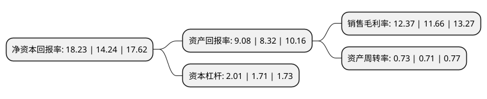

> 本页面由自动化程序生成于 2022年5月20日 01:19
> 内容可能存在错误，如有bug请提交issue至：https://github.com/Eroleice/doc-pi/issues
{.is-warning}

# 上市公司基本情况

## 基本资料

天津利安隆新材料股份有限公司（以下简称“利安隆”）成立于2003年08月08日，天津市。于2017年01月19日在深交所创业板上市。

利安隆注册资本20,501.042万元，主营业务:高分子材料抗老化化学助剂的研发，生产，销售及相关服务;主要产品:抗氧化剂，光稳定剂和U-PACK产品。以下是详细信息：

- 公司名称: 天津利安隆新材料股份有限公司
- 股票代码: 300596.SZ
- 所在地: 天津 - 天津市
- 成立日期: 2003年08月08日
- 注册资本: 20,501.042万元
- 法定代表人: 李海平
- 主营业务: 主营业务:高分子材料抗老化化学助剂的研发，生产，销售及相关服务;主要产品:抗氧化剂，光稳定剂和U-PACK产品
- 公司官网: www.rianlon.com
- 公司介绍: 公司是全球领先的高分子材料抗老化助剂产品和技术供应商、国家级高新技术企业，主要产品有抗氧化剂、光稳定剂和整体解决方案复配产品U-pack。公司的研究院，有工艺工程研究所和应用技术研究所，基于各种化学基础科学研究、各类高分子材料助剂生产工艺创新、助剂新产品研究、应用技术研究和工业转化技术研究为一体。公司还有完整的ISO9001质控体系，有严格的质控程序和手段保证对产品的各项指标进行实时监控，而且还有很多高于同行业标准的创新内控措施，确保品质达到一流。

## 股东及高管情况

上市公司第一大股东为天津利安隆科技集团有限公司，持股32,461,290股，占比14.752%，**疑似为**上市公司实际控制人。

截至2022年05月13日，上市公司的前十大股东中，共有3名自然人股东，5名机构股东，2个产品账户，其中5%以上大股东共有6名。上市公司前十大股东明细如下：

> 未能通过持股比例判定出上市公司实际控制人（持股30%以上）
> 可能存在通过间接持股、联合持股、协议控制等方式拥有实际控制权的主体，具体请参考上市公司定期公告！
{.is-warning}

> 截至2022年05月13日，上市公司前十大股东信息如下：

| 股东名称 | 持股数量（股） | 持股比例 |
| --- | --- | --- |
| 天津利安隆科技集团有限公司 | 32,461,290 | 14.752% |
| 天津利安隆科技集团有限公司 | 32,461,290 | 15.834% |
| 利安隆国际集团有限公司 | 25,059,240 | 11.3881% |
| 利安隆国际集团有限公司 | 25,059,240 | 12.2234% |
| 天津聚鑫隆股权投资基金合伙企业(有限合伙) | 15,784,409 | 7.1732% |
| 天津聚鑫隆股权投资基金合伙企业(有限合伙) | 15,784,409 | 7.6993% |
| 圣金隆 | 6,244,556 | 3.046% |
| 广州廷博创业投资有限公司 | 4,347,000 | 2.1204% |
| 王志奎 | 4,228,584 | 2.0626% |
| 梁玉生 | 3,710,418 | 1.8099% |

## 利润表分析

上市公司2021年总收入为34.44亿元，净利润为4.26亿元，实现盈利。

## 杜邦分析

> 数据列示周期：2021年 | 2020年 | 2019年
{.is-info}

上市公司的净资产收益率在近一年有所上升，上升幅度为28.02%，其变化情况分解如下：
- 上市公司的销售毛利率在近一年上升了6.09%，可能是生产效率的提升、商品原材料价格下跌或商品价格的上涨所致。
- 上市公司的资产周转率在近一年上升了2.82%，可能是源自于更快的销售回款或库存管理效果提升。
- 上市公司的财务杠杆比率在近一年上升了17.54%，可能是增加负债扩大生产规模。

