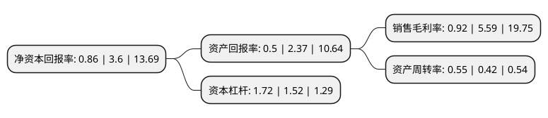

> 本页面由自动化程序生成于 2022年5月20日 01:19
> 内容可能存在错误，如有bug请提交issue至：https://github.com/Eroleice/doc-pi/issues
{.is-warning}

# 上市公司基本情况

## 基本资料

浙江扬帆新材料股份有限公司（以下简称“扬帆新材”）成立于2002年12月24日，绍兴市。于2017年04月12日在深交所创业板上市。

扬帆新材注册资本23,475.013万元，主要从事光引发剂，巯基化合物及衍生物等精细化工新材料的研发，生产和销售，主要产品为光引发剂907，巯基化合物系列产品等以下是详细信息：

- 公司名称: 浙江扬帆新材料股份有限公司
- 股票代码: 300637.SZ
- 所在地: 浙江 - 绍兴市
- 成立日期: 2002年12月24日
- 注册资本: 23,475.013万元
- 法定代表人: 樊彬
- 主营业务: 主要从事光引发剂，巯基化合物及衍生物等精细化工新材料的研发，生产和销售，主要产品为光引发剂907，巯基化合物系列产品等
- 公司官网: www.zjyfxc.com
- 公司介绍: 公司专业从事紫外光固化新材料和含硫精细化工新材料的研发、生产和销售的中国A股创业板上市公司。“寿尔福化学”是公司在化工领域的专用品牌。907、369、TPO、184、ITX、BMS等是公司主要光引发剂产品，主要用于UV涂料、UV油墨、PCB抗蚀剂等方面的紫外光固化。他们能使电子线路板绝缘涂料、木器涂料、皮革油墨、丝印油墨、柔性油墨等涂层在特定波长的紫外光灯照射下快速固化，同时避免了溶剂挥发对环境的影响，更加环保和健康。含硫精细化工产品，除了作为光引发剂的关键原料外，还广泛应用于医药、农药、电子化学品等方面。公司长期以来与多家高校进行紧密合作和技术研发，强大的研发力量为新产品开发、向新领域拓展、为客户定制产品提供了有力的技术保障。公司非常重视对质量、安全和环保方面的严格管理，先后通过了ISO9001质量管理体系认证、ISO14001环境管理体系认证、OHSAS18001职业健康安全管理体系认证。经过多年的发展，公司形成了“仁德创富，成己惠人”的独特企业文化。

## 股东及高管情况

上市公司第一大股东为浙江扬帆控股集团有限公司，持股55,606,200股，占比23.69%，**疑似为**上市公司实际控制人。

截至2022年03月31日，上市公司的前十大股东中，共有4名自然人股东，3名机构股东，1个产品账户，2个海外主体，其中5%以上大股东共有3名。上市公司前十大股东明细如下：

> 未能通过持股比例判定出上市公司实际控制人（持股30%以上）
> 可能存在通过间接持股、联合持股、协议控制等方式拥有实际控制权的主体，具体请参考上市公司定期公告！
{.is-warning}

> 截至2022年03月31日，上市公司前十大股东信息如下：

| 股东名称 | 持股数量（股） | 持股比例 |
| --- | --- | --- |
| 浙江扬帆控股集团有限公司 | 55,606,200 | 23.69% |
| SFCCO.,LTD. | 37,175,400 | 15.84% |
| SFC CO., LTD. | 37,175,400 | 15.84% |
| 宁波新帆投资管理有限公司 | 10,755,460 | 4.58% |
| 王云友 | 7,972,800 | 3.4% |
| 宁波益进凡投资管理合伙企业(有限合伙) | 4,103,200 | 1.75% |
| 上海通怡投资管理有限公司-通怡梧桐23号私募证券投资基金 | 2,022,960 | 0.86% |
| 洪幼琴 | 1,557,850 | 0.66% |
| 陈蓉 | 1,280,800 | 0.55% |
| 陈蝶虹 | 952,100 | 0.41% |

## 利润表分析

上市公司2021年总收入为7.2亿元，净利润为0.06亿元，实现盈利。

## 杜邦分析

> 数据列示周期：2021年 | 2020年 | 2019年
{.is-info}

上市公司的净资产收益率在近一年有所下降，下降幅度为-76.11%，其变化情况分解如下：
- 上市公司的销售毛利率在近一年下降了-83.54%，可能是生产效率的下降、商品原材料价格上涨或商品价格的下跌所致。
- 上市公司的资产周转率在近一年上升了30.95%，可能是源自于更快的销售回款或库存管理效果提升。
- 上市公司的财务杠杆比率在近一年上升了13.16%，可能是增加负债扩大生产规模。

