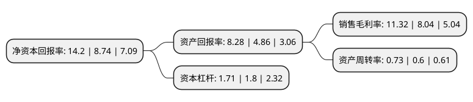

> 本页面由自动化程序生成于 2022年5月20日 01:19
> 内容可能存在错误，如有bug请提交issue至：https://github.com/Eroleice/doc-pi/issues
{.is-warning}

# 上市公司基本情况

## 基本资料

晶瑞电子材料股份有限公司（以下简称“晶瑞电材”）成立于2001年11月29日，苏州市。于2017年05月23日在深交所创业板上市。

晶瑞电材注册资本34,668.289万元，主要产品:超净高纯试剂，光刻胶，功能性材料，锂电池粘结剂，食品级消毒剂过氧乙酸;主营业务:公司是一家专业从事微电子化学品的产品研发，生产和销售的高新技术企业，主要生产四大类微电子化学品，应用到五大下游行业:主导产品包括超净高纯试剂，光刻胶，功能性材料和锂电池粘结剂四大类微电子化学品，广泛应用于半导体，光伏太阳能电池，LED，平板显示和锂电池等五大新兴行业。以下是详细信息：

- 公司名称: 晶瑞电子材料股份有限公司
- 股票代码: 300655.SZ
- 所在地: 江苏 - 苏州市
- 成立日期: 2001年11月29日
- 注册资本: 34,668.289万元
- 法定代表人: 吴天舒
- 主营业务: 主要产品:超净高纯试剂，光刻胶，功能性材料，锂电池粘结剂，食品级消毒剂过氧乙酸;主营业务:公司是一家专业从事微电子化学品的产品研发，生产和销售的高新技术企业，主要生产四大类微电子化学品，应用到五大下游行业:主导产品包括超净高纯试剂，光刻胶，功能性材料和锂电池粘结剂四大类微电子化学品，广泛应用于半导体，光伏太阳能电池，LED，平板显示和锂电池等五大新兴行业
- 公司官网: www.jingrui-chem.com.cn
- 公司介绍: 苏州晶瑞化学股份有限公司(SCCC)2001.11.29注册成立，位于苏州市吴中经济开发区澄湖东路，是一家生产销售微电子业用超纯化学材料和其他精细化工产品的上市企业。品种包括氢氟酸、过氧化氢、氨水、盐酸、硫酸、硝酸、异丙醇、冰醋酸、混合酸(硅腐蚀液、铝腐蚀液、铬腐蚀液、BOE、金蚀刻液)氢氧化钾、氢氧化钠、配套试剂等。目前主要产品的纯度为，单项金属杂质含量小于0.1ppb。产品广泛应用于超大规模集成电路、LED、TFT-LCD面板制造过程、太阳能硅片的蚀刻与清洗。

## 股东及高管情况

上市公司第一大股东为新银国际有限公司，持股57,567,725股，占比16.61%，**疑似为**上市公司实际控制人。

截至2022年03月31日，上市公司的前十大股东中，共有6名自然人股东，1名机构股东，3个产品账户，其中5%以上大股东共有2名。上市公司前十大股东明细如下：

> 未能通过持股比例判定出上市公司实际控制人（持股30%以上）
> 可能存在通过间接持股、联合持股、协议控制等方式拥有实际控制权的主体，具体请参考上市公司定期公告！
{.is-warning}

> 截至2022年03月31日，上市公司前十大股东信息如下：

| 股东名称 | 持股数量（股） | 持股比例 |
| --- | --- | --- |
| 新银国际有限公司 | 57,567,725 | 16.61% |
| 李虎林 | 21,150,211 | 6.1% |
| 徐萍 | 15,864,509 | 4.58% |
| 中国工商银行股份有限公司-诺安成长混合型证券投资基金 | 13,839,381 | 3.99% |
| 苏钢 | 6,961,338 | 2.01% |
| 中国银行股份有限公司-国投瑞银新能源混合型证券投资基金 | 6,037,008 | 1.74% |
| 许宁 | 5,732,362 | 1.65% |
| 吴天舒 | 5,445,695 | 1.57% |
| 徐成中 | 4,580,583 | 1.32% |
| 中国建设银行股份有限公司-国投瑞银先进制造混合型证券投资基金 | 4,203,698 | 1.21% |

## 利润表分析

上市公司2021年总收入为18.32亿元，净利润为2.07亿元，实现盈利。

## 杜邦分析

> 数据列示周期：2021年 | 2020年 | 2019年
{.is-info}

上市公司的净资产收益率在近一年有所上升，上升幅度为62.47%，其变化情况分解如下：
- 上市公司的销售毛利率在近一年上升了40.8%，可能是生产效率的提升、商品原材料价格下跌或商品价格的上涨所致。
- 上市公司的资产周转率在近一年上升了21.67%，可能是源自于更快的销售回款或库存管理效果提升。
- 上市公司的财务杠杆比率在近一年下降了-5%，可能是减少负债降低财务费用。

