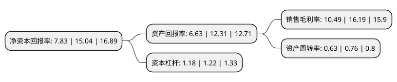

> 本页面由自动化程序生成于 2022年5月20日 01:19
> 内容可能存在错误，如有bug请提交issue至：https://github.com/Eroleice/doc-pi/issues
{.is-warning}

# 上市公司基本情况

## 基本资料

北京中石伟业科技股份有限公司（以下简称“中石科技”）成立于1997年04月10日，北京市。于2017年12月27日在深交所创业板上市。

中石科技注册资本28,092.995万元，导热材料，EMI屏蔽材料，电源滤波器的研发，设计，生产，销售与技术服务以下是详细信息：

- 公司名称: 北京中石伟业科技股份有限公司
- 股票代码: 300684.SZ
- 所在地: 北京 - 北京市
- 成立日期: 1997年04月10日
- 注册资本: 28,092.995万元
- 法定代表人: 吴晓宁
- 主营业务: 导热材料，EMI屏蔽材料，电源滤波器的研发，设计，生产，销售与技术服务
- 公司官网: www.jones-corp.com
- 公司介绍: 公司是一家致力于使用自主研发的导热/导电功能高分子技术和电源滤波技术提高电子设备可靠性的专业化企业。产品涵盖热管理材料、人工合成石墨材料、电磁屏蔽及IP密封材料、EMI滤波器、信号滤波器、EMI/EMC设计咨询和整改等众多业务领域，并具备服务于智能终端、通讯设备、新能源汽车、电子电力、机械制造、轨道交通等行业的产品优势，可持续为客户提供有竞争力的热管理及电磁兼容全面解决方案。公司先后通过了ISO9001质量管理体系认证、ISO14001环境管理体系认证、OHSAS18001(ISO45001)职业健康安全管理体系认证、QC080000电气和电子元器件和产品有害物质过程管理体系；同时还获得了国家高新技术企业证书、中关村高新技术企业证书、AEO高级认证等证书；并拥有国际权威机构认证并授权的测试平台，及多家国内外知名客户的审核。凭借服务国际化客户积累的一整套独有的管理体系，从而为“JONES制造”添加了更高标准的品质承诺。

## 股东及高管情况

上市公司第一大股东为吴晓宁，持股60,148,378股，占比21.42%，**疑似为**上市公司实际控制人。

截至2022年03月31日，上市公司的前十大股东中，共有5名自然人股东，4名机构股东，1个海外主体，其中5%以上大股东共有3名。上市公司前十大股东明细如下：

> 未能通过持股比例判定出上市公司实际控制人（持股30%以上）
> 可能存在通过间接持股、联合持股、协议控制等方式拥有实际控制权的主体，具体请参考上市公司定期公告！
{.is-warning}

> 截至2022年03月31日，上市公司前十大股东信息如下：

| 股东名称 | 持股数量（股） | 持股比例 |
| --- | --- | --- |
| 吴晓宁 | 60,148,378 | 21.42% |
| 叶露 | 59,429,637 | 21.16% |
| HAN WU | 14,510,800 | 5.17% |
| 北京盛景未名创业投资中心(有限合伙) | 8,512,456 | 3.03% |
| 深圳市创新投资集团有限公司 | 3,746,336 | 1.33% |
| 无锡市金投宜创产业投资合伙企业(有限合伙) | 2,046,169 | 0.73% |
| 陈曲 | 1,418,456 | 0.51% |
| 朱光福 | 1,150,930 | 0.41% |
| 黄春芳 | 1,102,300 | 0.39% |
| 华能贵诚信托有限公司 | 1,049,317 | 0.37% |

## 利润表分析

上市公司2021年总收入为12.47亿元，净利润为1.3亿元，实现盈利。

## 杜邦分析

> 数据列示周期：2021年 | 2020年 | 2019年
{.is-info}

上市公司的净资产收益率在近一年有所下降，下降幅度为-47.94%，其变化情况分解如下：
- 上市公司的销售毛利率在近一年下降了-35.21%，可能是生产效率的下降、商品原材料价格上涨或商品价格的下跌所致。
- 上市公司的资产周转率在近一年下降了-17.11%，可能是源自于更慢的销售回款或库存管理效果下降。
- 上市公司的财务杠杆比率在近一年下降了-3.28%，可能是减少负债降低财务费用。

