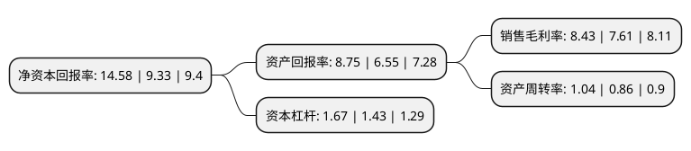

> 本页面由自动化程序生成于 2022年5月20日 01:20
> 内容可能存在错误，如有bug请提交issue至：https://github.com/Eroleice/doc-pi/issues
{.is-warning}

# 上市公司基本情况

## 基本资料

宁波润禾高新材料科技股份有限公司（以下简称“润禾材料”）成立于2000年12月06日，宁波市。于2017年11月27日在深交所创业板上市。

润禾材料注册资本12,688万元，有机硅深加工产品及纺织印染助剂产品研发，生产和销售。以下是详细信息：

- 公司名称: 宁波润禾高新材料科技股份有限公司
- 股票代码: 300727.SZ
- 所在地: 浙江 - 宁波市
- 成立日期: 2000年12月06日
- 注册资本: 12,688万元
- 法定代表人: 叶剑平
- 主营业务: 有机硅深加工产品及纺织印染助剂产品研发，生产和销售
- 公司官网: www.chinarunhe.com
- 公司介绍: 公司是专业从事纺织印染助剂的研发、生产的国家高新技术企业。公司于2000年成立至今，经过健康、快速的发展，现已成为国内知名嵌段硅油、丝光平滑剂、纺织印染助剂供应商。公司现已拥有一支技术精湛、专业过硬的科技队伍。每年公司都将不断引进在相关领域具有资深阅历的高级技术人员，同时与武汉科技学院合作建立了研究生教育创新基地和大学生就业实习基地。有了雄厚的技术保障，才有公司产品的不断革新。在纺织的后整理助剂方面，公司续写着“卓越的手感风格整理专家”的辉煌，在羊绒超爽滑整理方面获得了突破、在涤纶织物的蓬松柔软也取得了进展；在纺织印染助剂的方面，新型的无醛固色剂、多功能精炼剂、代用碱都达到了国内领先水平。

## 股东及高管情况

上市公司第一大股东为浙江润禾控股有限公司，持股52,591,630股，占比41.45%，为上市公司实际控制人。

截至2022年03月31日，上市公司的前十大股东中，共有6名自然人股东，3名机构股东，1个产品账户，其中5%以上大股东共有3名。上市公司前十大股东明细如下：

> 截至2022年03月31日，上市公司前十大股东信息如下：

| 股东名称 | 持股数量（股） | 持股比例 |
| --- | --- | --- |
| 浙江润禾控股有限公司 | 52,591,630 | 41.45% |
| 叶剑平 | 14,582,906 | 11.49% |
| 宁海协润投资合伙企业(有限合伙) | 9,830,729 | 7.75% |
| 俞彩娟 | 3,614,385 | 2.85% |
| 宁海咏春投资合伙企业(有限合伙) | 2,529,271 | 1.99% |
| 麻金翠 | 1,041,690 | 0.82% |
| 宁波仁庆私募基金管理有限公司-仁庆2号私募证券投资基金 | 989,050 | 0.78% |
| 瞿运 | 410,000 | 0.32% |
| 葛绍辉 | 400,000 | 0.32% |
| 吕亚琴 | 286,500 | 0.23% |

## 利润表分析

上市公司2021年总收入为11.03亿元，净利润为0.93亿元，实现盈利。

## 杜邦分析

> 数据列示周期：2021年 | 2020年 | 2019年
{.is-info}

上市公司的净资产收益率在近一年有所上升，上升幅度为56.27%，其变化情况分解如下：
- 上市公司的销售毛利率在近一年上升了10.78%，可能是生产效率的提升、商品原材料价格下跌或商品价格的上涨所致。
- 上市公司的资产周转率在近一年上升了20.93%，可能是源自于更快的销售回款或库存管理效果提升。
- 上市公司的财务杠杆比率在近一年上升了16.78%，可能是增加负债扩大生产规模。

