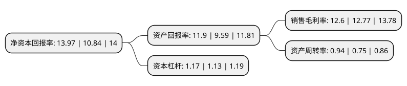

> 本页面由自动化程序生成于 2022年5月20日 01:20
> 内容可能存在错误，如有bug请提交issue至：https://github.com/Eroleice/doc-pi/issues
{.is-warning}

# 上市公司基本情况

## 基本资料

山东泰和水处理科技股份有限公司（以下简称“泰和科技”）成立于2006年03月14日，枣庄市。于2019年11月28日在深交所创业板上市。

泰和科技注册资本21,600万元，主要产品:阻垢缓蚀剂，阻垢分散剂，杀菌灭藻剂，螯合剂，粘泥剥离剂，清洗预膜剂，除氧剂，反渗透阻垢剂，清洗剂，杀菌剂等;主营业务:水处理药剂的研发，生产和销售。以下是详细信息：

- 公司名称: 山东泰和水处理科技股份有限公司
- 股票代码: 300801.SZ
- 所在地: 山东 - 枣庄市
- 成立日期: 2006年03月14日
- 注册资本: 21,600万元
- 法定代表人: 程终发
- 主营业务: 主要产品:阻垢缓蚀剂，阻垢分散剂，杀菌灭藻剂，螯合剂，粘泥剥离剂，清洗预膜剂，除氧剂，反渗透阻垢剂，清洗剂，杀菌剂等;主营业务:水处理药剂的研发，生产和销售
- 公司官网: www.thwater.com
- 公司介绍: 公司是一家集研发、生产和销售为一体的规模化水处理药剂专业生产商，产品包括阻垢缓蚀剂、杀菌灭藻剂、清洗预膜剂、螯合剂、分散剂、反渗透药剂等，广泛应用于电力、冶金、石化等工业循环冷却水系统、反渗透系统(海水淡化、纯水制造等)、采油、日化、纺织印染、制浆造纸、陶瓷、涂料、电子清洗、制糖、水产养殖、农业等领域。是中国化工学会工业水处理专业委员会副主任委员单位、全国功能高分子行业委员会理事单位、全国化学标准化技术委员会水处理分会委员及标准起草单位之一、国家火炬计划重点高新技术企业、山东省高新技术企业、创新型试点企业。公司是国内少数大规模生产水处理药剂的厂家之一，已经形成完整的水处理药剂产品布局。

## 股东及高管情况

上市公司第一大股东为程终发，持股102,872,700股，占比47.6263%，为上市公司实际控制人。

截至2022年05月11日，上市公司的前十大股东中，共有5名自然人股东，3名机构股东，2个产品账户，其中5%以上大股东共有8名。上市公司前十大股东明细如下：

> 截至2022年05月11日，上市公司前十大股东信息如下：

| 股东名称 | 持股数量（股） | 持股比例 |
| --- | --- | --- |
| 程终发 | 102,872,700 | 47.6263% |
| 程终发 | 102,872,700 | 47.6263% |
| 程终发 | 102,872,700 | 47.6263% |
| 上海复星创泓股权投资基金合伙企业(有限合伙) | 14,851,000 | 6.8755% |
| 枣庄和生投资管理中心(有限合伙) | 14,580,000 | 6.75% |
| 枣庄和生投资管理中心(有限合伙) | 14,580,000 | 6.75% |
| 枣庄和生投资管理中心(有限合伙) | 14,580,000 | 6.75% |
| 上海复星创泓股权投资基金合伙企业(有限合伙) | 12,691,000 | 5.8755% |
| 李敬娟 | 2,721,600 | 1.26% |
| 王家庚 | 2,544,900 | 1.18% |

## 利润表分析

上市公司2021年总收入为22.09亿元，净利润为2.78亿元，实现盈利。

## 杜邦分析

> 数据列示周期：2021年 | 2020年 | 2019年
{.is-info}

上市公司的净资产收益率在近一年有所上升，上升幅度为28.87%，其变化情况分解如下：
- 上市公司的销售毛利率在近一年下降了-1.33%，可能是生产效率的下降、商品原材料价格上涨或商品价格的下跌所致。
- 上市公司的资产周转率在近一年上升了25.33%，可能是源自于更快的销售回款或库存管理效果提升。
- 上市公司的财务杠杆比率在近一年上升了3.54%，可能是增加负债扩大生产规模。

