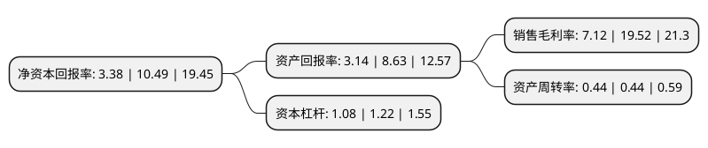

> 本页面由自动化程序生成于 2022年5月20日 01:21
> 内容可能存在错误，如有bug请提交issue至：https://github.com/Eroleice/doc-pi/issues
{.is-warning}

# 上市公司基本情况

## 基本资料

安徽华业香料股份有限公司（以下简称“华业香料”）成立于2002年07月12日，安庆市。于2020年09月16日在深交所创业板上市。

华业香料注册资本7,455.5万元，主要产品为丙位内酯，丁位内酯系列合成香料，主要从事内酯系列合成香料的研发，生产和销售。以下是详细信息：

- 公司名称: 安徽华业香料股份有限公司
- 股票代码: 300886.SZ
- 所在地: 安徽 - 安庆市
- 成立日期: 2002年07月12日
- 注册资本: 7,455.5万元
- 法定代表人: 徐基平
- 主营业务: 主要产品为丙位内酯，丁位内酯系列合成香料，主要从事内酯系列合成香料的研发，生产和销售
- 公司官网: www.anhuihuaye.com
- 公司介绍: 公司自设立以来，公司一直专注于经营香料业务，主要从事内酯系列合成香料的研发、生产和销售，主营业务突出。公司自设立以来，始终坚持以市场为导向，以客户为目标，以技术创新打造核心竞争力，坚持走“创新、协调、绿色、开放、共享”的发展道路，打造行业高端品牌。公司为国家高新技术企业，拥有省级认定的企业技术中心、安徽省院士工作站。公司通过技术研究、工艺绿色化改造、副产物开发、资源综合利用等集成创新实现了“传统产品+新工艺”，进一步提升了内酯类香料的市场竞争力，产品在国际市场上具有竞争优势。公司为中国香料香精化妆品工业协会副理事长单位，在由中国轻工业联合会发布的2017年度“中国轻工业香料行业十强企业”评选中，公司位列第七名；公司还被中国香化协会授予“中国香料香精化妆品行业优秀企业奖”、“2016年度香料香精优秀品牌企业”等荣誉称号。

## 股东及高管情况

上市公司第一大股东为华文亮，持股21,083,400股，占比28.28%，**疑似为**上市公司实际控制人。

截至2022年03月31日，上市公司的前十大股东中，共有7名自然人股东，2名机构股东，1个产品账户，其中5%以上大股东共有4名。上市公司前十大股东明细如下：

> 未能通过持股比例判定出上市公司实际控制人（持股30%以上）
> 可能存在通过间接持股、联合持股、协议控制等方式拥有实际控制权的主体，具体请参考上市公司定期公告！
{.is-warning}

> 截至2022年03月31日，上市公司前十大股东信息如下：

| 股东名称 | 持股数量（股） | 持股比例 |
| --- | --- | --- |
| 华文亮 | 21,083,400 | 28.28% |
| 徐基平 | 11,988,600 | 16.08% |
| 范一义 | 9,568,000 | 12.83% |
| 潜山众润投资合伙企业(有限合伙) | 4,160,000 | 5.58% |
| 安徽国元创投有限责任公司 | 3,725,000 | 5% |
| 安徽高新金通安益股权投资基金(有限合伙) | 3,044,186 | 4.08% |
| 陈宣炳 | 880,000 | 1.18% |
| 邓探科 | 221,700 | 0.3% |
| 金香芝 | 178,200 | 0.24% |
| 陈新华 | 169,200 | 0.23% |

## 利润表分析

上市公司2021年总收入为2.46亿元，净利润为0.17亿元，实现盈利。

## 杜邦分析

> 数据列示周期：2021年 | 2020年 | 2019年
{.is-info}

上市公司的净资产收益率在近一年有所下降，下降幅度为-67.78%，其变化情况分解如下：
- 上市公司的销售毛利率在近一年下降了-63.52%，可能是生产效率的下降、商品原材料价格上涨或商品价格的下跌所致。
- 上市公司的资产周转率在近一年下降了0%，可能是源自于更慢的销售回款或库存管理效果下降。
- 上市公司的财务杠杆比率在近一年下降了-11.48%，可能是减少负债降低财务费用。

