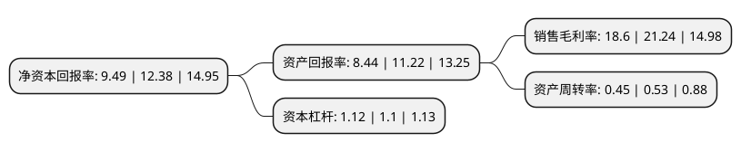

> 本页面由自动化程序生成于 2022年5月20日 01:21
> 内容可能存在错误，如有bug请提交issue至：https://github.com/Eroleice/doc-pi/issues
{.is-warning}

# 上市公司基本情况

## 基本资料

新乡市瑞丰新材料股份有限公司（以下简称“瑞丰新材”）成立于1996年11月11日，新乡市。于2020年11月27日在深交所创业板上市。

瑞丰新材注册资本15,000万元，公司主要从事油品添加剂，无碳纸显色剂等精细化工系列产品的研发，生产和销售。公司产品为精细化工品，按用途可以分为润滑油添加剂，无碳纸显色剂两大类。以下是详细信息：

- 公司名称: 新乡市瑞丰新材料股份有限公司
- 股票代码: 300910.SZ
- 所在地: 河南 - 新乡市
- 成立日期: 1996年11月11日
- 注册资本: 15,000万元
- 法定代表人: 郭春萱
- 主营业务: 公司主要从事油品添加剂，无碳纸显色剂等精细化工系列产品的研发，生产和销售公司产品为精细化工品，按用途可以分为润滑油添加剂，无碳纸显色剂两大类
- 公司官网: www.richful.com
- 公司介绍: 公司在精细化工新材料领域深耕发展，凭借技术优势和产品优势，已发展成为国内领先的润滑油添加剂供应商和全球主要的无碳纸显色剂供应商。公司主要从事油品添加剂、无碳纸显色剂等精细化工系列产品的研发、生产和销售。公司拥有比较完善的生产设备和生产技术工艺，凭借技术优势和产品优势，已发展成为国内领先的润滑油添加剂供应商和全球主要的无碳纸显色剂供应商。公司产品为精细化工品，按用途可以分为润滑油添加剂、无碳纸显色剂两大类。其中润滑油添加剂又分为单剂和复合剂。单剂产品通常对于润滑油的性能改善只具有单一的功效，单剂产品主要有清净剂、分散剂、抗氧抗腐剂、高温抗氧剂等；复合剂通常具有复合效应，主要为多种上述单剂产品与不同类型的基础油混合加工而成。公司整体技术水平国内领先，目前拥有多项国内外发明专利。公司掌握多项业界领先的核心技术，目前已获得授权国内发明专利9项、国外发明专利3项、实用新型专利3项，并有多项国内外发明专利正在申请中。

## 股东及高管情况

上市公司第一大股东为郭春萱，持股55,833,133股，占比37.22%，为上市公司实际控制人。

截至2022年05月13日，上市公司的前十大股东中，共有2名自然人股东，4名机构股东，2个产品账户，1个海外主体，1名其他股东，其中5%以上大股东共有5名。上市公司前十大股东明细如下：

> 截至2022年05月13日，上市公司前十大股东信息如下：

| 股东名称 | 持股数量（股） | 持股比例 |
| --- | --- | --- |
| 郭春萱 | 55,833,133 | 37.22% |
| 郭春萱 | 55,833,133 | 37.22% |
| 中国石化集团资本有限公司 | 22,500,000 | 15% |
| 苏州松禾成长二号创业投资中心(有限合伙) | 11,771,011 | 7.85% |
| 苏州松禾成长二号创业投资中心(有限合伙) | 11,565,011 | 7.71% |
| 前海股权投资基金(有限合伙) | 3,551,600 | 2.37% |
| 高华-汇丰-GOLDMAN,SACHS&CO.LLC | 3,430,518 | 2.29% |
| 深圳市松禾国创新能股权投资基金合伙企业(有限合伙) | 2,250,000 | 1.5% |
| 前海方舟资产管理有限公司 | 2,122,781 | 1.42% |
| 高盛国际-自有资金 | 2,000,000 | 1.33% |

## 利润表分析

上市公司2021年总收入为10.81亿元，净利润为2.01亿元，实现盈利。

## 杜邦分析

> 数据列示周期：2021年 | 2020年 | 2019年
{.is-info}

上市公司的净资产收益率在近一年有所下降，下降幅度为-23.34%，其变化情况分解如下：
- 上市公司的销售毛利率在近一年下降了-12.43%，可能是生产效率的下降、商品原材料价格上涨或商品价格的下跌所致。
- 上市公司的资产周转率在近一年下降了-15.09%，可能是源自于更慢的销售回款或库存管理效果下降。
- 上市公司的财务杠杆比率在近一年上升了1.82%，可能是增加负债扩大生产规模。

