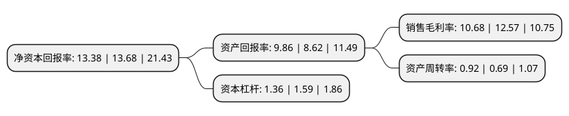

> 本页面由自动化程序生成于 2022年5月20日 01:21
> 内容可能存在错误，如有bug请提交issue至：https://github.com/Eroleice/doc-pi/issues
{.is-warning}

# 上市公司基本情况

## 基本资料

南通江天化学股份有限公司（以下简称“江天化学”）成立于1999年11月04日，南通市。于2021年01月07日在深交所创业板上市。

江天化学注册资本8,020万元，公司专注于以甲醇下游深加工为产业链的高端专用精细化学品的研发，生产和销售。公司主要产品包括颗粒多聚甲醛，高浓度甲醛，超高纯氯甲烷及1，3，5-三丙烯酰基六氢-均三嗪等。以下是详细信息：

- 公司名称: 南通江天化学股份有限公司
- 股票代码: 300927.SZ
- 所在地: 江苏 - 南通市
- 成立日期: 1999年11月04日
- 注册资本: 8,020万元
- 法定代表人: 朱辉
- 主营业务: 公司专注于以甲醇下游深加工为产业链的高端专用精细化学品的研发，生产和销售公司主要产品包括颗粒多聚甲醛，高浓度甲醛，超高纯氯甲烷及1，3，5-三丙烯酰基六氢-均三嗪等
- 公司官网: www.ntjtc.com
- 公司介绍: 公司是按现代企业管理制度建立起来的以生产有机化工原料、中间体和新型材料为主的国有有限责任公司。公司是江苏省高新技术企业。公司专注于以甲醇下游深加工为产业链的高端专用精细化学品的研发、生产和销售。公司主要产品包括颗粒多聚甲醛、高浓度甲醛、超高纯氯甲烷及1,3,5-三丙烯酰基六氢-均三嗪等，目前公司产品应用于合成树脂、胶黏剂、混凝土外加剂、农药除草剂、香精香料、染料、电子化学品以及纺织染整助剂、表面活性剂等多个领域。公司具备突出的技术实力和研发能力，公司多年来一直注重产品生产技术的革新与工艺的改进优化，拥有7项发明专利和27项实用新型专利；公司生产的颗粒多聚甲醛、高浓度甲醛及超高纯氯甲烷被认定为高新技术产品，产品各项技术指标及生产工艺均处于行业领先水平。公司高度重视安全生产和环境保护，不断提升生产的绿色、智能及节能化水平，先后获得“安全生产标准化二级企业”、“江苏省节水型企业”、南通市环境信用评级“绿色等级企业”等资质及称号。

## 股东及高管情况

上市公司第一大股东为南通产业控股集团有限公司，持股30,100,000股，占比37.53%，为上市公司实际控制人。

截至2022年03月31日，上市公司的前十大股东中，共有7名自然人股东，3名机构股东，其中5%以上大股东共有3名。上市公司前十大股东明细如下：

> 截至2022年03月31日，上市公司前十大股东信息如下：

| 股东名称 | 持股数量（股） | 持股比例 |
| --- | --- | --- |
| 南通产业控股集团有限公司 | 30,100,000 | 37.53% |
| 南通新源投资发展有限公司 | 12,050,000 | 15.02% |
| 南通江山农药化工股份有限公司 | 12,050,000 | 15.02% |
| 朱辉 | 1,785,000 | 2.23% |
| 张永锋 | 595,000 | 0.74% |
| 陈梅 | 595,000 | 0.74% |
| 付益平 | 261,000 | 0.33% |
| 胡岳荣 | 231,360 | 0.29% |
| 陈金龙 | 188,400 | 0.23% |
| 任建军 | 173,750 | 0.22% |

## 利润表分析

上市公司2021年总收入为7.09亿元，净利润为0.75亿元，实现盈利。

## 杜邦分析

> 数据列示周期：2021年 | 2020年 | 2019年
{.is-info}

上市公司的净资产收益率在近一年有所下降，下降幅度为-2.19%，其变化情况分解如下：
- 上市公司的销售毛利率在近一年下降了-15.04%，可能是生产效率的下降、商品原材料价格上涨或商品价格的下跌所致。
- 上市公司的资产周转率在近一年上升了33.33%，可能是源自于更快的销售回款或库存管理效果提升。
- 上市公司的财务杠杆比率在近一年下降了-14.47%，可能是减少负债降低财务费用。

