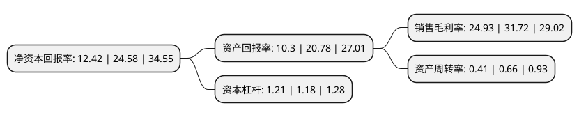

> 本页面由自动化程序生成于 2022年5月20日 01:22
> 内容可能存在错误，如有bug请提交issue至：https://github.com/Eroleice/doc-pi/issues
{.is-warning}

# 上市公司基本情况

## 基本资料

金三江(肇庆)硅材料股份有限公司（以下简称“金三江”）成立于2003年12月03日，肇庆市。于2021年09月13日在深交所创业板上市。

金三江注册资本12,166万元，专业从事沉淀法二氧化硅的研发，生产和销售，其生产产品主要为牙膏用二氧化硅。以下是详细信息：

- 公司名称: 金三江(肇庆)硅材料股份有限公司
- 股票代码: 301059.SZ
- 所在地: 广东 - 肇庆市
- 成立日期: 2003年12月03日
- 注册资本: 12,166万元
- 法定代表人: 赵国法
- 主营业务: 专业从事沉淀法二氧化硅的研发，生产和销售，其生产产品主要为牙膏用二氧化硅
- 公司官网: www.gz-silica.com
- 公司介绍: 公司是一家基于对客户需求的深刻理解，以产品创新、技术、工艺和解决方案为驱动，致力于为客户创造价值为目标的研发型、定制化、成长型高新技术企业，专业从事沉淀法二氧化硅的研发、生产和销售，其生产产品主要为牙膏用二氧化硅，所生产的“牙膏用(高磨擦型)二氧化硅”、“牙膏用(磨擦型)二氧化硅”、“牙膏用(增稠型)二氧化硅”等产品被评定为“广东省高新技术产品”，并通过Reach认证(欧盟化学品注册、评估、许可和限制认证)、Halal认证(清真食品认证)、Kosher认证(犹太洁食认证)等一系列认证。

## 股东及高管情况

上市公司第一大股东为广州飞雪集团有限公司，持股53,123,229股，占比43.67%，为上市公司实际控制人。

截至2022年03月31日，上市公司的前十大股东中，共有3名自然人股东，4名机构股东，3个产品账户，其中5%以上大股东共有4名。上市公司前十大股东明细如下：

> 截至2022年03月31日，上市公司前十大股东信息如下：

| 股东名称 | 持股数量（股） | 持股比例 |
| --- | --- | --- |
| 广州飞雪集团有限公司 | 53,123,229 | 43.67% |
| 广州赛纳股权投资合伙企业(有限合伙) | 15,426,993 | 12.68% |
| 赵国法 | 8,566,497 | 7.04% |
| 任振雪 | 8,566,497 | 7.04% |
| 广东粤科格金先进制造投资合伙企业(有限合伙) | 4,342,548 | 3.57% |
| 中国工商银行股份有限公司-宝盈优势产业灵活配置混合型证券投资基金 | 1,483,477 | 1.22% |
| 广州赛智股权投资合伙企业(有限合伙) | 1,204,236 | 0.99% |
| 招商银行股份有限公司-宝盈成长精选混合型证券投资基金 | 387,800 | 0.32% |
| 吕学志 | 236,463 | 0.19% |
| 中国农业银行股份有限公司-宝盈转型动力灵活配置混合型证券投资基金 | 229,259 | 0.19% |

## 利润表分析

上市公司2021年总收入为2.02亿元，净利润为0.5亿元，实现盈利。

## 杜邦分析

> 数据列示周期：2021年 | 2020年 | 2019年
{.is-info}

上市公司的净资产收益率在近一年有所下降，下降幅度为-49.47%，其变化情况分解如下：
- 上市公司的销售毛利率在近一年下降了-21.41%，可能是生产效率的下降、商品原材料价格上涨或商品价格的下跌所致。
- 上市公司的资产周转率在近一年下降了-37.88%，可能是源自于更慢的销售回款或库存管理效果下降。
- 上市公司的财务杠杆比率在近一年上升了2.54%，可能是增加负债扩大生产规模。

