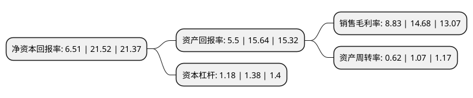

> 本页面由自动化程序生成于 2022年5月20日 01:22
> 内容可能存在错误，如有bug请提交issue至：https://github.com/Eroleice/doc-pi/issues
{.is-warning}

# 上市公司基本情况

## 基本资料

浙江本立科技股份有限公司（以下简称“本立科技”）成立于2011年05月13日，台州市。于2021年09月14日在深交所创业板上市。

本立科技注册资本7,068万元，主营业务为医药中间体，农药中间体，新材料中间体的研发，生产和销售。以下是详细信息：

- 公司名称: 浙江本立科技股份有限公司
- 股票代码: 301065.SZ
- 所在地: 浙江 - 台州市
- 成立日期: 2011年05月13日
- 注册资本: 7,068万元
- 法定代表人: 吴政杰
- 主营业务: 主营业务为医药中间体，农药中间体，新材料中间体的研发，生产和销售
- 公司官网: www.benlitech.com
- 公司介绍: 公司主营业务为医药中间体、农药中间体、新材料中间体的研发、生产和销售。发行人始终坚持以创新为驱动，针对化工中间体行业应用领域存在的痛点和难点，开发安全、环保和经济的合成工艺以替代传统工艺，是国内领先的专注于清洁生产的化工中间体生产企业。公司致力于通过自主研发创新，为喹诺酮原料药等行业的产业升级提供安全、环保、高效的中间体产品、技术与服务。发行人专注于化工中间体领域十余年，积累了较多专利与非专利技术，并构建了成熟高效的研发和成果转化体系，形成了较强的持续研发创新能力。

## 股东及高管情况

上市公司第一大股东为吴政杰，持股17,090,000股，占比24.18%，**疑似为**上市公司实际控制人。

截至2022年03月31日，上市公司的前十大股东中，共有9名自然人股东，1名机构股东，其中5%以上大股东共有5名。上市公司前十大股东明细如下：

> 未能通过持股比例判定出上市公司实际控制人（持股30%以上）
> 可能存在通过间接持股、联合持股、协议控制等方式拥有实际控制权的主体，具体请参考上市公司定期公告！
{.is-warning}

> 截至2022年03月31日，上市公司前十大股东信息如下：

| 股东名称 | 持股数量（股） | 持股比例 |
| --- | --- | --- |
| 吴政杰 | 17,090,000 | 24.18% |
| 陈建军 | 7,140,000 | 10.1% |
| 杭州少思投资合伙企业(有限合伙) | 5,250,000 | 7.43% |
| 顾海宁 | 4,270,000 | 6.04% |
| 蒋华江 | 3,570,000 | 5.05% |
| 王远音 | 2,550,000 | 3.61% |
| 蔡继平 | 2,380,000 | 3.37% |
| 刘国平 | 2,300,000 | 3.25% |
| 俞庆祥 | 2,000,000 | 2.83% |
| 赵一顺 | 1,500,000 | 2.12% |

## 利润表分析

上市公司2021年总收入为6.21亿元，净利润为0.54亿元，实现盈利。

## 杜邦分析

> 数据列示周期：2021年 | 2020年 | 2019年
{.is-info}

上市公司的净资产收益率在近一年有所下降，下降幅度为-69.75%，其变化情况分解如下：
- 上市公司的销售毛利率在近一年下降了-39.85%，可能是生产效率的下降、商品原材料价格上涨或商品价格的下跌所致。
- 上市公司的资产周转率在近一年下降了-42.06%，可能是源自于更慢的销售回款或库存管理效果下降。
- 上市公司的财务杠杆比率在近一年下降了-14.49%，可能是减少负债降低财务费用。

