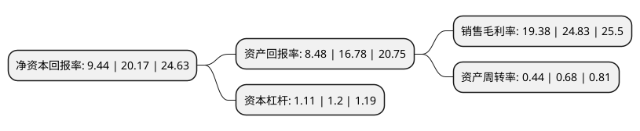

> 本页面由自动化程序生成于 2022年5月20日 01:22
> 内容可能存在错误，如有bug请提交issue至：https://github.com/Eroleice/doc-pi/issues
{.is-warning}

# 上市公司基本情况

## 基本资料

江苏新瀚新材料股份有限公司（以下简称“新瀚新材”）成立于2008年07月25日，南京市。于2021年10月11日在深交所创业板上市。

新瀚新材注册资本7,960万元，公司主营业务为芳香族酮类产品的研发，生产和销售，主要产品包括特种工程塑料核心原料，光引发剂和化妆品原料等产品。以下是详细信息：

- 公司名称: 江苏新瀚新材料股份有限公司
- 股票代码: 301076.SZ
- 所在地: 江苏 - 南京市
- 成立日期: 2008年07月25日
- 注册资本: 7,960万元
- 法定代表人: 严留新
- 主营业务: 公司主营业务为芳香族酮类产品的研发，生产和销售，主要产品包括特种工程塑料核心原料，光引发剂和化妆品原料等产品
- 公司官网: www.sinohighchem.com
- 公司介绍: 公司主营业务为芳香族酮类产品的研发、生产和销售，主要产品包括特种工程塑料核心原料、光引发剂和化妆品原料等产品。公司客户覆盖SOLVAY(索尔维)、VICTREX(威格斯)、EVONIK(赢创)、IGM(艾坚蒙)、SYMRISE(德之馨)、长兴化学及久日新材等国际知名化工集团或境内外上市公司。公司深耕芳香酮领域十余年，已经形成了从实验室到工业化生产的系列产品研发及生产体系，积累了5项发明专利与10项非专利技术；公司自2014年起获得江苏省高新技术企业资格，并于2017年11月通过高新技术企业复审；2018年，南京市科学技术委员会认定公司为南京市工程技术研究中心；2018年12月，中国科技部、国家科学技术奖励工作办公室、中国民营科技促进会认定公司为国家火炬特色产业基地，并授予公司优秀民营科技企业奖；2019年江苏省民营科技企业协会认定公司为江苏省民营科技企业。

## 股东及高管情况

上市公司第一大股东为严留新，持股20,340,000股，占比25.55%，**疑似为**上市公司实际控制人。

截至2022年03月31日，上市公司的前十大股东中，共有8名自然人股东，2名机构股东，其中5%以上大股东共有4名。上市公司前十大股东明细如下：

> 未能通过持股比例判定出上市公司实际控制人（持股30%以上）
> 可能存在通过间接持股、联合持股、协议控制等方式拥有实际控制权的主体，具体请参考上市公司定期公告！
{.is-warning}

> 截至2022年03月31日，上市公司前十大股东信息如下：

| 股东名称 | 持股数量（股） | 持股比例 |
| --- | --- | --- |
| 严留新 | 20,340,000 | 25.55% |
| 秦翠娥 | 15,500,000 | 19.47% |
| 郝国梅 | 5,600,000 | 7.04% |
| 张萍 | 4,910,000 | 6.17% |
| 汤浩 | 3,650,000 | 4.59% |
| 南京远谟投资企业(有限合伙) | 3,513,462 | 4.41% |
| 叶玄羲 | 2,000,000 | 2.51% |
| 徐雅珍 | 1,682,538 | 2.11% |
| 李大生 | 1,202,000 | 1.51% |
| 北京中财龙马资本投资有限公司-宁波龙马龙腾投资管理中心(有限合伙) | 1,202,000 | 1.51% |

## 利润表分析

上市公司2021年总收入为3.42亿元，净利润为0.66亿元，实现盈利。

## 杜邦分析

> 数据列示周期：2021年 | 2020年 | 2019年
{.is-info}

上市公司的净资产收益率在近一年有所下降，下降幅度为-53.2%，其变化情况分解如下：
- 上市公司的销售毛利率在近一年下降了-21.95%，可能是生产效率的下降、商品原材料价格上涨或商品价格的下跌所致。
- 上市公司的资产周转率在近一年下降了-35.29%，可能是源自于更慢的销售回款或库存管理效果下降。
- 上市公司的财务杠杆比率在近一年下降了-7.5%，可能是减少负债降低财务费用。

