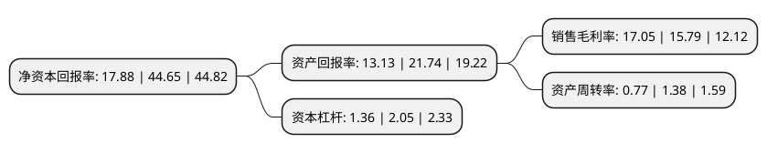

> 本页面由自动化程序生成于 2022年5月20日 01:22
> 内容可能存在错误，如有bug请提交issue至：https://github.com/Eroleice/doc-pi/issues
{.is-warning}

# 上市公司基本情况

## 基本资料

杭州星华反光材料股份有限公司（以下简称“星华反光”）成立于2003年04月03日，杭州市。于2021年09月30日在深交所创业板上市。

星华反光注册资本6,000万元，公司主营业务为反光材料，反光服饰及其他反光制品的研发，设计，生产及销售。公司产品主要包括:反光材料，反光服饰和其他反光制品。以下是详细信息：

- 公司名称: 杭州星华反光材料股份有限公司
- 股票代码: 301077.SZ
- 所在地: 浙江 - 杭州市
- 成立日期: 2003年04月03日
- 注册资本: 6,000万元
- 法定代表人: 王世杰
- 主营业务: 公司主营业务为反光材料，反光服饰及其他反光制品的研发，设计，生产及销售公司产品主要包括:反光材料，反光服饰和其他反光制品
- 公司官网: www.chinastars.com.cn
- 公司介绍: 公司主营业务为反光材料、反光服饰及其他反光制品的研发、设计、生产及销售。公司秉持“安全”、“绿色”理念，致力于为客户提供品质专业、稳定可靠、富有时尚感的安全防护用品和消费品，产品广泛应用于职业安全防护、个人安全防护、休闲服饰、功能性面料、运动用品、户外用品、箱包、鞋类等领域。公司产品已取得出口欧洲、美国、加拿大、澳大利亚等国家和地区的关于质量、环保、安全等方面的认证，包括CE认证、SGS认证、美国UL实验室安全认证等，并通过REACH、ROHS、OEKO-TEX等欧盟国家有毒或有害物质检测认证。凭借先进的技术水平和领先的产品品质，公司在业内建立了良好的品牌知名度，拥有广泛的用户群体，与下游多家著名品牌企业建立了长期稳定的合作关系。公司品牌被评为“浙江省著名商标”、“杭州市著名商标”，公司被列为浙江省中小型“隐形冠军”培育对象。

## 股东及高管情况

上市公司第一大股东为王世杰，持股28,465,000股，占比47.44%，为上市公司实际控制人。

截至2022年03月31日，上市公司的前十大股东中，共有7名自然人股东，3名机构股东，其中5%以上大股东共有3名。上市公司前十大股东明细如下：

> 截至2022年03月31日，上市公司前十大股东信息如下：

| 股东名称 | 持股数量（股） | 持股比例 |
| --- | --- | --- |
| 王世杰 | 28,465,000 | 47.44% |
| 陈奕 | 5,599,999 | 9.33% |
| 杭州杰创企业咨询管理合伙企业(有限合伙) | 4,500,000 | 7.5% |
| 牛江 | 2,427,500 | 4.05% |
| 张小萍 | 1,023,801 | 1.71% |
| 厉炯慧 | 960,000 | 1.6% |
| 陆松筠 | 652,500 | 1.09% |
| 杭州浙科盛元创业投资合伙企业(有限合伙) | 630,000 | 1.05% |
| 杭州浙农科业投资管理有限公司-杭州浙农科众创业投资合伙企业(有限合伙) | 600,000 | 1% |
| 郑厚甫 | 202,500 | 0.34% |

## 利润表分析

上市公司2021年总收入为7.91亿元，净利润为1.34亿元，实现盈利。

## 杜邦分析

> 数据列示周期：2021年 | 2020年 | 2019年
{.is-info}

上市公司的净资产收益率在近一年有所下降，下降幅度为-59.96%，其变化情况分解如下：
- 上市公司的销售毛利率在近一年上升了7.98%，可能是生产效率的提升、商品原材料价格下跌或商品价格的上涨所致。
- 上市公司的资产周转率在近一年下降了-44.2%，可能是源自于更慢的销售回款或库存管理效果下降。
- 上市公司的财务杠杆比率在近一年下降了-33.66%，可能是减少负债降低财务费用。

