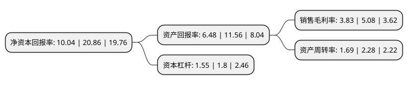

> 本页面由自动化程序生成于 2022年5月20日 01:22
> 内容可能存在错误，如有bug请提交issue至：https://github.com/Eroleice/doc-pi/issues
{.is-warning}

# 上市公司基本情况

## 基本资料

华润化学材料科技股份有限公司（以下简称“华润材料”）成立于2003年07月14日，常州市。于2021年10月26日在深交所创业板上市。

华润材料注册资本147,941.655万元，公司主要从事聚酯材料及新材料的研发，生产和销售，产品主要用于生产饮用水瓶，热灌装饮料瓶，碳酸饮料瓶，食用油瓶以及医用采血管，膜，片材等领域。以下是详细信息：

- 公司名称: 华润化学材料科技股份有限公司
- 股票代码: 301090.SZ
- 所在地: 江苏 - 常州市
- 成立日期: 2003年07月14日
- 注册资本: 147,941.655万元
- 法定代表人: 房昕
- 主营业务: 公司主要从事聚酯材料及新材料的研发，生产和销售，产品主要用于生产饮用水瓶，热灌装饮料瓶，碳酸饮料瓶，食用油瓶以及医用采血管，膜，片材等领域
- 公司官网: www.crcchem.com
- 公司介绍: 公司主要从事聚酯材料及新材料的研发、生产和销售，是全球聚酯材料的领军企业。至2019年末，主营产品聚酯瓶片产能为160万吨/年，位列全球前五、中国前三。公司聚酯瓶片产品主要用于生产饮用水瓶、热灌装饮料瓶、碳酸饮料瓶、食用油瓶以及医用采血管、膜、片材等领域。公司主要客户包括可口可乐、顶津、娃哈哈、怡宝、农夫山泉等国内外知名大型饮料品企业，在国内外市场上享有较高的声誉。公司建立了良好生产质量管理体系，通过ISO9001体系认证、OHSAS18001体系认证以及可口可乐、百事可乐认证，产品符合欧盟、FDA要求，并获得“国家级企业管理现代化创新成果二等奖”“最佳工艺进步奖”“可持续发展环保奖”等荣誉称号。

## 股东及高管情况

上市公司第一大股东为华润化学材料投资有限公司，持股854,189,859股，占比57.74%，为上市公司实际控制人。

截至2022年03月31日，上市公司的前十大股东中，共有3名自然人股东，4名机构股东，3个产品账户，其中5%以上大股东共有2名。上市公司前十大股东明细如下：

> 截至2022年03月31日，上市公司前十大股东信息如下：

| 股东名称 | 持股数量（股） | 持股比例 |
| --- | --- | --- |
| 华润化学材料投资有限公司 | 854,189,859 | 57.74% |
| 华润化工有限公司 | 353,999,475 | 23.93% |
| 碧辟(中国)投资有限公司 | 49,314,736 | 3.33% |
| 深创投红土股权投资管理(深圳)有限公司-深创投制造业转型升级新材料基金(有限合伙) | 23,923,444 | 1.62% |
| 中信建投证券-浦发银行-中信建投华润化学材料1号战略配售集合资产管理计划 | 14,619,138 | 0.99% |
| 太平人寿保险有限公司-传统-普通保险产品-022L-CT001深 | 4,784,688 | 0.32% |
| 张爽姿 | 1,947,602 | 0.13% |
| 武汉兴开源电力工程有限公司 | 1,500,000 | 0.1% |
| 杨冬 | 1,478,396 | 0.1% |
| 刘国华 | 1,207,800 | 0.08% |

## 利润表分析

上市公司2021年总收入为125.85亿元，净利润为4.82亿元，实现盈利。

## 杜邦分析

> 数据列示周期：2021年 | 2020年 | 2019年
{.is-info}

上市公司的净资产收益率在近一年有所下降，下降幅度为-51.87%，其变化情况分解如下：
- 上市公司的销售毛利率在近一年下降了-24.61%，可能是生产效率的下降、商品原材料价格上涨或商品价格的下跌所致。
- 上市公司的资产周转率在近一年下降了-25.88%，可能是源自于更慢的销售回款或库存管理效果下降。
- 上市公司的财务杠杆比率在近一年下降了-13.89%，可能是减少负债降低财务费用。

