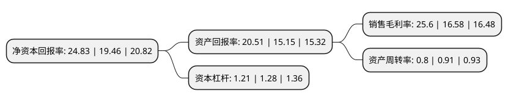

> 本页面由自动化程序生成于 2022年5月20日 01:23
> 内容可能存在错误，如有bug请提交issue至：https://github.com/Eroleice/doc-pi/issues
{.is-warning}

# 上市公司基本情况

## 基本资料

湖南恒光科技股份有限公司（以下简称“恒光股份”）成立于2008年12月18日，怀化市。于2021年11月18日在深交所创业板上市。

恒光股份注册资本10,667万元，化学原料及其联产品的生产和销售，产业链延伸及对产品深度加工;通过对生产技术局部研发及改进，生产线优化设计，实现资源综合利用。以下是详细信息：

- 公司名称: 湖南恒光科技股份有限公司
- 股票代码: 301118.SZ
- 所在地: 湖南 - 怀化市
- 成立日期: 2008年12月18日
- 注册资本: 10,667万元
- 法定代表人: 曹立祥
- 主营业务: 化学原料及其联产品的生产和销售，产业链延伸及对产品深度加工;通过对生产技术局部研发及改进，生产线优化设计，实现资源综合利用
- 公司官网: www.hgkjgf.com
- 公司介绍: 公司是一家围绕循环经济发展模式，集硫、氯化工产品链的研发、生产和销售于一体的高新技术企业。公司依托区域丰富的盐卤资源和含硫尾砂矿资源优势，通过深入发挥现有循环经济发展模式的优势，循环利用氯碱和硫酸等基础化工产品生产过程中的联、副产品，围绕氯化合物和硫化合物向下游精细化工产品延伸，逐步形成了以硫化工、氯化工产品链为主线的产品布局。公司是高新技术企业，经怀化市科学技术局批准建立市级工程技术研究中心。公司先后被评为“湖南省两型工业企业”和“湖南省最具成长性中小企业”，并获得湖南省科学技术进步三等奖。公司被列为怀化市循环经济与清洁生产试点企业，公司及子公司恒光化工被认定为“湖南省企业技术中心”，公司及子公司衡阳恒荣被认定为“湖南省新材料企业”。

## 股东及高管情况

上市公司第一大股东为湖南洪江恒光投资管理有限公司，持股48,900,000股，占比45.84%，为上市公司实际控制人。

截至2022年03月31日，上市公司的前十大股东中，共有4名自然人股东，5名机构股东，1个产品账户，其中5%以上大股东共有2名。上市公司前十大股东明细如下：

> 截至2022年03月31日，上市公司前十大股东信息如下：

| 股东名称 | 持股数量（股） | 持股比例 |
| --- | --- | --- |
| 湖南洪江恒光投资管理有限公司 | 48,900,000 | 45.84% |
| 湘江产业投资有限责任公司 | 11,560,000 | 10.84% |
| 李世鸿 | 3,000,000 | 2.81% |
| 谢刚 | 2,600,000 | 2.44% |
| 曹立祥 | 2,565,000 | 2.4% |
| 华菱津杉(湖南)创业投资有限公司 | 2,350,000 | 2.2% |
| 上海唯盛投资有限公司 | 2,249,000 | 2.11% |
| 游新农 | 1,740,000 | 1.63% |
| 湖南省财信产业基金管理有限公司 | 1,500,000 | 1.41% |
| 长沙通和投资管理咨询有限公司 | 1,000,000 | 0.94% |

## 利润表分析

上市公司2021年总收入为9.33亿元，净利润为2.38亿元，实现盈利。

## 杜邦分析

> 数据列示周期：2021年 | 2020年 | 2019年
{.is-info}

上市公司的净资产收益率在近一年有所上升，上升幅度为27.6%，其变化情况分解如下：
- 上市公司的销售毛利率在近一年上升了54.4%，可能是生产效率的提升、商品原材料价格下跌或商品价格的上涨所致。
- 上市公司的资产周转率在近一年下降了-12.09%，可能是源自于更慢的销售回款或库存管理效果下降。
- 上市公司的财务杠杆比率在近一年下降了-5.47%，可能是减少负债降低财务费用。

