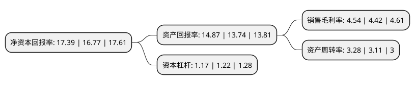

> 本页面由自动化程序生成于 2022年5月20日 01:23
> 内容可能存在错误，如有bug请提交issue至：https://github.com/Eroleice/doc-pi/issues
{.is-warning}

# 上市公司基本情况

## 基本资料

山东隆华新材料股份有限公司（以下简称“隆华新材”）成立于2011年03月28日，淄博市。于2021年11月10日在深交所创业板上市。

隆华新材注册资本43,000.002万元，软泡用聚醚及CASE用聚醚以下是详细信息：

- 公司名称: 山东隆华新材料股份有限公司
- 股票代码: 301149.SZ
- 所在地: 山东 - 淄博市
- 成立日期: 2011年03月28日
- 注册资本: 43,000.002万元
- 法定代表人: 张萍
- 主营业务: 软泡用聚醚及CASE用聚醚
- 公司官网: www.longhuapu.com.cn
- 公司介绍: 公司自设立以来一直在借鉴成熟工艺技术生产聚醚多元醇(PPG)及聚合物多元醇(POP)的基础上，组织自身研发团队，研发新工艺、新技术，以提高生产效率，降低原材料耗用，提高产品质量为目的，制造优质的产品满足市场需求。公司是国内聚醚多元醇(PPG)及聚合物多元醇(POP)规模化生产企业，公司的主营业务为聚醚多元醇(PPG)及聚合物多元醇(POP)的研发、生产与销售。公司的经营范围为：生物质材料、聚醚生产、销售；环氧乙烷、苯乙烯[抑制了的]、3-氯-1，2-环氧丙烷(以上三项不带有储存设施的经营，有效期限以许可证为准)、化工产品(不含危险、监控、易制毒化学品)、塑料制品、机械设备(不含九座以下乘用车)、日用百货、聚氨酯轮、陶瓷制品销售；货物及技术进出口(依法须经批准的项目，经相关部门批准后方可开展经营活动)。

## 股东及高管情况

上市公司第一大股东为韩志刚，持股142,796,164股，占比33.21%，为上市公司实际控制人。

截至2022年03月31日，上市公司的前十大股东中，共有5名自然人股东，5名机构股东，其中5%以上大股东共有3名。上市公司前十大股东明细如下：

> 截至2022年03月31日，上市公司前十大股东信息如下：

| 股东名称 | 持股数量（股） | 持股比例 |
| --- | --- | --- |
| 韩志刚 | 142,796,164 | 33.21% |
| 韩润泽 | 78,444,164 | 18.24% |
| 新余隆振投资合伙企业(有限合伙) | 26,286,571 | 6.11% |
| 新余隆宁投资合伙企业(有限合伙) | 17,530,423 | 4.08% |
| 宁波梅山保税港区卓惠欣群股权投资合伙企业(有限合伙) | 15,989,817 | 3.72% |
| 马月平 | 14,767,067 | 3.43% |
| 新余隆信投资合伙企业(有限合伙) | 14,376,776 | 3.34% |
| 新余隆致投资合伙企业(有限合伙) | 10,770,995 | 2.5% |
| 杲鑫 | 10,158,237 | 2.36% |
| 韩曰曾 | 6,497,509 | 1.51% |

## 利润表分析

上市公司2021年总收入为42.75亿元，净利润为1.94亿元，实现盈利。

## 杜邦分析

> 数据列示周期：2021年 | 2020年 | 2019年
{.is-info}

上市公司的净资产收益率在近一年有所上升，上升幅度为3.7%，其变化情况分解如下：
- 上市公司的销售毛利率在近一年上升了2.71%，可能是生产效率的提升、商品原材料价格下跌或商品价格的上涨所致。
- 上市公司的资产周转率在近一年上升了5.47%，可能是源自于更快的销售回款或库存管理效果提升。
- 上市公司的财务杠杆比率在近一年下降了-4.1%，可能是减少负债降低财务费用。

