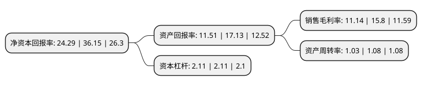

> 本页面由自动化程序生成于 2022年5月20日 01:23
> 内容可能存在错误，如有bug请提交issue至：https://github.com/Eroleice/doc-pi/issues
{.is-warning}

# 上市公司基本情况

## 基本资料

浙江联盛化学股份有限公司（以下简称“联盛化学”）成立于2007年10月19日，台州市。于2022年04月19日在深交所创业板上市。

联盛化学注册资本8,100万元，公司是一家特种精细化工领域的高新技术企业，以医药中间体，农药中间体，电子化学品及化工溶剂为主的精细化学品的研发，生产，销售及进出口贸易作为主营业务，主要产品包括γ-丁内酯(GBL)，α-乙酰基-γ-丁内酯(ABL)，N-甲基吡咯烷酮(NMP)，4-氯-2-三氟乙酰基苯胺水合物盐酸盐(E2)，环丙甲酮(CPMK)，异丙醇(IPA)，1，2-己二醇(HDO)。以下是详细信息：

- 公司名称: 浙江联盛化学股份有限公司
- 股票代码: 301212.SZ
- 所在地: 浙江 - 台州市
- 成立日期: 2007年10月19日
- 注册资本: 8,100万元
- 法定代表人: 牟建宇
- 主营业务: 公司是一家特种精细化工领域的高新技术企业，以医药中间体，农药中间体，电子化学品及化工溶剂为主的精细化学品的研发，生产，销售及进出口贸易作为主营业务，主要产品包括γ-丁内酯(GBL)，α-乙酰基-γ-丁内酯(ABL)，N-甲基吡咯烷酮(NMP)，4-氯-2-三氟乙酰基苯胺水合物盐酸盐(E2)，环丙甲酮(CPMK)，异丙醇(IPA)，1，2-己二醇(HDO)
- 公司官网: www.realsunchem.com
- 公司介绍: 公司是一家特种精细化工领域的高新技术企业，以医药中间体、农药中间体、电子化学品及化工溶剂为主的精细化学品的研发、生产、销售及进出口贸易作为主营业务，主要产品包括γ-丁内酯(GBL)、α-乙酰基-γ-丁内酯(ABL)、N-甲基吡咯烷酮(NMP)、4-氯-2-三氟乙酰基苯胺水合物盐酸盐(E2)、环丙甲酮(CPMK)、异丙醇(IPA)、1,2-己二醇(HDO)，生产过程中的副产品主要有氢气、乙醇、香蕉水、磷酸盐、氯化锂水溶液、2-甲基-4,5-二氢呋喃等。

## 股东及高管情况

上市公司第一大股东为联盛化学集团有限公司，持股57,000,000股，占比52.78%，为上市公司实际控制人。

截至2022年04月19日，上市公司的前十大股东中，共有2名自然人股东，3名机构股东，5个产品账户，其中5%以上大股东共有3名。上市公司前十大股东明细如下：

> 截至2022年04月19日，上市公司前十大股东信息如下：

| 股东名称 | 持股数量（股） | 持股比例 |
| --- | --- | --- |
| 联盛化学集团有限公司 | 57,000,000 | 52.78% |
| 牟建宇 | 10,000,000 | 9.26% |
| 俞快 | 9,000,000 | 8.33% |
| 台州市高盛投资合伙企业(有限合伙) | 5,000,000 | 4.63% |
| 国金证券股份有限公司 | 125,269 | 0.12% |
| 中国石油天然气集团公司企业年金计划-中国工商银行股份有限公司 | 41,580 | 0.04% |
| 中国工商银行股份有限公司企业年金计划-中国建设银行股份有限公司 | 33,264 | 0.03% |
| 中国建设银行股份有限公司企业年金计划-中国工商银行股份有限公司 | 29,106 | 0.03% |
| 中国石油化工集团公司企业年金计划-中国工商银行股份有限公司 | 29,106 | 0.03% |
| 中国银行股份有限公司企业年金计划-中国农业银行 | 24,948 | 0.02% |

## 利润表分析

上市公司2021年总收入为8.33亿元，净利润为0.92亿元，实现盈利。

## 杜邦分析

> 数据列示周期：2021年 | 2020年 | 2019年
{.is-info}

上市公司的净资产收益率在近一年有所下降，下降幅度为-32.81%，其变化情况分解如下：
- 上市公司的销售毛利率在近一年下降了-29.49%，可能是生产效率的下降、商品原材料价格上涨或商品价格的下跌所致。
- 上市公司的资产周转率在近一年下降了-4.63%，可能是源自于更慢的销售回款或库存管理效果下降。
- 上市公司的财务杠杆比率在近一年下降了0%，可能是减少负债降低财务费用。

