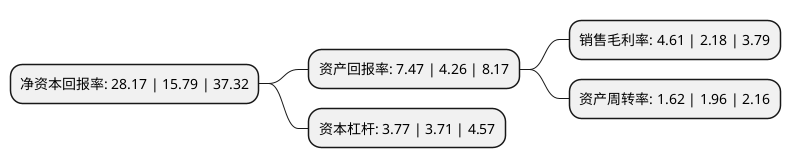

> 本页面由自动化程序生成于 2022年5月20日 01:23
> 内容可能存在错误，如有bug请提交issue至：https://github.com/Eroleice/doc-pi/issues
{.is-warning}

# 上市公司基本情况

## 基本资料

万凯新材料股份有限公司（以下简称“万凯新材”）成立于2008年03月31日，嘉兴市。于2022年03月29日在深交所创业板上市。

万凯新材注册资本34,339.54万元，聚酯材料研发，生产，销售，主要产品包括瓶级PET和大有光PET以下是详细信息：

- 公司名称: 万凯新材料股份有限公司
- 股票代码: 301216.SZ
- 所在地: 浙江 - 嘉兴市
- 成立日期: 2008年03月31日
- 注册资本: 34,339.54万元
- 法定代表人: 沈志刚
- 主营业务: 聚酯材料研发，生产，销售，主要产品包括瓶级PET和大有光PET
- 公司官网: www.wkai.cc
- 公司介绍: 公司是国内领先的聚酯材料研发、生产、销售企业，致力于为社会提供健康、安全、环保、优质的聚酯材料，主要产品包括瓶级PET和大有光PET。公司凭借高品质产品、技术创新及规模优势，被授予“中国民营企业制造业500强”、“中国对外贸易500强民营企业”、“浙江省知名商号”、“浙江出口名牌”等荣誉称号。公司拥有180万吨/年的瓶级PET产能，产能规模位居全球前列，同时采用具有自主知识产权的IPA单独酯化、低温聚合工艺和复合节能保温等生产技术，确保生产效率和产品品质。公司依靠优异的产品性能、稳定的产品质量，积累了深厚的客户资源。公司主要客户包括农夫山泉、可口可乐、怡宝、娃哈哈等多家国内外知名企业，全球各大品牌方严格的准入制度促成了公司业务的“护城河”。公司产品销至全球上百个国家和地区，其中不乏俄罗斯、埃及、尼日利亚等“一带一路”国家，是瓶级PET“中国制造”的代表型企业。

## 股东及高管情况

上市公司第一大股东为浙江正凯集团有限公司，持股120,639,328股，占比35.13%，为上市公司实际控制人。

截至2022年03月31日，上市公司的前十大股东中，共有1名自然人股东，5名机构股东，4个产品账户，其中5%以上大股东共有3名。上市公司前十大股东明细如下：

> 截至2022年03月31日，上市公司前十大股东信息如下：

| 股东名称 | 持股数量（股） | 持股比例 |
| --- | --- | --- |
| 浙江正凯集团有限公司 | 120,639,328 | 35.13% |
| 沈志刚 | 22,575,674 | 6.57% |
| 御心投资有限公司 | 22,250,472 | 6.48% |
| 广州复朴道和投资管理有限公司-衢州复朴长实投资合伙企业(有限合伙) | 10,298,482 | 3% |
| 宁波长江奇湾股权投资基金管理有限公司-宁波长江奇湾股权投资基金合伙企业(有限合伙) | 8,900,189 | 2.59% |
| 中金资本运营有限公司-厦门中金盈润股权投资基金合伙企业(有限合伙) | 8,484,846 | 2.47% |
| 浙江深改产业发展合伙企业(有限合伙) | 5,340,113 | 1.56% |
| 博信(天津)股权投资管理合伙企业(有限合伙)-宁波丰鼎优泰股权投资基金合伙企业(有限合伙) | 5,340,113 | 1.56% |
| 茅台建信(贵州)投资基金管理有限公司-贵州茅台建信旅游投资管理中心(有限合伙) | 5,303,029 | 1.54% |
| 上海汇瑾股权投资管理有限公司-海宁凯滨晟世投资合伙企业(有限合伙) | 5,303,029 | 1.54% |

## 利润表分析

上市公司2021年总收入为95.86亿元，净利润为4.41亿元，实现盈利。

## 杜邦分析

> 数据列示周期：2021年 | 2020年 | 2019年
{.is-info}

上市公司的净资产收益率在近一年有所上升，上升幅度为78.4%，其变化情况分解如下：
- 上市公司的销售毛利率在近一年上升了111.47%，可能是生产效率的提升、商品原材料价格下跌或商品价格的上涨所致。
- 上市公司的资产周转率在近一年下降了-17.35%，可能是源自于更慢的销售回款或库存管理效果下降。
- 上市公司的财务杠杆比率在近一年上升了1.62%，可能是增加负债扩大生产规模。

