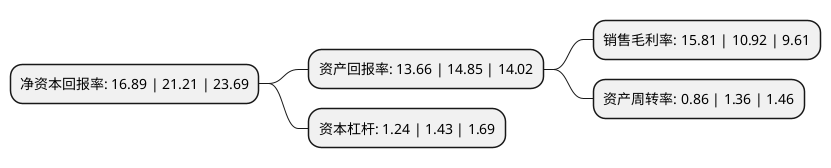

> 本页面由自动化程序生成于 2022年5月20日 01:23
> 内容可能存在错误，如有bug请提交issue至：https://github.com/Eroleice/doc-pi/issues
{.is-warning}

# 上市公司基本情况

## 基本资料

华融化学股份有限公司（以下简称“华融化学”）成立于2000年09月07日，成都市。于2022年03月22日在深交所创业板上市。

华融化学注册资本48,000万元，公司是一家致力于高品质氢氧化钾绿色循环综合利用的先进企业，主要产品为高品质氢氧化钾。以下是详细信息：

- 公司名称: 华融化学股份有限公司
- 股票代码: 301256.SZ
- 所在地: 四川 - 成都市
- 成立日期: 2000年09月07日
- 注册资本: 48,000万元
- 法定代表人: 唐冲
- 主营业务: 公司是一家致力于高品质氢氧化钾绿色循环综合利用的先进企业，主要产品为高品质氢氧化钾
- 公司官网: www.cnchccl.com
- 公司介绍: 华融化学是一家致力于高品质氢氧化钾绿色循环综合利用的先进企业，主要产品为高品质氢氧化钾。根据百川盈孚统计，公司2019年高品质片状氢氧化钾销量居国内第二。发行人已掌握碱类及酸类超净高纯试剂的生产技术和量产能力，秉承“钾延伸、氯转型”的创新发展战略，公司优化产品结构，重点投入湿电子化学品等战略新兴产业领域技术的研发创新，大力发展超净高纯试剂、食品添加剂、环保型水处理剂和优质钾肥等鼓励类新兴精细化工产品，着力打通“产、供、销、储、运”全流程大数据，构建一体化综合服务的新业态；通过募投项目的实施，不断提升公司在电子信息、新能源、食品医药、高端日化、新型肥料等下游应用领域的影响力和市场占有率，实现从生产型企业向研发、生产及服务一体化企业转型。

## 股东及高管情况

上市公司第一大股东为新希望化工投资有限公司，持股343,800,000股，占比71.63%，为上市公司实际控制人。

截至2022年03月31日，上市公司的前十大股东中，共有6名自然人股东，2名机构股东，2个产品账户，其中5%以上大股东共有1名。上市公司前十大股东明细如下：

> 截至2022年03月31日，上市公司前十大股东信息如下：

| 股东名称 | 持股数量（股） | 持股比例 |
| --- | --- | --- |
| 新希望化工投资有限公司 | 343,800,000 | 71.63% |
| 宁波新融化学科技合伙企业(有限合伙) | 16,200,000 | 3.38% |
| 李卓强 | 538,932 | 0.11% |
| 西藏中睿合银投资管理有限公司-中睿合银昊天1期对冲基金 | 481,900 | 0.1% |
| 赵善芹 | 377,400 | 0.08% |
| 王光坤 | 356,300 | 0.07% |
| 柯希明 | 300,000 | 0.06% |
| 张锦山 | 293,200 | 0.06% |
| 西藏中睿合银投资管理有限公司-中睿合银昊天3期私募证券投资基金 | 263,529 | 0.05% |
| 钮金根 | 260,110 | 0.05% |

## 利润表分析

上市公司2021年总收入为6.44亿元，净利润为1.01亿元，实现盈利。

## 杜邦分析

> 数据列示周期：2021年 | 2020年 | 2019年
{.is-info}

上市公司的净资产收益率在近一年有所下降，下降幅度为-20.37%，其变化情况分解如下：
- 上市公司的销售毛利率在近一年上升了44.78%，可能是生产效率的提升、商品原材料价格下跌或商品价格的上涨所致。
- 上市公司的资产周转率在近一年下降了-36.76%，可能是源自于更慢的销售回款或库存管理效果下降。
- 上市公司的财务杠杆比率在近一年下降了-13.29%，可能是减少负债降低财务费用。

