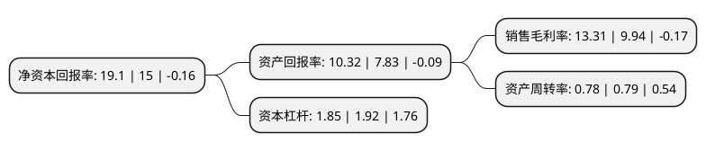

> 本页面由自动化程序生成于 2022年5月20日 01:24
> 内容可能存在错误，如有bug请提交issue至：https://github.com/Eroleice/doc-pi/issues
{.is-warning}

# 上市公司基本情况

## 基本资料

新疆天业股份有限公司（以下简称“新疆天业”）成立于1997年06月09日，石河子市。于1997年06月17日在上交所主板上市。

新疆天业注册资本170,735.426万元，主营业务:氯碱化工和塑料节水器材以下是详细信息：

- 公司名称: 新疆天业股份有限公司
- 股票代码: 600075.SH
- 所在地: 新疆 - 石河子市
- 成立日期: 1997年06月09日
- 注册资本: 170,735.426万元
- 法定代表人: 周军
- 主营业务: 主营业务:氯碱化工和塑料节水器材
- 公司官网: www.xj-tianye.com
- 公司介绍: 公司是新疆生产建设兵团第八师的大型国有企业。所属产业涉及塑料制品、节水器材、热电、化工、电石、水泥、矿业、建材、物流、对外贸易、建筑、安装与房地产等多个领域。公司拥有国家认定的企业技术中心、国家节水灌溉工程中心、博士后科研工作站和氯碱化工国家地方联合工程研究中心等国家级高水平研发平台。经过多年上市发展，形成了集电力、电石、氯碱化工、农业节水、物流商贸、建筑安装、食品加工、塑料包装等为一体的多元化综合类上市公司。公司是全国第一批循环经济试点企业、技术创新示范企业，荣获中国学习型组织优秀单位、国家技能人才培育突出贡献企业奖、全国专业技术人才先进集体等优秀称号。

## 股东及高管情况

上市公司第一大股东为新疆天业(集团)有限公司，持股770,731,710股，占比45.14%，为上市公司实际控制人。

截至2022年03月31日，上市公司的前十大股东中，共有4名自然人股东，5名机构股东，1个产品账户，其中5%以上大股东共有1名。上市公司前十大股东明细如下：

> 截至2022年03月31日，上市公司前十大股东信息如下：

| 股东名称 | 持股数量（股） | 持股比例 |
| --- | --- | --- |
| 新疆天业(集团)有限公司 | 770,731,710 | 45.14% |
| 石河子市锦富国有资本投资运营有限公司 | 76,750,668 | 4.5% |
| 常州投资集团有限公司 | 9,708,737 | 0.57% |
| 肖强 | 8,799,746 | 0.52% |
| 中国建设银行股份有限公司-浙商丰利增强债券型证券投资基金 | 8,000,000 | 0.47% |
| 天域融资本运营有限公司 | 5,000,826 | 0.29% |
| 蔡稚奇 | 4,945,000 | 0.29% |
| 陈鹏 | 3,500,040 | 0.2% |
| 黄贞火 | 3,500,000 | 0.2% |
| 金石期货有限公司-新疆生产建设兵团联创股权投资有限合伙企业 | 3,404,372 | 0.2% |

## 利润表分析

上市公司2021年总收入为120.14亿元，净利润为15.99亿元，实现盈利。

## 杜邦分析

> 数据列示周期：2021年 | 2020年 | 2019年
{.is-info}

上市公司的净资产收益率在近一年有所上升，上升幅度为27.33%，其变化情况分解如下：
- 上市公司的销售毛利率在近一年上升了33.9%，可能是生产效率的提升、商品原材料价格下跌或商品价格的上涨所致。
- 上市公司的资产周转率在近一年下降了-1.27%，可能是源自于更慢的销售回款或库存管理效果下降。
- 上市公司的财务杠杆比率在近一年下降了-3.65%，可能是减少负债降低财务费用。

