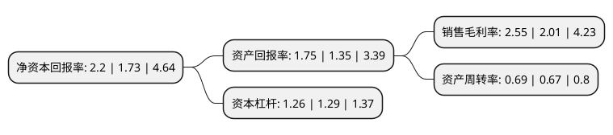

> 本页面由自动化程序生成于 2022年5月20日 01:24
> 内容可能存在错误，如有bug请提交issue至：https://github.com/Eroleice/doc-pi/issues
{.is-warning}

# 上市公司基本情况

## 基本资料

乐凯胶片股份有限公司（以下简称“乐凯胶片”）成立于1998年01月16日，保定市。于1998年01月22日在上交所主板上市。

乐凯胶片注册资本55,330.71万元，主要产品:彩纸，彩卷。以下是详细信息：

- 公司名称: 乐凯胶片股份有限公司
- 股票代码: 600135.SH
- 所在地: 河北 - 保定市
- 成立日期: 1998年01月16日
- 注册资本: 55,330.71万元
- 法定代表人: 王洪泽
- 主营业务: 主要产品:彩纸，彩卷
- 公司官网: gufen.luckyfilm.com.cn
- 公司介绍: 公司是中国乐凯胶片集团公司的旗舰企业，主营业务是彩色感光材料和照相化学材料，近年来主营业务向膜及带涂层的膜类加工产品领域扩展。公司现拥有完善的乳剂制备、彩色相纸涂布、彩纸整理包装、冲洗加工套药以及光学膜涂布生产线等装备先进的多条生产线，并设有检测手段先进、设施完善的品质保证中心及物流管理中心。公司作为国有控股的感光材料上市公司，拥有非常高的知名度和巨大的品牌价值，拥有优秀的企业文化，拥有国内感光材料专家和研发队伍，我国感光行业的中国工程院院士就在乐凯公司。公司拥有先进的实验设备、生产设备和高素质的产业工人，所生产的质优价廉的产品深受广大顾客的欢迎，产品出口连年大幅上升。遍布全国的营销网络和专业的服务队伍是公司实施服务营销和向数码领域进军的雄厚资源，潜力巨大的感光材料市场和前景无限的数码影像领域为公司提供了一个广阔的舞台。

## 股东及高管情况

上市公司第一大股东为中国乐凯集团有限公司，持股252,776,443股，占比45.68%，为上市公司实际控制人。

截至2022年03月31日，上市公司的前十大股东中，共有7名自然人股东，3名机构股东，其中5%以上大股东共有2名。上市公司前十大股东明细如下：

> 截至2022年03月31日，上市公司前十大股东信息如下：

| 股东名称 | 持股数量（股） | 持股比例 |
| --- | --- | --- |
| 中国乐凯集团有限公司 | 252,776,443 | 45.68% |
| 眉山市彭山鑫城产业投资有限公司 | 42,842,480 | 7.74% |
| 詹冰洁 | 2,505,515 | 0.45% |
| 钱薇 | 2,226,900 | 0.4% |
| 沈妙卿 | 2,090,000 | 0.38% |
| 顾永涛 | 1,312,886 | 0.24% |
| 赵玉璞 | 1,298,823 | 0.23% |
| 天津欣来贸易有限责任公司 | 1,113,600 | 0.2% |
| 王鹏 | 1,010,000 | 0.18% |
| 韩美娟 | 958,130 | 0.17% |

## 利润表分析

上市公司2021年总收入为22.35亿元，净利润为0.57亿元，实现盈利。

## 杜邦分析

> 数据列示周期：2021年 | 2020年 | 2019年
{.is-info}

上市公司的净资产收益率在近一年有所上升，上升幅度为27.17%，其变化情况分解如下：
- 上市公司的销售毛利率在近一年上升了26.87%，可能是生产效率的提升、商品原材料价格下跌或商品价格的上涨所致。
- 上市公司的资产周转率在近一年上升了2.99%，可能是源自于更快的销售回款或库存管理效果提升。
- 上市公司的财务杠杆比率在近一年下降了-2.33%，可能是减少负债降低财务费用。

