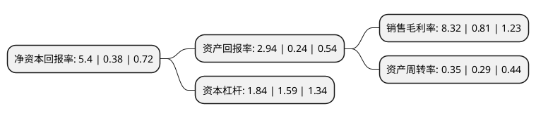

> 本页面由自动化程序生成于 2022年5月20日 01:25
> 内容可能存在错误，如有bug请提交issue至：https://github.com/Eroleice/doc-pi/issues
{.is-warning}

# 上市公司基本情况

## 基本资料

沧州大化股份有限公司（以下简称“沧州大化”）成立于1998年09月24日，沧州市。于2000年04月06日在上交所主板上市。

沧州大化注册资本41,859.63万元，主要产品:尿素，TDI。以下是详细信息：

- 公司名称: 沧州大化股份有限公司
- 股票代码: 600230.SH
- 所在地: 河北 - 沧州市
- 成立日期: 1998年09月24日
- 注册资本: 41,859.63万元
- 法定代表人: 谢华生
- 主营业务: 主要产品:尿素，TDI
- 公司官网: www.czdh.chemchina.com
- 公司介绍: 公司是由中国化工集团控股、沧州市政府参股，以化肥、TDI为主导产品的大型综合性化工企业集团，属国有独资企业。主要拥有年产合成氨、尿素、TDI、烧碱以及浓硝酸、硝酸铵等生产能力。公司主导产品“飞狮”牌TDI，产品通过ISO9000国际质量体系认证，是公认的名牌产品。公司经过不断的技术改造，淘汰落后产能，实施产业升级，已发展成为我国重要的异氰酸酯和化肥生产基地。公司已初步建立起上下游产品紧密衔接、产业链完整、主业突出的循环经济发展模式。目前，公司正按照“提质、降耗、扩能”的发展思路，稳步推进一系列扩产改造及配套项目，使得产业结构将更趋合理，竞争优势更加突出，企业核心竞争力和行业影响力进一步增强。

## 股东及高管情况

上市公司第一大股东为沧州大化集团有限责任公司，持股190,467,424股，占比45.5%，为上市公司实际控制人。

截至2022年03月31日，上市公司的前十大股东中，共有3名自然人股东，2名机构股东，5个产品账户，其中5%以上大股东共有1名。上市公司前十大股东明细如下：

> 截至2022年03月31日，上市公司前十大股东信息如下：

| 股东名称 | 持股数量（股） | 持股比例 |
| --- | --- | --- |
| 沧州大化集团有限责任公司 | 190,467,424 | 45.5% |
| 陈武峰 | 6,586,684 | 1.57% |
| 张建富 | 3,385,626 | 0.81% |
| 上海银行股份有限公司-富国精诚回报12个月持有期混合型证券投资基金 | 3,194,900 | 0.76% |
| 中国工商银行股份有限公司-东方红启元三年持有期混合型证券投资基金 | 3,148,712 | 0.75% |
| 中国银行股份有限公司-富国改革动力混合型证券投资基金 | 3,037,600 | 0.73% |
| 中国工商银行股份有限公司-申万菱信新动力混合型证券投资基金 | 2,656,840 | 0.63% |
| 招商银行股份有限公司-东方红恒阳五年定期开放混合型证券投资基金 | 2,373,240 | 0.57% |
| 深圳市永万丰实业有限公司 | 1,900,000 | 0.45% |
| 张洪敏 | 1,862,700 | 0.44% |

## 利润表分析

上市公司2021年总收入为23.87亿元，净利润为1.98亿元，实现盈利。

## 杜邦分析

> 数据列示周期：2021年 | 2020年 | 2019年
{.is-info}

上市公司的净资产收益率在近一年有所上升，上升幅度为1321.05%，其变化情况分解如下：
- 上市公司的销售毛利率在近一年上升了927.16%，可能是生产效率的提升、商品原材料价格下跌或商品价格的上涨所致。
- 上市公司的资产周转率在近一年上升了20.69%，可能是源自于更快的销售回款或库存管理效果提升。
- 上市公司的财务杠杆比率在近一年上升了15.72%，可能是增加负债扩大生产规模。

