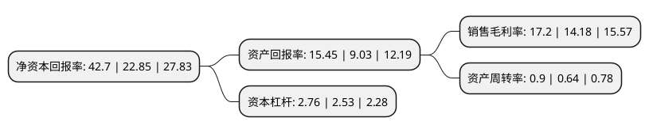

> 本页面由自动化程序生成于 2022年5月20日 01:25
> 内容可能存在错误，如有bug请提交issue至：https://github.com/Eroleice/doc-pi/issues
{.is-warning}

# 上市公司基本情况

## 基本资料

万华化学集团股份有限公司（以下简称“万华化学”）成立于1998年12月16日，烟台市。于2001年01月05日在上交所主板上市。

万华化学注册资本313,974.663万元，主要产品:纯MDI，聚合MDI。以下是详细信息：

- 公司名称: 万华化学集团股份有限公司
- 股票代码: 600309.SH
- 所在地: 山东 - 烟台市
- 成立日期: 1998年12月16日
- 注册资本: 313,974.663万元
- 法定代表人: 廖增太
- 主营业务: 主要产品:纯MDI，聚合MDI
- 公司官网: www.whchem.com
- 公司介绍: 公司是一家全球化运营的化工新材料公司，依托不断创新的核心技术、产业化装置及高效的运营模式，为客户提供更具竞争力的产品及解决方案。公司业务涵盖MDI、TDI、聚醚多元醇等聚氨酯产业集群，丙烯酸及酯、环氧丙烷等石化产业集群，水性PUD、PA乳液、TPU、ADI系列等功能化学品及材料产业集群。所服务的行业主要包括：生活家居、运动休闲、汽车交通、建筑工业和电子电器等。在生产领域，国内烟台、宁波、珠海等地生产基地稳定运营。在研发领域，烟台、北京、佛山、上海等地的研发中心已逐渐成型，北美技术中心在休斯敦正式投入使用。另外，万华化学在欧洲、美国、日本等多个国家和地区均设有公司和办事处。公司将“为客户创造价值”作为第一使命，致力于为客户提供稳定的、高质量的、有竞争力的产品和快速高效的服务，做负责任的供应商和行业领袖。

## 股东及高管情况

上市公司第一大股东为烟台国丰投资控股集团有限公司，持股677,764,654股，占比21.59%，**疑似为**上市公司实际控制人。

截至2022年03月31日，上市公司的前十大股东中，共有1名自然人股东，6名机构股东，1个产品账户，2个海外主体，其中5%以上大股东共有5名。上市公司前十大股东明细如下：

> 未能通过持股比例判定出上市公司实际控制人（持股30%以上）
> 可能存在通过间接持股、联合持股、协议控制等方式拥有实际控制权的主体，具体请参考上市公司定期公告！
{.is-warning}

> 截至2022年03月31日，上市公司前十大股东信息如下：

| 股东名称 | 持股数量（股） | 持股比例 |
| --- | --- | --- |
| 烟台国丰投资控股集团有限公司 | 677,764,654 | 21.59% |
| Prime Partner International   Limited | 336,042,361 | 10.7% |
| 烟台中诚投资股份有限公司 | 330,379,594 | 10.52% |
| 宁波市中凯信创业投资股份有限公司 | 301,808,357 | 9.61% |
| 香港中央结算有限公司(陆股通) | 230,896,998 | 7.35% |
| 中国证券金融股份有限公司 | 73,348,508 | 2.34% |
| 北京德杰汇通科技有限公司 | 69,995,240 | 2.23% |
| 中央汇金资产管理有限责任公司 | 20,695,020 | 0.66% |
| 孙惠刚 | 17,680,413 | 0.56% |
| 全国社保基金一零三组合 | 16,600,000 | 0.53% |

## 利润表分析

上市公司2021年总收入为1,455.37亿元，净利润为250.39亿元，实现盈利。

## 杜邦分析

> 数据列示周期：2021年 | 2020年 | 2019年
{.is-info}

上市公司的净资产收益率在近一年有所上升，上升幅度为86.87%，其变化情况分解如下：
- 上市公司的销售毛利率在近一年上升了21.3%，可能是生产效率的提升、商品原材料价格下跌或商品价格的上涨所致。
- 上市公司的资产周转率在近一年上升了40.63%，可能是源自于更快的销售回款或库存管理效果提升。
- 上市公司的财务杠杆比率在近一年上升了9.09%，可能是增加负债扩大生产规模。

