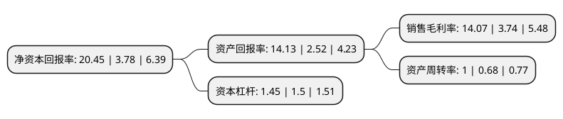

> 本页面由自动化程序生成于 2022年5月20日 01:26
> 内容可能存在错误，如有bug请提交issue至：https://github.com/Eroleice/doc-pi/issues
{.is-warning}

# 上市公司基本情况

## 基本资料

贵州红星发展股份有限公司（以下简称“红星发展”）成立于1999年05月02日，安顺市。于2001年03月20日在上交所主板上市。

红星发展注册资本29,323.66万元，主要产品有碳酸钡，碳酸锶，不溶性硫磺，硫脲，电解二氧化锰，金属锰，硝酸锶，氯化锶，金属锶等。以下是详细信息：

- 公司名称: 贵州红星发展股份有限公司
- 股票代码: 600367.SH
- 所在地: 贵州 - 安顺市
- 成立日期: 1999年05月02日
- 注册资本: 29,323.66万元
- 法定代表人: 郭汉光
- 主营业务: 主要产品有碳酸钡，碳酸锶，不溶性硫磺，硫脲，电解二氧化锰，金属锰，硝酸锶，氯化锶，金属锶等
- 公司官网: www.hxfz.com.cn
- 公司介绍: 公司是首家东西部结合在西部地区上市的公司。公司主营业务为电子磁性材料、橡胶塑料助剂、天然植物提取等系列多个品种，主要产品有碳酸钡、碳酸锶、电解二氧化锰、不溶性硫磺、硫脲、硫磺、硫酸钡、硝酸锶、氯化锶、万寿菊等。碳酸钡和碳酸锶是生产电视机显像管、计算机显示器、工业监视器、电子元器件的重要原料，还被广泛应用于电子信息、化工、轻工、冶金、陶瓷等多个行业。同时公司钡、锶盐产品已经在世界各大玻壳企业占据了主要份额公司坚持以财务管理为龙头，以市场为导向，以企业文化建设为依托的发展战略，发扬“艰苦创业、无私奉献、开拓创新、争创一流”的企业精神，依托青岛红星化工多年来形成的信誉、市场、技术、管理等优势同西部丰富的资源结合起来继续走东西结合、优势互补、低成本扩张的道路，重点发展以电子磁性材料，橡胶塑料助剂，绿色植物提取物等为支柱的高科技多元化产业，把企业打造成为具有“一流的的效益”的现代化企业。

## 股东及高管情况

上市公司第一大股东为青岛红星化工集团有限责任公司，持股105,067,336股，占比35.83%，为上市公司实际控制人。

截至2022年03月31日，上市公司的前十大股东中，共有2名自然人股东，3名机构股东，4个产品账户，1个海外主体，其中5%以上大股东共有1名。上市公司前十大股东明细如下：

> 截至2022年03月31日，上市公司前十大股东信息如下：

| 股东名称 | 持股数量（股） | 持股比例 |
| --- | --- | --- |
| 青岛红星化工集团有限责任公司 | 105,067,336 | 35.83% |
| JPMORGAN CHASE BANK,NATIONAL ASSOCIATION | 2,396,410 | 0.82% |
| 跬步基金管理(珠海)有限公司-三角梅2号私募证券投资基金 | 1,774,400 | 0.61% |
| 熊美云 | 1,685,700 | 0.57% |
| 康帝实业有限公司 | 1,434,803 | 0.49% |
| 广东原始森林私募证券投资管理有限公司-原始森林博源一号私募证券投资基金 | 1,350,000 | 0.46% |
| 华泰证券股份有限公司 | 1,276,158 | 0.44% |
| 跬步基金管理(珠海)有限公司-三角梅1号私募证券投资基金 | 1,252,400 | 0.43% |
| 王荣华 | 1,183,000 | 0.4% |
| 苏州格外投资管理有限公司-格外投资新三板1号基金 | 1,150,000 | 0.39% |

## 利润表分析

上市公司2021年总收入为21.95亿元，净利润为3.08亿元，实现盈利。

## 杜邦分析

> 数据列示周期：2021年 | 2020年 | 2019年
{.is-info}

上市公司的净资产收益率在近一年有所上升，上升幅度为441.01%，其变化情况分解如下：
- 上市公司的销售毛利率在近一年上升了276.2%，可能是生产效率的提升、商品原材料价格下跌或商品价格的上涨所致。
- 上市公司的资产周转率在近一年上升了47.06%，可能是源自于更快的销售回款或库存管理效果提升。
- 上市公司的财务杠杆比率在近一年下降了-3.33%，可能是减少负债降低财务费用。

