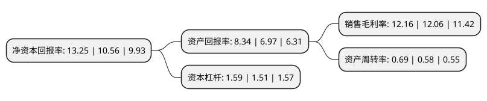

> 本页面由自动化程序生成于 2022年5月20日 01:26
> 内容可能存在错误，如有bug请提交issue至：https://github.com/Eroleice/doc-pi/issues
{.is-warning}

# 上市公司基本情况

## 基本资料

昊华化工科技集团股份有限公司（以下简称“昊华科技”）成立于1999年08月05日，成都市。于2001年01月11日在上交所主板上市。

昊华科技注册资本91,922.966万元，主要产品或提供的劳务包括:催化剂，变压吸附气体分离技术及装置，特种气体，有机化工产品，特种阀门，吸附剂等的研制，生产，销售，化工产品开发设计与技术咨询。经营自产产品及技术的出口业务;经营生产所需的原辅材料，仪器仪表，机械设备，零配件及技术的进出口业务。以下是详细信息：

- 公司名称: 昊华化工科技集团股份有限公司
- 股票代码: 600378.SH
- 所在地: 四川 - 成都市
- 成立日期: 1999年08月05日
- 注册资本: 91,922.966万元
- 法定代表人: 胡冬晨
- 主营业务: 主要产品或提供的劳务包括:催化剂，变压吸附气体分离技术及装置，特种气体，有机化工产品，特种阀门，吸附剂等的研制，生产，销售，化工产品开发设计与技术咨询经营自产产品及技术的出口业务;经营生产所需的原辅材料，仪器仪表，机械设备，零配件及技术的进出口业务
- 公司官网: www.hhkj.chemchina.com
- 公司介绍: 公司是经国家经贸委批准，以西南化工研究设计院为主要发起单位，并将变压吸附气体分离技术及成套装置、催化剂产品、碳一化学及工程设计等优良资产注入成立的股份制有限公司。公司主营碳一化学技术及催化剂的生产和销售，在气体分离、纯化应用领域居于世界前列。公司的变压吸附技术可从各种混合气及工业废气中回收提纯氢气、一氧化碳、二氧化碳等，该技术充分利用了有限的资源来生产有用的产品。公司的变压吸附技术具有操作简单、应用范围广、环保优势明显、市场潜力大等显著特点，现已在全国各地的化工、化肥、冶金、石油化工等行业进行推广，并出口印度尼西亚、巴基斯坦、以色列等国。2018年，公司收购晨光院、黎明院、西北院、光明院、曙光院、沈阳院、海化院、大连院、锦西院、株洲院和北方院100%股权，新增业务涵盖氟化工、聚氨酯功能材料、电子化学品、特种涂料以及橡胶制品等精细化工业务。

## 股东及高管情况

上市公司第一大股东为中国昊华化工集团股份有限公司，持股590,198,123股，占比64.21%，为上市公司实际控制人。

截至2022年03月31日，上市公司的前十大股东中，共有4名机构股东，6个产品账户，其中5%以上大股东共有3名。上市公司前十大股东明细如下：

> 截至2022年03月31日，上市公司前十大股东信息如下：

| 股东名称 | 持股数量（股） | 持股比例 |
| --- | --- | --- |
| 中国昊华化工集团股份有限公司 | 590,198,123 | 64.21% |
| 盈投控股有限公司 | 61,323,800 | 6.67% |
| 国新投资有限公司 | 46,804,110 | 5.09% |
| 国家军民融合产业投资基金有限责任公司 | 37,850,000 | 4.12% |
| 中国农业银行股份有限公司-大成新锐产业混合型证券投资基金 | 14,826,336 | 1.61% |
| 广发证券股份有限公司-大成睿景灵活配置混合型证券投资基金 | 9,577,390 | 1.04% |
| 中国华融资产管理股份有限公司 | 8,816,621 | 0.96% |
| 中国建设银行股份有限公司-银华富裕主题混合型证券投资基金 | 7,457,457 | 0.81% |
| 全国社保基金一一三组合 | 6,754,772 | 0.73% |
| 中国银行股份有限公司-大成景气精选六个月持有期混合型证券投资基金 | 5,958,934 | 0.65% |

## 利润表分析

上市公司2021年总收入为74.24亿元，净利润为9.03亿元，实现盈利。

## 杜邦分析

> 数据列示周期：2021年 | 2020年 | 2019年
{.is-info}

上市公司的净资产收益率在近一年有所上升，上升幅度为25.47%，其变化情况分解如下：
- 上市公司的销售毛利率在近一年上升了0.83%，可能是生产效率的提升、商品原材料价格下跌或商品价格的上涨所致。
- 上市公司的资产周转率在近一年上升了18.97%，可能是源自于更快的销售回款或库存管理效果提升。
- 上市公司的财务杠杆比率在近一年上升了5.3%，可能是增加负债扩大生产规模。

